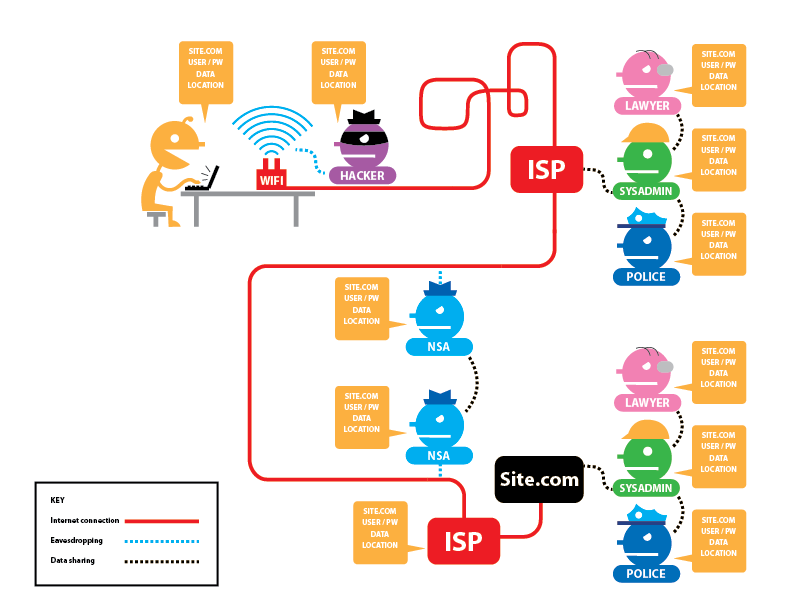
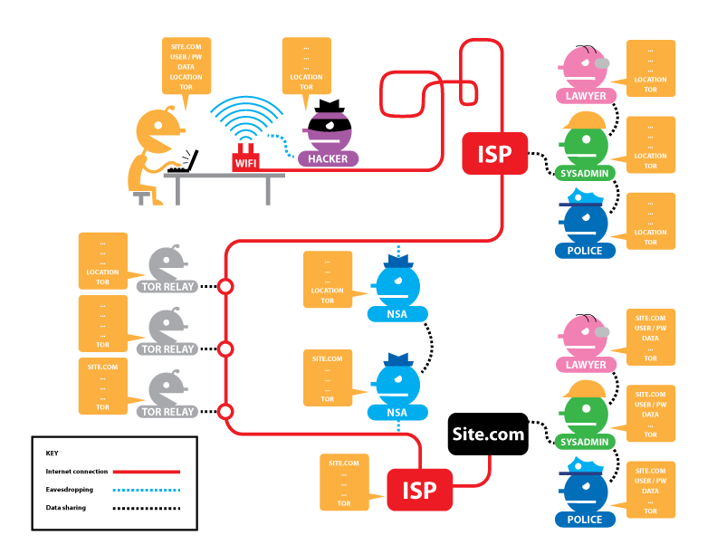
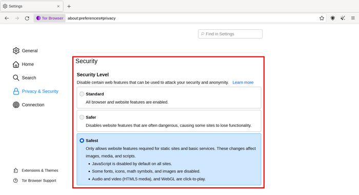
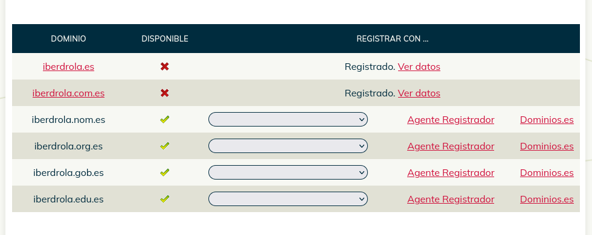
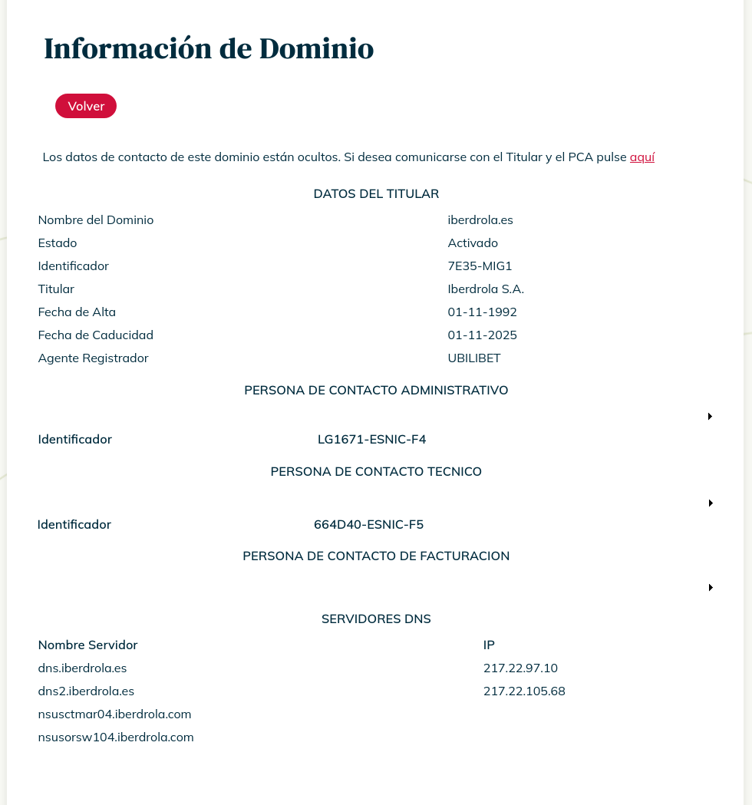

# 2.1 Intelligence Gathering

En la Unidad 1 se estudiaron las diferentes fases de un test de intrusión, entre ellas la fase de recolección o recopilación de información que se considera una de las mas importantes, ya que permite conocer de manera detallada el objetivo y así diseñar una estrategia de ataque efectiva.

La información publicada en la red no para de crecer. A diario, miles de millones de personas se conectan a Internet y publican datos de sus vidas, de sus viajes, comparten fotos y vídeos, escriben artículos, actualizan sus paginas web y las ‘empresas suben documentos a sus servidores. De toda la información disponible, ¿cuál es la que puede interesar mas?

En primer lugar es interesante averiguar la información comercial y legal del objetivo como detalles de sus empleados y los cargos que ocupan, sus direcciones de correo, las relaciones de la empresa con otras compañías, suministradores y clientes, conocer qué tipos de proyectos desarrolla, marcas registradas y patentes que posee y otra información similar.

En segundo lugar es de interés conocer la información tecnológica de la empresa como el tipo de servicio web o gestor de contenidos que emplea, si hace uso de servicios en la nube y de qué tipo son, metadatos de documentos para averiguar el tipo de software de edición y gestión y sus versiones, los dominios registrados, si están en uso o abandonados, el rango de direcciones IP de los diferentes servicios, documentación interna publicada por error y que esta accesible a través del navegador, infraestructura de la red interna, el tipo de protocolos que se emplean, etcétera,

La información recopilada puede ser enorme y poco útil, por lo que debe ser tratada y procesada para generar inteligencia. La inteligencia es un producto ‘obtenido tras aplicar el ciclo de inteligencia a la información obtenida. La inteligencia tiene un valor mucho más elevado que la información, es más útil y precisa, por lo que el test de intrusión tendré mayores probabilidades de éxito. A este proceso de obtener inteligencia se le conoce como ***intelligence gathering***.

La **ciberinteligencia** consiste en aplicar la inteligencia al ciberespacio de modo que se puedan detectar las amenazas y neutralizarlas antes de que ocurran.

La Figura 2.1 representa una categorización en función de la calidad del saber que permite realizar un juicio o una decisión lo más acertada posible. Los datos son material no organizado ni analizado, por lo que deben ser procesados. Por ejemplo, una fecha, una lista de años, un nombre, un cargo. La información serían los datos que han sido organizados y procesados, y el conocimiento una combinación de información, experiencia e intuición. Además, se debe tener en cuenta que disponer de mayor cantidad de datos o información puede entorpecer la mejora de su calidad, no llegando a lograr la inteligencia adecuada.

**Figura 2.1**

En esta unidad se presentan numerosas herramientas que automatizan la tarea de recopilar información, pero es importante tener en cuenta que ninguna herramienta es capaz de sustituir al analista. Por tanto, el uso exclusivo de herramientas automáticas conlleva el riesgo de pasar por alto información útil o relevante que un buen analista sería capaz de identificar.

El numero de fuentes de las que se puede obtener información para generar inteligencia es enorme; por ello, hay disciplinas específicas para cada una de ellas. Según la Oficina del Director de Inteligencia Nacional de los Estados Unidos, se distinguen seis disciplinas diferentes ([¿Qué es inteligencia? Oficina del Director de inteligencia Nacional](https://www.dni.gov/index.php/what-we-do/what-is-intelligence)).

- **OSINT** (Open Source intelligence): inteligencia en fuentes abiertas.
- **HUMINT** (Human intelligence): inteligencia de fuentes humanas
- **SIGINT** (Signal intelligence): inteligencia de señales.
- **GEOINT** (Geospacial intelligence): inteligencia geoespacial
- **IMINT** (Imagery inteligence): inteligencia de imágenes.
* **MASINT** (Measurement And Signature intelligence): inteligencia basada en medidas físicas.

A continuación se explican aquellas que se consideran mas relevantes para un hacker ético: OSINT, HUMINT y SIGINT.


## 2.1.1. Inteligencia en Fuentes Abiertas (OSINT)

Los buscadores de Internet, como Google, DuckDuckGo y Yahoo, permiten realizar búsquedas de información en la red en un tiempo récord. Además, existen otros buscadores especializados en la búsqueda de imágenes, buscadores tecnológicos, etc., que permiten obtener información más precisa sobre nuestro objetivo (ver Apartado 2.4.2).

Esta búsqueda de información en la que se investiga en fuentes públicas se conoce como inteligencia en fuentes abiertas u Open Source Intelligence (OSINT). Es importante destacar que "fuente abierta" no significa necesariamente que la fuente sea gratuita o digital. Dependiendo de la investigación que se esté llevando a cabo, puede ser relevante obtener información del registro mercantil, del catastro, de archivos documentales provinciales o estatales, etc., que, aunque sean fuentes públicas, su acceso puede tener algún coste.

Existen multitud de fuentes abiertas de las cuales se puede obtener información relevante. Por ejemplo:

- **Medios de comunicación**: prensa online y escrita, televisión, radio.
- **Fuentes gubernamentales**: boletín oficial del estado, boletines oficiales autonómicos y provinciales, registros gubernamentales.
- **Conferencias, simposios, artículos de investigación, bibliotecas online**, etcétera.

## 2.1.2. Inteligencia de fuentes humanas (HUMINT)

Se trata de un tipo de inteligencia que se elabora a partir de información recogida o suministrada directamente por personas; comúnmente se conoce como espionaje. La información proporcionada por fuentes humanas es muy útil porque puede aportar datos imposibles de adquirir por otros medios.

La obtención de información a través de fuentes humanas tiene dos fases. La primera implica la captación e infiltración de la fuente, lo cual muchas veces requiere una cantidad considerable de recursos. La segunda fase es la evaluación de la información adquirida, realizada por los oficiales de inteligencia y analistas, teniendo en cuenta la naturaleza de la persona. Por ejemplo, acudir a la cafetería donde suelen desayunar los trabajadores de una empresa y escuchar sus conversaciones puede ser una vía útil para obtener información, aunque también costosa.

## 2.1.3. Inteligencia de Señales (SIGINT)

Este tipo específico de inteligencia se elabora a partir de la obtención y el procesamiento de datos provenientes de la detección, interceptación y descifrado de señales y transmisiones de cualquier tipo.

Si se desea conocer más acerca del análisis de señales, se recomienda visualizar la charla *Matrioshka SIGINT. Análisis de señales ocultas*, presentada por David Marugén en la conferencia IntelCon 2020. David Marugén ([https://www.davidmarugan.es/](https://www.davidmarugan.es/)) es un investigador especializado en el análisis de señales de radio y miembro del equipo de Mundo Hacker, entre otros aspectos destacados de su currículo.

# 2.2. Redes Anónimas

Como es sabido, la navegación a través de Internet deja rastro. Las redes anónimas surgieron con el objetivo de proporcionar privacidad absoluta y una navegación completamente anónima. Existen diversas redes anónimas; la más conocida es TOR (The Onion Router), aunque también hay otras menos populares como I2P (The Invisible Internet Project) o FreeNet.

Nos centraremos en el uso y funcionamiento de TOR, con el objetivo de anonimizar nuestro entorno de trabajo y buscar información durante la fase de reconocimiento sin dejar rastro.

Si se desea conocer más detalles sobre el funcionamiento de las distintas redes anónimas, se recomienda consultar el libro *Deep Web: TOR, FreeNet & I2P. Privacidad y Anonimato*, de Daniel Echeverri (alias Adastra), publicado por la editorial OxWord.

## 2.2.1. La Red Oculta

En los últimos años se han acuñado términos como *deep web* o *dark web*, que en muchas ocasiones se utilizan de forma indistinta aunque representan conceptos diferentes. A menudo se emplea la imagen de un iceberg para representar los distintos tipos de información que se pueden encontrar en Internet, como el que se muestra en la Figura 2.2.

Los diferentes niveles representados en el iceberg se relacionan con la disponibilidad de la información:

- **Surface web** o web superficial: representa la información accesible públicamente y que está indexada por los buscadores. Al ser la parte visible del iceberg, se destaca que esta es solo una pequeña parte en comparación con todo lo que está oculto bajo la superficie.
- **Deep web**: representa aquella información que, siendo accesible, no está indexada por los buscadores, ya sea porque se trata de información generada dinámicamente o porque está detrás de bloqueadores (captchas, formularios de autenticación, etcétera).
- **Dark web**: representa información que no está indexada por buscadores de Internet y que requiere de clientes específicos para acceder a ella, por lo que su acceso está restringido.

[Figura 22. Iceberg representando los conceptos de surface web, deep web y dark web](https://www.independent.co.ug/technology-how-dark-Is-dark-web/)

[Figura 23. Porcentajes de servicios ofrecidos en la red TOR clasificados en diferentes categorías](https://en.wikipedia.org/wiki/Tor_(network))

La dark web se relaciona comúnmente con la ciberdelincuencia, pero no todo el contenido en la dark web es ilícito. Como se puede ver en la Figura 2.3, se estima que el 43,2 % de los sitios activos en la red TOR son de contenido lícito o desconocido, mientras que el 56,8 % sería contenido ilícito (temas financieros, drogas, pornografía, armas o ciberdelincuencia).

## 2.2.2. VPN vs. Redes Anónimas

Una VPN (*Virtual Private Network*) permite ocultar la IP de origen de la comunicación al destinatario, ofreciendo anonimato y privacidad. A priori, ofrece características similares a las redes anónimas; sin embargo, los servidores VPN pertenecen principalmente a corporaciones o entidades privadas, por lo que es necesario confiar ciegamente en que no facilitarán los datos de nuestras conexiones. Estos servicios suelen anunciarse en estos términos; por ejemplo, uno de los servicios más conocidos, ProtonVPN, de la empresa suiza Proton, afirma en su página web:

> *Keep your browsing history private. As a Swiss VPN provider, we do not log user activity or share data with third parties. Our anonymous VPN service enables internet without surveillance.*

Sin embargo, en 2021 se publicó la noticia de que un activista francés había sido detenido, y su IP se había almacenado a través de los servicios de ProtonMail, el servicio de correo electrónico de la empresa ([ProtonMail almacena en sus logs la IP de un activista francés por requerimiento de las autoridades suizas](https://techcrunch.com/2021/09/06/protonmail-logged-ip-address-of-french-activist-after-order-by-swiss-authorities/). Por tanto, la afirmación de completo anonimato no es cierta, ya que esta condición no se cumple en caso de que haya un requerimiento judicial hacia la empresa. En cambio, las redes anónimas son redes descentralizadas (P2P), por lo que el control de la red y de los nodos es mucho más complejo (aunque también se intenta).

El uso de redes anónimas puede tener algunos inconvenientes. A menudo son bloqueadas por algunos proveedores al identificar que la dirección IP desde la que se establece la conexión pertenece a este tipo de redes. Esto también puede ocurrir para conexiones a través de servidores VPN, aunque es menos frecuente.

Asimismo, la conexión a través de una VPN o una red anónima suele ser más lenta que una conexión normal, por lo que se puede notar cierta latencia. Esta latencia puede ser aún mayor en el caso de las redes anónimas, al utilizar más capas de cifrado y nodos intermedios en las comunicaciones.

## 2.2.3. Origen y Funcionamiento de la Red Tor

Los orígenes de Tor se remontan al proyecto *Onion Routing* (enrutado de cebolla) que llevaba a cabo el Laboratorio de Investigación Naval de EE. UU. durante los años 80. El nombre representa el modo en el que funcionan las comunicaciones en Tor, donde se utilizan diferentes capas de cifrado, cada una envolviendo a la anterior, como las capas de una cebolla. En el año 2004 se publicó el código fuente del proyecto con licencia abierta y la Electronic Frontier Foundation (EFF) comenzó a financiarlo. Dos años más tarde, en 2006, se fundó *[Tor Project](https://www.torproject.org/about/history/)* como una organización sin ánimo de lucro. Hoy en día, la red Tor dispone de miles de nodos, llamados *relays*, operados por voluntarios.

Tor es una red descentralizada de nodos (*relays*) en la que, para llevar a cabo una comunicación entre origen y destino, es necesario establecer una ruta a través de tres relays aleatorios; a esto se conoce como circuito de nodos en Tor. El último nodo, llamado *exit relay* o nodo de salida, es el que envía el tráfico al destino a través de Internet. De este modo, la privacidad y el anonimato están garantizados, ya que ningún intermediario puede fisgar en los datos (están cifrados) y no es posible conocer el origen de las comunicaciones al crearse un circuito aleatorio a través de diferentes relays. Sin embargo, como se verá a continuación, existen ciertas condiciones en las que este anonimato puede verse comprometido, por lo que esta "garantía" de anonimato no es del 100%.

La Figura 2.4 se ha obtenido de la web del proyecto Tor y permite analizar cómo de seguras son las comunicaciones. En la web se pueden activar y desactivar los botones de tráfico HTTPS y Tor que se encuentran en la parte superior izquierda. Los datos de la comunicación se representan mediante un bocadillo naranja en cuyo interior se distinguen varios elementos: la URL del dominio al que se quiere acceder, datos de usuario y contraseña, otros datos y la localización propia (dirección IP).

Asimismo, en el gráfico aparecen los diferentes actores que pueden husmear el tráfico en cualquier punto de la comunicación. Puede haber control por parte de nuestro ISP (nodo de entrada) o en el ISP de salida, así como en el dominio al que se esté accediendo. También es posible el espionaje de las comunicaciones por parte de organizaciones gubernamentales o de un individuo malicioso en cualquier punto de la ruta.

En caso de no usar conexiones seguras con tráfico HTTPS, todos nuestros datos estarán al alcance de cualquiera, pero si se activa el tráfico HTTPS (es decir, si el sitio web utiliza este tipo de conexión), nuestros datos dejan de ser accesibles, aunque siguen siéndolo nuestra IP y el dominio al que nos estamos conectando. Además, los datos pueden ser accesibles si el dominio final está intervenido.



Figura 2.4. Esquema donde se representa la inseguridadd de las comunicaciones cuando no se emplea cifrado, así como los diferentes actores que pueden husmear el tráfico.


La Figura 2.5 representa una conexión a un servicio de Internet usando Tor. En este caso, se puede observar cómo los posibles actores que estuvieran fisgoneando hasta el primer *relay* de Tor disponen de nuestra localización, pero desconocen la URL a la que queremos acceder. En cambio, a partir del *exit relay*, se conoce la URL de destino, pero no es posible determinar el origen de la conexión, por lo que, en teoría, resulta imposible relacionar ambos extremos.



[Figura 2.5](htts://to-manualtorprojectorg/secure-connections/). Esquema donde se representa la seguridad de las comunicaciones cuando se utiliza Tor.

Existen numerosas investigaciones dedicadas a explorar las posibles vías de ataque al anonimato de la red Tor. La imposibilidad de relacionar el tráfico del nodo de salida de Tor con la localización original no es tan absoluta, ya que existen algunas formas de correlacionar ambas conexiones. Por ejemplo, el análisis de los movimientos del ratón (*mouse fingerprinting*) o la determinación de la huella en el circuito de relays de Tor utilizado en la conexión (*circuit fingerprinting attack*) son algunas de las debilidades descubiertas. Especialmente relevante fue la caída de *Silk Road*, el mayor sitio en línea de venta de drogas y servicios ilícitos en Tor. Su creador, Ross Ulbricht, fue detenido por el FBI en 2013, y se han creado varias películas y documentales contando su historia.

Cualquier persona puede crear un servicio oculto, conocido como *hidden service*, y ponerlo accesible en Tor. Los servicios ocultos son direcciones con dominio *.onion*, pero estas direcciones no se resuelven mediante el protocolo DNS convencional.

Los nombres de dominio en Tor consisten en una cadena de 16 caracteres en la versión 2 (ya obsoleta) o 56 caracteres en la versión 3. Esta dirección se genera a partir de la clave pública del servicio oculto, que da como resultado una lista aleatoria e ilegible de caracteres. Es posible generar dominios que tengan una cadena específica, como que comiencen con el nombre de la organización; para ello, es necesario generar claves de forma aleatoria hasta obtener la cadena deseada, lo que resulta computacionalmente muy costoso. Un ejemplo de esto es el dominio del buscador DuckDuckGo en Tor:

> ```
> duckduckgogg42xjoc72x3sjasowoarfbgemvfimafttstwagswzczad.onion
> ```

## 2.2.4. Uso de Tor en las comunicaciones

Tor se puede utilizar de dos formas: para navegar por Internet obteniendo la privacidad que ofrece esta red, lo que se conoce como *navegación outproxy*; o para acceder a los servicios ocultos (*hidden services*) disponibles solo en la red Tor (*navegación inproxy*).

Existen diversas herramientas para navegar a través de Tor. La principal es **Tor Browser**, que se puede descargar e instalar a través de la web del proyecto Tor. El navegador dispone de diferentes niveles de seguridad (*Standard*, *Safer* y *Safest*); el recomendado para navegar por la dark web es *Safest*, como se observa en la Figura 2.6.



[Figura 2.6.](https://tb-manual.torproject.org/security-settings/) Niveles de seguridad del navegador Tor

Además, el proyecto *Get Tor* ofrece diferentes vías de acceso para aquellas personas que intentan conectarse desde países con censura ([Información para obtener Tor evitando la censura](https://support.torproject.org/censorship/)).

Para utilizar Tor en dispositivos Android, existe la aplicación **Orbot**. Esta aplicación crea un proxy a través del cual circulará todo el tráfico de las aplicaciones del móvil. Para navegar en la web se puede utilizar la aplicación **Orfox**, que requiere tener **Orbot** instalado en el dispositivo (Páginas con información de las aplicaciones [Orbot](https://guardianproject.info/apps/org.torproject.android/) y [Orfox](https://guardianproject.info/apps/info.guardianproject.orfox/)). Ambas aplicaciones están disponibles para descargar desde Google Play.

Para lograr lo mismo en un equipo de sobremesa o portátil, es necesario crear un proxy SOCKS5. En sistemas Linux, están disponibles las herramientas de línea de comandos **Tor Service** y **Proxychains**. En el laboratorio del Apartado 2.5.1 se explica cómo configurar y utilizar estas herramientas.

Por último, si se desea que todo el tráfico de los dispositivos de la red doméstica circule a través de Tor de forma transparente, se debe realizar la configuración en el router de salida de Internet. Una forma de hacerlo es usando una **[Raspberry Pi](https://learn.adafruit.com/onion-pi)**.

------

# 2.3. Reconocimiento de Infraestructura mediante DNS

El reconocimiento DNS se puede realizar en su mayor parte de forma pasiva, ya que los datos se obtienen de registros públicos. El objetivo es determinar direcciones DNS, nombres de dominio y subdominios, servidores de correo, servidores web, servidores de nombres, rangos de direcciones IP y configuraciones erróneas en algunos de estos, para obtener información adicional que no debería ser pública.

Una vez que se obtiene toda esta información, se continúa explorando cada uno de los recursos (los diferentes dominios y subdominios descubiertos) para seguir recopilando más información de cada uno de ellos. Para hacer esto, se emplean las técnicas que se describen en el Apartado 2.4.

Al concluir esta fase, la información obtenida se usa en la fase siguiente de *escaneo y enumeración* (véase la Unidad 3).

## 2.3.1. Información WHOIS

Según datos de Verisign, a finales del tercer trimestre de 2021 existían 264,4 millones de nombres de dominio. El registrante (*registrant*) de un dominio debe proporcionar información básica para poder registrarlo. El protocolo WHOIS (RFC 3912) permite consultar y almacenar esta información, incluyendo nombre, correo electrónico, dirección, teléfono, datos de contacto administrativo y técnico, registrador, fecha de creación y expiración, y, opcionalmente, los servidores DNS donde esté alojado. Hoy en día, gran parte de los datos personales del registrante no se muestran como medida de protección de privacidad.

La información WHOIS referente a un dominio no está disponible en una base de datos centralizada, sino que está distribuida y es administrada por entidades independientes: los registradores (*registrars*) y los registros (*registries*). Estos registradores están acreditados por la **ICANN** (*[Internet Corporation for Assigned Names and Numbers](https://www.icann.org/en/accredited-registrars)*) para gestionar el registro de nombres de dominio y asociarlos a direcciones IP.

Algunas de las normas estipuladas por la ICANN para los registradores son:

- Requerir a los clientes que acepten los términos y condiciones.
- Informar a los clientes cuando su dominio esté a punto de caducar.
- Publicar la información en WHOIS y asegurarse de que esté actualizada.


**Figura 2.7.** Relación entre los actores que intervienen en el registro de dominios y el mantenimiento de información WHOIS.
(Fuente: https://wpintensity.com/best-whois-lookup-sites/)

Los operadores de registros (*registry operators*) son organizaciones (bajo contrato de la ICANN) que gestionan dominios de primer nivel (TLD), en concreto, gTLD. Se encargan de mantener la base de datos maestra de todos los nombres de dominio registrados en cada TLD y de generar el archivo de zona que permite a las computadoras encaminar el tráfico de Internet hacia y desde los TLD en cualquier lugar del mundo.

La información almacenada en WHOIS se puede consultar mediante herramientas web o herramientas en línea de comandos. Algunas herramientas web conocidas son:

- **Whois.net**: https://whois.net/
- **Whois**: https://whois.com/
- **lookup.icann.org**: https://lookup.icann.org/
- **GoDaddy WHOIS**: https://godaddy.com/whois

En la línea de comandos, está disponible el comando `whois`. El siguiente ejemplo muestra la información que se obtiene para el dominio *iberdrola.com* (la salida se muestra abreviada):

```bash
$ whois iberdrola.com
Domain ID: 2114955_DOMAIN_COM-VASH
Registrar WHOIS Server: whois.ascio.com
Registrar URL: http://www.ascio.com
Updated Date: 2021-10-06T07:01:53Z
Expiry Date: 2022-10-05T20:00:00Z
Registrar: Ascio Technologies, Inc.
Registrar Abuse Contact Email: abuse@ascio.com
Registrar Abuse Contact Phone: +1.4165180123
Domain Status: ok https://icann.org/epp#ok

Registrant ID: Not Disclosed
Registrant Name: Not Disclosed
Registrant Organization: Not Disclosed

Admin ID: Not Disclosed
```

Se pueden ver las fechas de creación y expiración del dominio, los datos del registrador y los datos del registrante, que en su mayoría aparecen ocultos. También se muestra información de los servidores de nombres autorizados. En algunos casos, en el apartado **Domain Status**, aparecen los valores `serverDeleteProhibited`, `serverTransferProhibited` y `serverUpdateProhibited`, que indican que el dominio no se puede eliminar, transferir o actualizar. Esta es una medida de seguridad para evitar cambios no autorizados en los DNS del dominio.

Un mensaje interesante que aparece en la salida del comando es el siguiente:

>  "*The Registry database contains ONLY .COM, .NET, .EDU domains and Registrars*". 

Como se ha explicado anteriormente, la ICANN solo gestiona los dominios gTLD, por lo que la información de WHOIS para otros dominios debe consultarse en otros servidores.

El comando `whois` trata de determinar automáticamente el servidor WHOIS adecuado para el nombre de dominio consultado y, si no puede hacerlo, utiliza por defecto `whois.arin.net`. También se puede emplear la opción `-h` para indicar manualmente el servidor que se desea utilizar en la consulta. Si hay dudas, se puede utilizar la opción `--verbose` para que el comando muestre información de los servidores a los que realiza las consultas.

A continuación se muestra un ejemplo de consulta para el dominio `iberdrola.es`:

```bash
$ whois iberdrola.es
# Salida: Este TLD no dispone de servidor WHOIS, pero puede acceder a la base de datos de WHOIS en https://www.nic.es/
```
En el caso de los dominios `.es`, aunque la consulta se considera pública, la entidad responsable, Red.es, exige una autorización previa para poder usar este servicio en línea de comandos ([Procedimiento de acceso al servicio whois](https://www.dominios.es/es/sobre-dominios/valores-anadidos)). La alternativa es usar la herramienta web disponible en la página de `dominios.es`.

La Figura 2.8. muestra los dominios registrados y disponibles para el dominio `iberdrola.es`.



Figura 2.8. Dominios esparioles registrados con el nombre berdrola. (Fuente: wwwdominios.es)



Figura 2.9. Datos del dominio iberdrolaes. (Fuente: wuw.dominios.es)

Los datos de los dominios registrados se pueden consultar haciendo clic en el enlace **Ver datos**. Tras hacer clic, la información disponible para el dominio `iberdrola.es` se muestra en la **Figura 2.9**. La información de la persona de contacto administrativa se puede desplegar para conocer el nombre de la persona responsable.

## 2.3.2. Herramientas en Línea de Comandos

El sistema operativo dispone de comandos con los que se puede obtener información de DNS. Entre otros, cuenta con los comandos `host` y `nslookup`.

El comando `host` se usa habitualmente para obtener la dirección IP de un determinado nombre de dominio.

```bash
$ host www.google.com
www.google.com has address 142.250.201.68
www.google.com has IPv6 address 2a00:1450:4003:0808::2008
```

También puede realizar consultas a servidores de nombres. La respuesta mostrará por defecto los registros A, AAAA y MX que se obtengan. Se pueden usar los parámetros -t para especificar el tipo de registro que se desea mostrar y -a para mostrar todos los registros disponibles.

El siguiente cuadro muestra la ejecución del comando host consultando al servidor DNS de Google por el dominio iberdrola.es.

```bash
$ host www.iberdrola.es 8.8.8.8
Using domain server:
Name: 8.8.8.8
Address: 8.8.8.8#53
Aliases: 

www.iberdrola.es is an alias for www.iberdrola.es.edgekey.net.
www.iberdrola.es.edgekey.net is an alias for e168760.dscb.akamaiedge.net.
e168760.dscb.akamaiedge.net has address 23.47.189.163
e168760.dscb.akamaiedge.net has address 23.47.188.202
e168760.dscb.akamaiedge.net has IPv6 address 2a02:26f0:980:a::6010:569a
e168760.dscb.akamaiedge.net has IPv6 address 2a02:26f0:980:a::6010:5695
e168760.dscb.akamaiedge.net has IPv6 address 2a02:26f0:980:a::6010:5685
e168760.dscb.akamaiedge.net has IPv6 address 2a02:26f0:980:a::6010:5694

```

En este otro ejemplo, se añade el parámetro `-a` para ver todos los registros disponibles (la salida se muestra abreviada).

```bash
$ host -a iberdrola.es 8.8.8.8
Trying "iberdrola.es"
Trying "iberdrola.es"
Using domain server:
Name: 8.8.8.8
Address: 8.8.8.8#53
Aliases: 

;; ->>HEADER<<- opcode: QUERY, status: NOERROR, id: 25135
;; flags: qr rd ra; QUERY: 1, ANSWER: 22, AUTHORITY: 0, ADDITIONAL: 0

;; QUESTION SECTION:
;iberdrola.es.                  IN      ANY

;; ANSWER SECTION:
iberdrola.es.           21600   IN      NS      dns2.iberdrola.es.
iberdrola.es.           21600   IN      NS      dns.iberdrola.es.
iberdrola.es.           21600   IN      NS      nsusorsw104.iberdrola.com.
iberdrola.es.           21600   IN      NS      nsusctmar04.iberdrola.com.
iberdrola.es.           3600    IN      TXT     "atlassian-domain-verification=qLTr25167u7aAxKDbWiQJ9ByqNZmKaAanqSwBSmeX9Q5xTquRrPnsBafJSjTM7CG"
iberdrola.es.           3600    IN      TXT     "LjZfFUw0g5KKboY3YrNv8C9VrSX6YmpYZT9A7sp2IZk="
iberdrola.es.           3600    IN      TXT     "apple-domain-verification=KYirppAezo1wD71d"
iberdrola.es.           3600    IN      TXT     "v=spf1 redirect=spf.iberdrola.com"
iberdrola.es.           3600    IN      TXT     "YMr3yucIIXEQINx7voEH6nVsr6iD65Wjc6x1rqNRLb5y4MTrE+M5niOIr+ngNwZ+k23cxSV5Zc/3vfQ9Z1mhJQ=="
iberdrola.es.           3600    IN      TXT     "facebook-domain-verification=g1o6z27rsaheoj1c4sgg5cr2e6nmk7"
iberdrola.es.           3600    IN      TXT     "atlassian-domain-verification=byus6FOIL3ftvFuUcJbPsV2XKe8M6EVpCLLN8zRamqCfgaBjnNaNYcfIzd4siFtg"
iberdrola.es.           3600    IN      TXT     "docusign=f6da6585-c24f-4e48-a813-076b69fa4427"
iberdrola.es.           3600    IN      TXT     "cisco-ci-domain-verification=32557c2d0e8a15393b801c9c532c3602c8238f226e272b9e3c4811b7f6797205"
iberdrola.es.           3600    IN      TXT     "google-site-verification=_ClAzGweNhfzIz3OIgppGs1qcrq3f851gyws7F69vO8"
iberdrola.es.           3600    IN      TXT     "tmes=40faf3ef80804cbad47989570e9b7114"
iberdrola.es.           3600    IN      MX      10 iberdrola.in.tmes.trendmicro.eu.
iberdrola.es.           3600    IN      CAA     0 issue "digicert.com"
iberdrola.es.           3600    IN      CAA     0 issuewild "amazon.com"
iberdrola.es.           3600    IN      CAA     0 issuewild "digicert.com"
iberdrola.es.           3600    IN      CAA     0 issue "amazon.com"
iberdrola.es.           3600    IN      CAA     0 iodef "mailto:dnstec@iberdrola.es"
iberdrola.es.           21600   IN      SOA     dns.iberdrola.es. please_set_email.absolutely.nowhere. 2010102582 3600 3600 2419200 900

Received 1263 bytes from 8.8.8.8#53 in 41 ms
```
Además de los comandos disponibles en el sistema, existen multitud de scripts para automatizar la enumeración DNS, entre ellos:

- [dnsrecon ](https://github.com/darkoperator/dnsrecon): Herramienta escrita en Python que permite realizar comprobaciones de transferencia de zona, realizar fuerza bruta mediante diccionario para el descubrimiento de subdominios, etcétera.
- [dnsenum](https://github.com/fwaeytens/dnsenum): Script multihilo escrito en Perl para obtener información DNS de un dominio y descubrir rangos de IP no contiguos. Realiza pruebas de transferencia de zona y descubrimientos de subdominios mediante búsquedas en Google y fuerza bruta, entre otras operaciones.
- [dnsdict6](https://github.com/vanhauser-thc/thc-ipv6): Parte del conjunto de herramientas *IPv6 Attack Toolkit* desarrollado por el grupo THC (The Hacker's Choice, https://www.thc.org/), creadores de Hydra. `dnsdict6` es una herramienta de fuerza bruta de subdominios que emplea IPv6, a menudo olvidado por los administradores de sistemas y que puede dejar agujeros de seguridad.
- [dnsmap](https://github.com/resurrecting-open-source-projects/dnsmap): Herramienta para buscar subdominios mediante técnicas de fuerza bruta.
- [dnswalk](https://github.com/davebarr/dnswalk): Depurador DNS desarrollado en Perl, cuyo objetivo es testear la configuración DNS en busca de fallos o inconsistencias.
- [fierce](https://github.com/mschwager/fierce): Herramienta de reconocimiento DNS para localizar direcciones IP no contiguas de un dominio.
- [knockpy](https://github.com/guelfoweb/knock): Herramienta para enumerar subdominios mediante el uso de diccionarios, configurando una API Key de VirusTotal, que según el autor de la herramienta ofrece los mejores resultados. Esta clave se puede obtener de forma gratuita registrándose en [www.virustotal.com](https://www.virustotal.com/).

Muchas de estas herramientas están disponibles en los repositorios de Kali Linux, por lo que se pueden instalar fácilmente con `apt install` si no vienen instaladas por defecto. En la **Figura 2.10** se muestra el resultado obtenido por `dnsrecon` para el dominio `iberdrola.es`.

> Actividad propuesta 2.1
>
> Instala y prueba las distintas herramientas en Kali Linux y compara los resultados que se obtienen en cada una de ellas.

```bash
$ dnsrecon --domain iberdrola.es
[*] std: Performing General Enumeration against: iberdrola.es...
[-] DNSSEC is not configured for iberdrola.es
[*]      SOA dns.iberdrola.es 217.22.97.10
[*]      NS dns2.iberdrola.es 217.22.105.68
[*]      NS dns.iberdrola.es 217.22.97.10
[*]      NS nsusctmar04.iberdrola.com 157.225.202.39
[*]      NS nsusorsw104.iberdrola.com 157.225.102.39
[*]      MX iberdrola.in.tmes.trendmicro.eu 18.185.115.146
[*]      MX iberdrola.in.tmes.trendmicro.eu 18.185.115.145
[*]      MX iberdrola.in.tmes.trendmicro.eu 18.185.115.147
[*]      A iberdrola.es 23.41.4.68
[*]      A iberdrola.es 23.41.4.83
[*]      TXT iberdrola.es docusign=f6da6585-c24f-4e48-a813-076b69fa4427
[*]      TXT iberdrola.es apple-domain-verification=KYirppAezo1wD71d
[*]      TXT iberdrola.es tmes=40faf3ef80804cbad47989570e9b7114
[*]      TXT iberdrola.es atlassian-domain-verification=qLTr25167u7aAxKDbWiQJ9ByqNZmKaAanqSwBSmeX9Q5xTquRrPnsBafJSjTM7CG
[*]      TXT iberdrola.es v=spf1 redirect=spf.iberdrola.com
[*]      TXT iberdrola.es google-site-verification=_ClAzGweNhfzIz3OIgppGs1qcrq3f851gyws7F69vO8
[*]      TXT iberdrola.es atlassian-domain-verification=byus6FOIL3ftvFuUcJbPsV2XKe8M6EVpCLLN8zRamqCfgaBjnNaNYcfIzd4siFtg
[*]      TXT iberdrola.es facebook-domain-verification=g1o6z27rsaheoj1c4sgg5cr2e6nmk7
[*]      TXT iberdrola.es LjZfFUw0g5KKboY3YrNv8C9VrSX6YmpYZT9A7sp2IZk=
[*]      TXT iberdrola.es cisco-ci-domain-verification=32557c2d0e8a15393b801c9c532c3602c8238f226e272b9e3c4811b7f6797205
[*]      TXT iberdrola.es YMr3yucIIXEQINx7voEH6nVsr6iD65Wjc6x1rqNRLb5y4MTrE+M5niOIr+ngNwZ+k23cxSV5Zc/3vfQ9Z1mhJQ==
[*]      TXT _dmarc.iberdrola.es v=DMARC1; p=none; rua=mailto:dmarc_rua@iberdrola.com, mailto:iberdrola@dmarcrua.tmes.trendmicro.eu; ruf=mailto:dmarc_ruf@iberdrola.com; fo=1;
[*] Enumerating SRV Records
[+]      SRV _sipfederationtls._tcp.iberdrola.es sipfed.online.lync.com 52.112.190.82 5061
[+] 1 Records Found
```

## 2.3.3. Obtención de subdominios mediante fuerza bruta

No siempre se puede obtener toda la información en los registros o servidores DNS. Muchos de los subdominios que puede tener un determinado dominio no están registrados en estos servidores DNS públicos, por lo que la forma de averiguar si existen o no es hacer la consulta y esperar la respuesta. Para ello, se utilizan diccionarios que incluyen los nombres de subdominios más comunes y, mediante herramientas, se prueban uno a uno. Esta técnica se conoce como DNS Bruting. Existen multitud de diccionarios específicos con nombres de subdominios para probar (apartado 5.2.4). Además, las herramientas suelen traer sus propios diccionarios.

A continuación, se muestra de forma esquemática cómo se puede realizar DNS Bruting con algunas de las herramientas en línea de comandos mencionadas en el apartado anterior:

```bash
fierce --domain <dominio>
dnsenum <dominio> -f <diccionario>
dnsdict6 <dominio> <diccionario>
dnmap <dominio> -w <diccionario>
dnsrecon -d <dominio> -D <diccionario>
```

> ACTIVIDAD PROPUESTA2.2
> Prueba alguna de estas herramientas con diferentes diccionarios y compara los resultados que se obtienen.

## 2.3.4. Obtención de subdominios mediante certificados digitales

El análisis de los certificados digitales emitidos para un determinado dominio es una buena forma de obtener subdominios ocultos. En muchas ocasiones, las empresas desconocen que esta información es accesible de manera pública, dejando esos dominios desprotegidos y con acceso a internet. Para obtener esta información se emplea `ct-exposer` ([Repositorio en GitHub de ct-exposer](https://github.com/chris408/ct-exposer)).

Esta herramienta, desarrollada en Python, utiliza el protocolo experimental *Certificate Transparency* ([Cómo funciona el protocolo Certificate Transparency](https://certificate-transparency.dev/how-it-works)), creado para auditar de forma pública los certificados emitidos por una CA (*Certification Authority*) para un determinado dominio. Para instalar la herramienta es necesario clonar el repositorio primero en nuestro equipo.

de observar en la salida la lista contiene 117 dominios. Los dominios más intere- santes son los que no tienen entradas DNS porque son potencialmente aquellos ‘que pueden pertenecer ala red interna (la salida se muestra abreviada).


§ ./ct-exposer.py ~d iberdrola.con [+]: Downloading domain list from ort-sh... [+11 Download of domain list complete.

[+]: parsed 117 donain(e) from list. »

```bash
$ cd /opt ie
$ git clone https://github.con/christ0s/ct-exposer.git
$ cd ct-exposer
$ pip install -r requirements.txt
$ sudo chmod +x ct-exposer.py
```
Vamos a probar su funcionamiento con el dominio `iberdrola.com`. Como se puede observar en la salida de la lista contiene 117 dominios. Los dominios más interesantes son los que no tienen entradas DNS porque son potencialmente aquellos que pueden pertenecer a la red interna (la salida se muestra abreviada).

```bash
./ct-exposer.py -d iberdrola.com
[+]: Downloading domain list from crt.sh...
[+]: Download of domain list complete.
[+]: Parsed 117 domain(s) from list.
[+]: Domains found: 
13.69.68.13        accesojunta-iberdrola.com  
34.251.183.79      accionistasnews.iberdrola.com  
146.255.96.213     appsecrett.iberdrola.com  
157.225.232.45     appsus-enroll.iberdrola.com  
13.69.68.13        ava.iberdrola.com  
2.17.37.25         blog.iberdrola.com  
2.17.37.162        blogd.iberdrola.com 
... 
187.51.16.186      vop2.br.uc.iberdrola.com  
217.22.104.99      vbp2.es.uc.iberdrola.com  
157.225.100.140    vop2.us.uc.iberdrola.com  
13.69.68.13        wiw-accesojunta.iberdrola.com  
161.156.70.88      wine.investorday.iberdrola.com  
40.114.194.188     www.junta360.iberdrola.com  
217.22.97.105      ww5.iberdrola.com  

[+]: Domains with no DNS record:  
none   *.dberdrola.com
none   apps-enroll.iberdrola.com  
none   data-enroll.iberdrola.com  
none   datauk-enroll.iberdrola.com  
...
none   www.join.uc.iberdrola.com
none   www.nossosvalores.iberdrola.com
none   www.nuestrosvalores.iberdrola.com
none   www.ourvalues.iberdrola.com
none   www.portal.vc.iberdrola.com
none   www5spw.iberdrola.com
none xmservice.iberdrola.com
```
Se puede emplear la opción `-m` si solo interesa obtener las direcciones IP y no los nombres de dominio, y la opción `-u` si solo interesa obtener los nombres de dominio y no las direcciones IP. En los repositorios de Kali Linux se dispone de una herramienta similar, `certgraph`.

> ACTIVIDAD PROPUESTA 2.3
>
> Prueba el funcionamiento de `certgraph` y compara los resultados con los obtenidos por `ct-exposer`.

## 2.3.5. Transferencias de zona

La **transferencia de zona** es el proceso por el cual se copia el contenido de un servidor DNS principal a un servidor DNS secundario. Existen dos tipos de transferencias de zona:

- **Transferencia de zona completa (AXFR):** En esta transferencia de zona, el servidor DNS secundario copia completamente el fichero de zona. También se conoce como AXFR, que es el nombre de la consulta o petición en el protocolo DNS que se utiliza para realizar esta acción.
- **Transferencia de zona parcial (IXFR):** En este caso, el servidor secundario consulta los cambios del fichero de zona tras la última actualización y los incorpora a su archivo de zona.

Como medida de seguridad, el servidor principal debe estar configurado para filtrar las direcciones IP de los servidores secundarios que pueden realizar la transferencia de zona; de lo contrario, sería posible obtener todos los datos del servidor primario, incluidos los registros DNS de la red interna. Por ejemplo, esta configuración de seguridad se puede realizar en el servidor DNS BIND a través del fichero `/etc/named.conf`. A continuación, se muestra un ejemplo de cómo podría hacerse.


 ```bash

# /etc/named.conf

acl servidores-de-confianza {
    192.168.0.100;    // Servidor DNS secundario
    192.168.1.200;    // Servidor DNS terciario
};

zone "zonetransfer.net" {
    type master;
    file "zones/zonetransfer.net";
    allow-transfer { servidores-de-confianza; };
};
 ```

En el cuadro anterior se puede ver la configuración de la ACL `servidores-de-confianza`, que contiene las IP de dos servidores de nombres secundarios. A continuación, se especifica para la zona `zonetransfer.me`, mediante la directiva `allow-transfer`, la lista de servidores DNS de confianza autorizados a realizar las transferencias de zona.

El dominio `zonetransfer.me` ([Artículo sobre el dominio `zonetransfer.me` en la web de DigiNinja](https://digi.ninja/projects/zonetransferme.php)) ha sido creado por Robin Wood y configurado de forma insegura para permitir transferencias de zona con fines educativos y de concienciación en sus auditorías. Robin es el creador de la web [DigiNinja](https://digi.ninja), donde se publican artículos y laboratorios de ciberseguridad. También es el creador de la aplicación web vulnerable DVWA (*Damn Vulnerable Web Application*), que se utilizará en las explicaciones de hacking web en la Unidad 4. Además, es cofundador de SteelCon, una conferencia de ciberseguridad que se lleva a cabo en Inglaterra.

Para realizar la demostración de la transferencia de zona se usará el comando `dig`. El primer paso es obtener los servidores de nombres autorizados para el dominio en cuestión.

```bash
$ dig @8.8.8.8 zonetransfer.me ns +short
nsztml.digi-ninja.
nsztm2.digi-ninja.
```

La opción `ns` indica que se desean obtener los datos de los servidores de nombres (*name servers*), y con la opción `+short`, la salida del comando se muestra abreviada.

Ahora se puede realizar la petición de transferencia de zona a cualquiera de los dos servidores de nombres. En una auditoría se debería probar ambos, puesto que es posible encontrarse con que uno esté bien configurado, pero el otro no. Con la opción `axfr` del comando `dig`, se realiza la petición de transferencia de zona completa al servidor `@nsztml.digi.ninja` para el dominio `zonetransfer.me` (la salida se muestra abreviada).1 aig acts (nevtnl.digh-ninja sonetranefor.ne

"Hp. tep.sonetranefer-re. 4000

a 7


2

B 2. RECOPILACION DE INFORMACION 0 FoOTPaIRTING

‘by Robin Wood = robinbdigi ninja. see hetpr/(digi.ninja/erojects/sonetranaferne.php for more information.” ea ee Yat ne AMMA 2004, 67es 2001s s0t00:1222

‘Como se observa, la respuesta incluye todos los registros de la zona, una infor- mación muy valiosa para el test de intrusion. Para un anélisis detallado de toda la Informacion obtenida se recomienda leer el articulo en la web de DigiNinja.

De toda Ia salida destacan los registros NS, que estén dando informacion de los servidores de nombres para la zona internal.zonetransfer.me. Si estos servidores de nombres estén tambión mal configurados, se podrian obtener los registros DNS de la red interna de la compania. A continuación se comprueba si es posible.

```bash
$ dig axfr @nsztm1.digi.ninja zonetransfer.me

; <<>> DiG 9.20.3 <<>> axfr @nsztm1.digi.ninja zonetransfer.me
; (1 server found)
;; global options: +cmd
zonetransfer.me.        7200    IN      SOA     nsztm1.digi.ninja. robin.digi.ninja. 2019100801 172800 900 1209600 3600
zonetransfer.me.        301     IN      TXT     "google-site-verification=tyP28J7JAUHA9fw2sHXMgcCC0I6XBmmoVi04VlMewxA"
zonetransfer.me.        7200    IN      MX      0 ASPMX.L.GOOGLE.COM.
zonetransfer.me.        7200    IN      MX      10 ALT1.ASPMX.L.GOOGLE.COM.
zonetransfer.me.        7200    IN      MX      10 ALT2.ASPMX.L.GOOGLE.COM.
zonetransfer.me.        7200    IN      MX      20 ASPMX2.GOOGLEMAIL.COM.
zonetransfer.me.        7200    IN      MX      20 ASPMX3.GOOGLEMAIL.COM.
zonetransfer.me.        7200    IN      MX      20 ASPMX4.GOOGLEMAIL.COM.
zonetransfer.me.        7200    IN      MX      20 ASPMX5.GOOGLEMAIL.COM.
zonetransfer.me.        7200    IN      A       5.196.105.14
zonetransfer.me.        7200    IN      NS      nsztm1.digi.ninja.
zonetransfer.me.        7200    IN      NS      nsztm2.digi.ninja.
zonetransfer.me.        300     IN      HINFO   "Casio fx-700G" "Windows XP"
_acme-challenge.zonetransfer.me. 301 IN TXT     "6Oa05hbUJ9xSsvYy7pApQvwCUSSGgxvrbdizjePEsZI"
_sip._tcp.zonetransfer.me. 14000 IN     SRV     0 0 5060 www.zonetransfer.me.
14.105.196.5.IN-ADDR.ARPA.zonetransfer.me. 7200 IN PTR www.zonetransfer.me.
asfdbauthdns.zonetransfer.me. 7900 IN   AFSDB   1 asfdbbox.zonetransfer.me.
asfdbbox.zonetransfer.me. 7200  IN      A       127.0.0.1
asfdbvolume.zonetransfer.me. 7800 IN    AFSDB   1 asfdbbox.zonetransfer.me.
canberra-office.zonetransfer.me. 7200 IN A      202.14.81.230
cmdexec.zonetransfer.me. 300    IN      TXT     "; ls"
contact.zonetransfer.me. 2592000 IN     TXT     "Remember to call or email Pippa on +44 123 4567890 or pippa@zonetransfer.me when making DNS changes"
dc-office.zonetransfer.me. 7200 IN      A       143.228.181.132
deadbeef.zonetransfer.me. 7201  IN      AAAA    dead:beaf::
dr.zonetransfer.me.     300     IN      LOC     53 20 56.558 N 1 38 33.526 W 0.00m 1m 10000m 10m
DZC.zonetransfer.me.    7200    IN      TXT     "AbCdEfG"
email.zonetransfer.me.  2222    IN      NAPTR   1 1 "P" "E2U+email" "" email.zonetransfer.me.zonetransfer.me.
email.zonetransfer.me.  7200    IN      A       74.125.206.26
Hello.zonetransfer.me.  7200    IN      TXT     "Hi to Josh and all his class"
home.zonetransfer.me.   7200    IN      A       127.0.0.1
Info.zonetransfer.me.   7200    IN      TXT     "ZoneTransfer.me service provided by Robin Wood - robin@digi.ninja. See http://digi.ninja/projects/zonetransferme.php for more information."
internal.zonetransfer.me. 300   IN      NS      intns1.zonetransfer.me.
internal.zonetransfer.me. 300   IN      NS      intns2.zonetransfer.me.
intns1.zonetransfer.me. 300     IN      A       81.4.108.41
intns2.zonetransfer.me. 300     IN      A       167.88.42.94
office.zonetransfer.me. 7200    IN      A       4.23.39.254
ipv6actnow.org.zonetransfer.me. 7200 IN AAAA    2001:67c:2e8:11::c100:1332
owa.zonetransfer.me.    7200    IN      A       207.46.197.32
robinwood.zonetransfer.me. 302  IN      TXT     "Robin Wood"
rp.zonetransfer.me.     321     IN      RP      robin.zonetransfer.me. robinwood.zonetransfer.me.
sip.zonetransfer.me.    3333    IN      NAPTR   2 3 "P" "E2U+sip" "!^.*$!sip:customer-service@zonetransfer.me!" .
sqli.zonetransfer.me.   300     IN      TXT     "' or 1=1 --"
sshock.zonetransfer.me. 7200    IN      TXT     "() { :]}; echo ShellShocked"
staging.zonetransfer.me. 7200   IN      CNAME   www.sydneyoperahouse.com.
alltcpportsopen.firewall.test.zonetransfer.me. 301 IN A 127.0.0.1
testing.zonetransfer.me. 301    IN      CNAME   www.zonetransfer.me.
vpn.zonetransfer.me.    4000    IN      A       174.36.59.154
www.zonetransfer.me.    7200    IN      A       5.196.105.14
xss.zonetransfer.me.    300     IN      TXT     "'><script>alert('Boo')</script>"
zonetransfer.me.        7200    IN      SOA     nsztm1.digi.ninja. robin.digi.ninja. 2019100801 172800 900 1209600 3600
;; Query time: 40 msec
;; SERVER: 81.4.108.41#53(nsztm1.digi.ninja) (TCP)
;; WHEN: Mon Nov 11 00:50:47 CET 2024
;; XFR size: 50 records (messages 1, bytes 2085)
```

Como se observa, la respuesta incluye todos los registros de la zona, una información muy valiosa para el test de intrusión. Para un análisis detallado de toda la información obtenida se recomienda leer el artículo en la web de Digi.Ninja.

De todas la salida destacan los registros NS, que están dando información de los servidores de nombres para la zona **internal. zonetransfer.me**. Si estos servidores de nombres están también mal configurados, se podrían obtener los registros DNS de la red interna de la compañía. A continuación se comprueba si es posible.

```bash
$ dig axfr @intns1.zonetransfer.me internal.zonetransfer.me
; <<>> DiG 9.20.3 <<>> axfr @intns1.zonetransfer.me internal.zonetransfer.me
; (1 server found)
;; global options: +cmd
internal.zonetransfer.me. 7200  IN      SOA     intns1.zonetransfer.me. robin.digi.ninja. 2014101601 172800 900 1209600 3600
internal.zonetransfer.me. 300   IN      NS      intns1.zonetransfer.me.
cisco1.internal.zonetransfer.me. 300 IN A       10.1.1.254
cisco2.internal.zonetransfer.me. 300 IN A       10.1.1.253
dc.internal.zonetransfer.me. 300 IN     A       10.1.1.1
fileserv.internal.zonetransfer.me. 300 IN A     10.1.1.4
mail.internal.zonetransfer.me. 300 IN   A       10.1.1.3
internal.zonetransfer.me. 7200  IN      SOA     intns1.zonetransfer.me. robin.digi.ninja. 2014101601 172800 900 1209600 3600
;; Query time: 43 msec
;; SERVER: 81.4.108.41#53(intns1.zonetransfer.me) (TCP)
;; WHEN: Mon Nov 11 00:55:48 CET 2024
;; XFR size: 8 records (messages 1, bytes 301)
```

Y así es, se han obtenido los nombres y las direcciones Ip de dos routers CISCO, del controlador de dominio, de un servidor de archivos y del servidor de correo.

El comando `host`también se puede emplear para realizar la misma operación:

- `host -t ns <dominio>`: para obtener los servidores de nombres del dominio indicado.
- `host -l -a <dominio> <nombre_servidor>`: la opción `-l`realiza la transferencia de zona y `-a`muestra todos los registros de la zona.


Además, la opción `-a` de la herramienta `dnsrecon` activa la prueba de transferencia de zona.

> ACTIVIDAD PROPUESTA 2.4
>
> Prueba a realizar la transferencia de zona con alguna de las herramientas vistas hasta ahora.

## 2.3.6. DNS Cache Snooping

Esta técnica consiste en consultar al servidor DNS si un determinado dominio está almacenado en la caché; de este modo, se podrían averiguar los sitios por los que los usuarios de la organización navegan ([Artículo sobre reportes de vulnerabilidades DNS en Windows Server](https://learn.microsoft.com/en-us/troubleshoot/windows-server/networking/dns-server-cache-snooping-attacks)).

La información que se puede obtener con esta técnica sería valiosa para diseñar ataques de ingeniería social, ya que es posible saber la frecuencia con la que se visitan determinadas páginas manipulando el tiempo de almacenamiento en caché, además del tipo y versiones de software que se descargan en la organización. Si esta información se obtiene con acceso a la red interna, se podría utilizar el *framework* **Evilgrade**, que permite inyectar actualizaciones de software maliciosas. Para poder realizar este ataque, es necesario haber llevado a cabo previamente un ataque *Man-in-the-Middle* al objetivo (Apartado 6.3.1). Esta inyección de actualizaciones maliciosas solo será posible si el software que se intenta actualizar no verifica que la actualización tenga una firma digital correcta, algo que actualmente no es demasiado común.

Con la opción `-t snoop` de la herramienta `dnsrecon`, puede comprobarse si un servidor DNS responde a este tipo de peticiones.

```bash
$ dnsrecon —d <dominio> -n <nombre_servidor> —t snoop -D <diccionario>
```
## 2.3.7. Búsqueda inversa de direcciones IP

La búsqueda inversa de direcciones IP (*reverse IP lookup*) consiste en averiguar el nombre de dominio a partir de una dirección IP. Para realizar la resolución inversa, DNS dispone del registro PTR ([Artículo de Cloudflare: ¿Qué es un registro PTR de DNS?](https://www.cloudflare.com/es-es/learning/dns/dns-records/dns-ptr-record/)), que es lo contrario al registro A. Los filtros antispam suelen utilizar el registro PTR para comprobar si la IP de un determinado correo es legítima para realizar el envío con el nombre de dominio indicado en la cabecera.

En las labores de auditoría del hacker ético, la búsqueda inversa permite descubrir si una IP tiene asociado más de un nombre de dominio. El objetivo principal es conocer si hay otros dominios alojados en el mismo servidor web (*shared hosting*). Si esto fuera así, cualquier vulnerabilidad en uno de los servicios alojados podría comprometer el servidor completo. Existen numerosos ejemplos de hackeos que se han producido de este modo. Es recomendable leer el artículo de Rafay Baloch para conocer algunos de estos casos ([How Hackers Hack Into Websites On Shared Hosting](https://www.rafaybaloch.com/2017/08/how-hackers-hack-into-websites-on.html)).

Para realizar este reconocimiento, se pueden emplear el comando `host` y la herramienta `dnsrecon` de la siguiente forma.

```bash
host -t PTR <ip>
dnsrecon -t rvl -r <ip_inicial-ip final>
```

## 2.3.8. Herramientas de automatización

En los apartados anteriores se ha explicado el proceso de reconocimiento DNS empleando consultas y comandos de manera manual y con algunos scripts de reconocimiento. En este apartado se hará mención a dos herramientas que automatizan el proceso de reconocimiento DNS: **Sublist3r** y **SpiderFoot**. En el Apartado 2.4.6 se verá otro conjunto de *frameworks* para OSINT con mayor funcionalidad, que incluyen también herramientas específicas para el reconocimiento DNS.

### Sublist3r

Es un script escrito en Python que utiliza OSINT para enumerar un dominio. Utiliza los buscadores de Google, Yahoo, Bing, Baidu y Ask. También emplea Netcraft, VirusTotal, ThreatCrowd, DNSdumpster y ReverseDNS. Se puede instalar en Kali desde los repositorios con `apt` ([Repositorio oficial de Sublist3r](https://github.com/aboul3la/Sublist3r)).

Además, incorpora el script **subbrute** para la búsqueda de subdominios mediante fuerza bruta usando diccionarios, que se ha integrado en la herramienta Sublist3r mediante la opción `--bruteforce`. Esta opción puede ser bastante lenta.


 

En la Figura 2.11 se muestra el uso de la herramienta para reconocer el domi- lo repsol.com. Como se observa, la herramienta encuentra cuatro subdominios nices sin emplear la opción de fuerza brute.

Figura 2.1, Subdominios encontrados con la hertamienta sublist2r para el dominio repsolcom

Spidertoot

Es otra herramienta desarrollada en Python que emplea OSINT para el reconoci- miento DNS. Dispone de una version profesional, SpiderFoot HX”, con opciones avanzadas sobre la versión open source.

spiderfoot esté disponible en a instalación base de Kall. Los scripts se encuen- tran en el directorio /usr/share/spiderfoot y Kali dispone de los comandos spiderfoot y spiderfoot-cli,ya que es una herramienta que funciona en modo cliente-servidor.

Con spiderfoot -|ip:puerto se arranca el servicio de Spiderfoot. El servidor se arranca en la maquina local en el puerto 5009.

§ spiderfoot -1 127.0.0. Starting web server at htty

25009 Pecalhost :5009

Use SpiderFoot by starting your web browser of choice and browse to http://localhost:5009

[Wb oficial de spiderfoot (en inglés). https wuw-spiderfoot net


B 2. RECOPILACION DE INFORMACION 0 FoOTPaIRTING

Una vez arrancado el servicio, se abre el navegador y se introduce la direccion localhost:5009 para ver a interfaz web de Spiderfoct. La ventana Seans contie~ he el historia de los escaneos que se han realizado o los que se estan ejecutan- do.en ese momento, yen Settings se puede modificar la configuración global de Ia herramienta, ast como introducir API Keys para distintos servicios ontine que permitan mejorar las capacidades de recopllación de información. Para iniciar Un escaneo se abre el mend New Sean (Figuta 22).

Eee @ veto omen] ‘i on

Scans

Figura 212. Creación de un nuevo escaneo en Spiderfoot.

En el formulario se indican el nombre que se dar4 al escaneo (Sean Name), la URL del objetivo (Sean target) sobre la que se desea realizar la busqueda, y el motivo del escaneo organizado en varias pestafias y botones de selección (Fi- {gura 2.12). Se elegiré la opción Feetprinting en la pestaria By Use Case. Otra op- clén atin más silenciosa seria Passive para limitar todavia más las interacciones

wero [Omen] wae Fm a om]

A emcee

Figura 213. Formularlo para configurar un nuevo escaneo en Spiderfoot.

2

2. RECOPILACION DE INFORMACION 0 FoOTPRINTING &

con el objetivo. Se finaliza pulsando en Run Scan Now y esperando a que co- miencen a llegar los resultados al servicio web.

En la terminal donde se arranca Spiderfoot se puede observar cémo se estan realizando multitud de peticiones. El escaneo es lento y puede durar horas. La Figura 2.14 muestra un escaneo en proceso para el dominio iberdrola.com lan- zado anteriormente. Estos resultados se encuentran en el mend Scans.

‘Scans Yrs |= ol: az

Figura 2.14, tistado de los escaneos realizados © en proceso en Spiderfoot.

En esta ventana se puede ver que el escaneo se encuentra en proceso y los ele- mentos encontrados hasta el momento. Tambión se puede detener o clonar el ‘escaneo en la columna Aetion. Para ver los detalles del escaneo se debe hacer clic sobre el nombre de este.

1 ACTIVIDAD PROPUESTA2.5

Utiliza Spidertoot para realizar un andlisis de un dominio de tu elección. Deja la herramienta funcionando durante varias horas y comprueba los resultados cobtenidos.

2.3.9. Herramientas visuales

‘Ademas de las herramientas en linea de comandos que se han utiizado, se pue~ den emplear paginas web que ofrecen esta información:

¢ www.domaintools.com ofrece servicios avanzados y de pago para threat intelligence.

+ wwwrobtex.com recopilainformación de direcciones IP, DNS y AS (Autonomous   system) de fuentes pablicas y con una sola consulta

+ www.neteraft.com esté enfocada al ambito empresarial para la protección   de servicios. En la sección de recursos (resources) tiene herramientas para la   busqueda DNS, entre muchas otras.

2


B 2. RECOPILACION DE INFORMACION 0 FoOTPaIRTING

"

¢ www.virustotal.com se centra en la detección de malware, tiene una sección intelligence donde utiliza Google y Facebook y una API para obtener informa- ción de todo tipo,

+ https://ansdumpster.com/ devuelve, a través de una consulta sencilla de un   dominio, toda la información relativa a este: servidores de nombres, de correo   y otfos hosts asociados, incluyendo información del software, por ejemplo   tipo y version de los servidores empleados. Quizés, lo más interesante sea que   elabora un mapa de relacion entre los diferentes equipos descubiertos.

2.3.10. Transformadas de Maltego

Tambión es posible emplear las transformadas de Maltego (Apartado 2.4.6) para obtener información sobre ONS.

‘4 DNS from Domain > Other transforms > Domain using Mx (maill server). Trans- formada encargada de obtener los servidores de correo asociados al dominio.

‘DNS from Domain > Other transforms > Domain using NS (name server). Trans- formada para obtener los servidores de nombres asoclados al dominio.

+ se selecciona el conjunto de servidores obtenidos (MX y NS) y se ejecuta Resolve   'P sobre ellos.

‘¢ Se vuelven a agrupar, esta vez sobre las direcciones IP, y se ejecuta Resolve IP > IP owner detail

Una vez que se ha conseguido Ia información basica se puede obtener mas infor- mación con otras transformadas: Other transforms > To website where IP appear. Se realizan busquedas por las direcciones IP en los principales buscadores.

2.4. Técnicas y herramientas para recopilar información

Existe una infinidad de herramientas para recopilar todo tipo de Información. En ‘esta sección se aborda un gran nimero de ellas que hemos tratado de clasificar ‘en función de su utilidad. En primer lugar se verén algunas técnicas y herramien- tas que pueden emplearse para analizar un sitio web, certificar su contenido y ver los cambios que se han producido en este, En segundo lugar, se explican diferentes técnicas de recopilación de información en buscadores generalis~ tas como Google o Bing, y otros buscadores especializados. En tercer lugar, se analizan las técnicas y herramientas que se pueden utilizar para buscar infor mación en ficheros, tanto en su contenido como en sus metadates. A continua~ ción, se explican distintas herramientas para buscar información personal, como

|__ 2 SecaPnacion ae ingonmacion 9 FoorPaunring &

nameros de teléfono, redes sociales o direcciones de correo. Posteriormente, se ver que existe informacion procedente de brechas de seguridad, servicios que han sido comprometidos previamente, y que se pueden consultar. Por Ultimo, se destacarén algunos de los frameworks más completos que permiten realizar las tareas de OSINT de forma integrada desde una sola interfaz

Si se desea conocer mas sobre todas las herramientas disponibles para OSINT, s recomendable consultar los siguientes recursos:

4. OSINT Framework (https:/osintframework.com/). Web interactiva donde las    herramientas y recursos se clasifican por categorias. Las categorias se van    desplegando conforme se pincha sobre cada una de ellas (Figura 215).

+ Ciberpatrulla oSINT (https;//ciberpatrulla.com/links/). Web para buscar herra~   mientas clasificadas por categorias.

.

OSINT.LInk (inttps://osintlink/). Web con un listado de recursos clasificados por categorias.

4 OSINT Techniques (https;//inteltechniques.com/book\.htm)). Libro con más de 36 capitulos y 500 paginas que va ya por su 10* ediclión, Se puede comprar a través de Amazon. En la sección Resources de la web de intelTechniques tam- bión se pueden encontrar otros recursos accesibles de diferentes temas.

.

OSINT Handbook (https://i-intelligence eu/resources/osint-toolkit), Un docu- mento de más de 500 paginas con multitud de herramientas para OSINT.

on te hn et “Email Verification pt pecan — Chae soe eon a ome — OAshiey Madison Emaiis

“epdane Nunbers Pie Rees aes Races —— Search gine Fru egs RCO Art

aguas Tatton ©

st Framewerk©-

Figura 216, Hrramiontas que se pueden emplear para buscar drecciones de correo electronico que dparecon en brechas de informacion (uonte htps/fosintramenorkcorn).

### OCR Extracted Content from Images 110, 112, 114, 116, 118

B 2. RECOPILACION DE INFORMACION 0 FoOTPaIRTING

*

El canal de YouTube de The Cyber Mentor dispone de un curso sobre OSINT?! de 5 horas que tambión supone un gran recurso de aprendizaje de diversas técni- cas y herramientas.

Por dltimo, es importante saber que el uso de herramientas per se no garantiza 1 éxito, El uso de las herramientas debe integrarse dentro de un proceso de tra- bajo, de una metodologia que maximice el éxito de la fase de footprinting. Este ‘enfoque metodolégico se adqulere con la practica y la experiencia. Por ello, es recomendable tener siempre presentes las metodologias de pentesting que se ‘estudiaron en la primera unidad.

Jason Haddix (@jhaddix) es e! autor de la propuesta metodolégica The Bug Hunter's Methodology que ha sido presentada en diferentes conferencias de segu- ridad como DEFCON y que actualmente esta en su versión 4, Se recomienda visionar los videos”? donde explica en qué consiste su propuesta ya que contienen consejos muy tes.

24.1

El reconocimiento de la web objetivo es una tarea importante porque va a per- mitir recopilar información valiosa. En las siguientes secciones se tratara lo si- guiente:

Reconocimiento web

¢ Descarga completa del sitio web para su anélisis local. ‘¢ Como examinar versiones anteriores del sitio web. ‘¢ Como obtener un testigo online del estado del sitio web.

Descarga de un sitio web

Con esta acción se obtiene una copia local de todos los ficheros del sitio respe- tando su estructura, lo que puede dar una idea de cémo se organiza la informa- ci6n. No se descubre información oculta, pero podria hallarse información que se ha enlazado en un lugar pablico sin que el administrador del sitio se haya percatado de ello,

Por ejemplo, los comentarios HTML suelen ser un lugar donde se obtiene in- formaci6n puesto que ese texto se envia al navegador y queda a la vista de

2" curso de TCM. Open-Source Inteligence (OSINT) in S hours (en inglés). hitps! youtube/qwas\imbecne

22 videos de Jason Hacdt sobre metodologa an la bdsqueds de vunerabldaces (en inglés). The bug Hunters Methodology v4.0 Racon Eaton haps! youtube] paigluimes! The Bug Hunters Methodology. Application Analysis vt tp fyoutube/HmDY7W8AER4

] 2 RECOPILACION OE InFoRMaciON O FooTPRIATING &

‘cualquiera que lo inspeccione. Otros elementos que se pueden encontrar son direcciones de correo, nombres de subdominios, indicios de configuración del servidor 0 la aplicación web, archivos con contenido privado y metadatos con información relevante.

La herramienta wget, permite descargar desde la linea de comandos un sitio web completo lo que facilita la automatización de esta tarea mediante scripts. El siguiente comand realiza la descarga completa del sitio web www.example.

restrict-file-names-unix \ domains example.com \

El significado de cada una de las opciones utilizadas es el siguiente:

.

recursive. Se exploran los hiperenlaces de forma recursiva, lo que permite realizar la descarga completa del sitio.

no-clobber. Indica a wget que no sobrescriba un fichero en una carpeta si se descarga otro con el mismo nombre. En este caso se crearé otro fichero con el mismo nombre afiadiendo.1,.2, eteétera

page-requisites. Obtiene todos los ficheros de los que se compone una pagina web (imagenes, CSS, Javascript, eteétera),

htmi-extension. Guarda los ficheros con extensión html

-convert-links. Transforma los hipervinculos para que sean navegables de forma local.

restrict-file-names. Esta opción permite restringir los caracteres incluidos en los ficheros para escapar posibles caracteres peligrosos en el sistema operativo, Los valores posibles son windows, linux, nocentrol, ascil, lowercase y uppercase,

dounload an entre website wth wget (en ingle), htipe/ wewtinujoumnalcom[content/downleading-entie-wob-sito-mget


B 2. RECOPILACION DE INFORMACION 0 FoOTPaIRTING

‘¢ ~-domains. Lista de dominios que seguir. Esta opción es necesaria para no descargar enlaces que referencian otros sitios web.

¢ ~-no-parent. En caso de que la URL que se busca no se inicie en la carpeta su- petior del sitio, evitaria que se descarguen archivos de directorios superiores.

Versiones anteriores del sitio web

Los cambios que ha tenido una web a lo largo del tiempo pueden revelar in- formación interesante, como cambios en el uso de Ia tecnologia empleada o información eliminada que anteriormente estuvo disponible pUblicamente. Esto se puede realizar explorando Ia historia de un sitio web a través de servicios que almacenan copias completas del estado de todas las webs de Internet.

‘The Wayback Machine (inttp://web.archive.org) es uno de los lugares más visi- tados para recuperar información de sitios web que han desaparecido. La web ‘comenz6 a realizar capturas de todos los sitios web de internet en 1996 y actual mente dispone de mas de 700 000 millones de paginas web indexadas. Ade- más, realiza una labor bibliotecaria, recuperando software, juegos e imagenes de otras épocas, que de otro modo desapareceran. Incluso muchos juegos de videoconsolas antiguas se pueden jugar en linea en su web.

Para navegar por las distintas versiones de un sitio web se introduce Ia URL en el ‘cuadro de bisqueda. Se mostraré la maquina del tiempo desde la que se puede Vigjar a cualquier fecha pasada en la que se haya realizado una copia de ese sitio. Los dias en el calendario que se muestran en esferas indican que ese dia se realiz6 una copia; un mayor tamano de la esfera indica que se han realizado más copias (Figura 2.6). Las copias que se realizan no son un indicative de que €l sitio web se haya modificade © no, es simplemente el momento en el que se ha guardado el estado de la web, Además, la web ofrece una API con la que se pueden comparar dos versiones” de un sitio web, de modo que es posible de- sarrollar scripts propios para analizar los cambios más relevantes.

Tambión es posible realizar una copia del estado de un sitio a petición propia por sien el futuro se quiere utilizar esa información; por ejemplo, para obtener pruebas sobre clerta información publicada que puede ser borrada. En Espana hay casos judiciales en los que se ha aceptado como prueba la información de ‘The Wayback Machine, pero en otros casos no, por lo que siempre sera reco- mendable utilizar los servicios de testigo online que se mencionan en el siguiente apartado.

> Comparar dos versiones de un sitio web en The Wayback Machine (eninglés). > htpe/ farchivearg/developers/tutorial-compate-shopshot-wayback htm

*

] 2 RECOPILACION OE InFoRMaciON O FooTPRIATING &

autores,

Figura 216. nformación almacenada en The Wayback Machine para el dominio Iberdrola.com. (Fuente: htp//webarchive.org).

Otro sitio web similar es archive.today, si bien en este caso no se realizan copias ‘utomaticas de todo internet, sino que solo se almacenan las copias solicitadas por los propios usuarios. Otra alternativa es utilizar la caché de los buscadores web; 1 sitio cachedview.com ofrece un buscador de sitios web de la caché de Google.

Testigo online de un sitio web

Los servicios conocidos como testigos online*® sirven para certificar el conteni- do que aparece en una web, de modo que, si desaparece, el testigo sirve como prueba de que ese contenido ha existido. A continuación se mencionan dos herramientas:

+ eGarante (ihttps://www.egarante.com/). és un servicio online que certifica   pruebas de contenido en tres servicios: correo electronic, web y entrega de   documentos. Dispone de acceso limitado para uso personal y versiones de   pago para uso profesional

+ Save the Proof (https://mww-savetheproof.com/). similar al anterior, ncluye la

certificación de una sesión de navegación de hasta 16 minutos, certificación de tweets y otras herramientas.

* artculo sobre testigos online de INCI. https wwaincibe.es/ciudadania/blog/testigos-online-y-   ‘obtencion-de-prusbas-te-explicamos-suutlidad

Ps


B 2. RECOPILACION DE INFORMACION 0 FoOTPaIRTING

2.4.2. Hacking con buscadores

Internet es una gran fuente de información, y los buscadores son herramientas especialzadas en encontrar cualquier tipo de información en ella. Al escuchar (0 leer) la palabra buscador, enseguida se viene a la mente la herramienta para buscar paginas web. Sin embargo, en este apartado se vera que se pueden realizar bisquedas de otros servicios y de otro tipo mucho mas complejas. De hecho, el trmino haeking con buscadores se encuentra habitualmente en la bi- bliogratia, como por ejemplo en el libro Hacking con buscadores: Google, Bing & Shodan + Robtex, de Enrique Rando, publicado por Ia editorial OxWord.

Enos siguientes apartados se presentan los buscadores y las técnicas de hacking con buscadores más utilizadas para obtener información,

Buscadores web y dorks de bisqueda

Existen multitud de buscadores web, con Google, Yahoo!, Bing, Baidu, DuckDuckGo y Yandex como los más conocidos. Los buscadores recopilan la información gra- clas a un erawler*® (rastreador), tambión llamado robot, bot o arafia, una herra~ mienta que recorre las paginas web analizéndolas y clasificando su contenido para indexarlo. Tambión se analizan los enlaces que contiene el sitio web para visitarlos y comenzar un nuevo andlisis. El crawler visita los sitios web de manera periédica, de modo que cualquier cambio o actualización se vuelve a registrar ‘en la base de datos del buscador.

Estos crawlers dejan huella en los registros de los servidores web a través de la cabecera User-Agent de la petición HTTP (Apartado 41) El siguiente cuadro muestra las cabeceras User-Agent de los crawlers de Google, Bing, uckDuckGo y Baidu

DuckBuckBot/1.0; (+B2tp!//duckduckgo-con/duckdsck2ot eal) Nori11a/S.0 (compatible; Bosduspider/2.0; <nteps/hnoe-baisu.con/search/spider-html)

Hay un estandar de facto para evitar que los rastreadores indexen parte del con- tenido de un sitio web, el archivo robots.txt. El contenido de este fichero indica qué paginas no se desea que indexe un determinado cliente (definido por la cabecera User-Agent). A continuación se muestra el contenido de un fichero robots.txt.

2 información sobre el robot o crawler de Google. http|/weew.googlecom/bot htm!

User-agent: * Disallow: /egi-bin/ Disallow: /tmp/

Disallow: /privado/ /ssp-adin/

Disallow:

En este ejemplo aparecen cuatro directorios del sitio web cuyo contenido no se desea que se indexe por ningun crawler (User-agent: *). Sin embargo, esto no significa que el contenido no sea visitable, es mas, el fichero robots.txt puede ser una fuente de fugas de información si el autor no tiene esa precaución. Por ejemplo, en el fichero anterior, el directorio privade es facilmente descubierto por un atacante, no hay nada más que consultar el fichero robots.txt del sitio web. y si no est correctamente protegido se podria acceder a su contenido,

Además, respetar las directivas del fichero robots.txt es voluntario, por lo que herramientas de spam o malware no solo no las respetarén, sino que las utiliza ran como posibles puntos débiles. Por ello, no es recomendable usar este fichero para ocultar directorios del sitio web; este principio se conoce como seguridad por oscuridad (security by obscurity) en donde se confia la seguridad de un ‘elemento en mantenerlo oculto, una practica totalmente desaconsejable

Volviendo al uso de los buscadores para encontrar información, estos permiten es pecificar parametros o fitros de bisqueda para obtener resultados más precisos. Estos parémetros empleados para técnicas de hacking o descubrimiento de in- formación se denominan dorks. Por ejemplo, empleado en un buscador concrete come Google, esta técnica se denomina Google Dorks o Google Hacking, Existen dorks para descubrir nombres de usuario y contrasefias de bases de datos, ac- ceder a dispositives hardware online como webcams impresoras, obtener datos personales como nimeros de DNI, cuentas bancarias, etc. El sitio web Expleit- DE mantiene una base de datos de dorks para Google conacida como Google Hacking Database” (HDA).

Acontinuaci6n se expone una pequefia muestra de ejemplo de algunos dorks para Google interesantes:

« Sitios con paneles de administración de WordPress en el fichero robots.txt: inurtrobots.tet intext“disallow: {wp-admin”

+ Listado de directorios que contienen archivos con extensión sql (copia de se~   Quridad de una base de datos): intext:"index of "sql"

¢ Archivos con extensión sql que contienen la palabra password: filetype:sql password

Bose de datos de dorks para Google (en inglés). tps uw explit-dlscom google-hacking-databose

] 2 RECOPILACION OE InFoRMaciON O FooTPRIATING &


B 2. RECOPILACION DE INFORMACION 0 FoOTPaIRTING

### BUsqueda de errores en bases de datos SQL: "you have an error in your sql

syntax’ inurk/events.php2id=

* Listado de directorios con contenido multimedia procedente de camaras di-

gitales o teléfonos méviles: index.of.dcim

* Listado de directorios cuya URL contiene Ia palabra superadmin: inttle:"index

of inurksuperadmin

¢ Camaras web del fabricante Linksys accesibles online: camera linksys

inurl:main.egi

La Figura 2.17 muestra un ejemplo de los resultados mostrados por Google al

‘emplear uno de estos dorks.

Google rmemmers x oa

tex imported es

Figura 217. Resultado de la busqueda en Google usando un dork ora localizarficheros de bases de datos.

ACTIVIDAD PROPUESTA2.6

Explora la base de datos de Google Dorks de Exploit-DB (GHDE) y analiza los resultados que se obtienen con algune de ellos.

EI ndmero de dorks disponibles es enorme por lo que realizar una busqueda ma- nual puede ser tedioso. La herramienta pagodo”*, escrita en Python, permite ‘utomatizar este proceso. Antes de usarla, hay que tener precaución y leer dete- nidamente la documentación. Realizar un numero elevado de consultas a Google tendré como resultado el bloqueo de nuestra dirección IP por algiin tiempo, por lo que lo recomendable es utilizar el comando a través de proxychains (Aparta- do 251).

22 Repasitoro en GitHub de pagod (on inglés). nttps//github.com/opscisk/pagodo

2. RECOPILACION DE INFORMACION 0 FoOTPRINTING &

Para completar Ia informacion de esta sección, la web de Chema Alonso (cono- cido y reputado hacker espanol) dispone de dos articulos dedicados al descu- brimiento de ficheros en un sitio web”, y aunque son publicaciones realizadas en el afio 2013 gran parte de sus explicaciones siguen siendo relevantes en la ‘actualidad

Buscadores tecnolégicos

Los buscadores tecnolégicos no indexan contenido sino servicios, es decir, esca~ nean la red identificando los puertos actives de cada dirección IP y almacenan información de cabeceras (banners), lo que permite identifica el tipo de software yla version de este, Otros datos que se pueden obtener son la localización geo- grGtica, el ISP que utiliza para conectarse a internet el tipo de sistema operativo utlizado, ete. El uso de estos buscadores durante esta fase resulta interesante ya que recopila de forma pasiva información que solo estaria disponible mediante técnicas activas en una fase más tardia del test de intrusión

Los buscadores tecnolégicos mas conocidos son:

Shodan (https://www.shodan io/). Es un servicio freemium con diferentes ni- veles de uso, Las busquedas para usuarios no registrados estén limitadas a cadenas bésicas, mientras que con un usuario registrado se pueden utilizar operadores de bsqueda y la API de forma limitada. Para usar la API se dis~ pone de una clave que puede registrarse en algunas de las herramientas en linea de comandos que se verén en esta unidad. Tambión es posible buscar dispositivos por vulnerabilidades a través de su CVE, pero esta opción solo est6 disponible en cuentas empresariales.

+ Censys (https'//search.censysio/). Surgié como un proyecto de Investigacion   en la Universidad de Michigan y, a pesar de haberse convertido en una enti   dad privada, ofrece cuentas especiales para investigadores.

* Zoomeye* (https://www.zoomeye.org/). Es un buscador tecnolégico de ori   gen chino similar a Shodan. Las cuentas gratuitas bajo registro tienen un I   mite de datos mensuales y la cantidad de resultados de las busquedas esté   limitada a 400, con acceso ala API. Además, dispone de una herramienta en   linea de comandes y una libreria en Python para poder integrarlo en los de-   sarrollos propios.

2 Técnicas para descubriosficheros de un sto wet.

Artcul | de hits wnlladedelmalcom/2013/04[tecricas-parc-descubr-los-theros-de html ‘cule 2 de 2h ww eladedetmalcom/2018/04/tecricas-pare-descubti-ios-ficneros-de tml

® Ureia y herramianta Cll en Python para Zooméye (en inglés).

htipe//github.com/knownsec/zoomeye-python

=—


GBs coruacin oe nronmecin overruns

Se muestra a continuación con un ejemplo breve el potencial de estos buscado- res. Para ello, se utilizaré una cuenta registrada en Shodan para poder hacer uso de los filtros de busqueda. En la Figura 2.18 se muestra un pequefio ejemplo de los filtros disponibles.

iter Name Beseription xampte country 2 etter Country code pen porte inthe United States napate Tite of he webste Hacked Webs

a omen ronan at curt ae

port Port number forthe sence that ieruning SSH servers

product Nome ofthe software tat POWER INE naung Smt HE aicanteiemaaaal sd Systeme

‘Algunos de fos ftros de Shodan más habituoes. (Fuente: htps://annwshodenio).

Figura 2.1

Por ejemplo, para encontrar todos los dispositivos indexados por Shodan en la ciudad de Sevilla, Espana, se utiliza la siguiente cadena de bisqueda:

city:Sevilla country:Es

La Figura 2.19 muestra los resultados que se obtienen. En la columna izquierda aparece el total de resultados obtenidos (hay dos ciudades con la cadena Sevilla fen su nombre), 1I3 903 dispositivos conectados, clasificados tambión en función de los puertos, las organizaciones, los productos y os sistemas operatives mas utiizados.

wo

2. RECOPILACION DE INFORMACION 0 FoOTPRINTING &

113908

Figura 219, Resultados de una busqueda en Shodan ‘con Ia cadena city Sevilla countrys,

La busqueda se puede afinar mucho más y ahadir cualquier cadena deseada que aparezca en el banner del servicio; por ejemplo, para buscar los servidores Apache de la versin 2.4.29 se anadiria Apache/2.4.29. Apareceré un listado mas reducido; si se pulsa sobre alguno de ellos se ven los detalles de este servicio. En Ia Figura 2.20 se muestra un ejemplo de ello. La información se muestra en dos columnas: en la de la izquierda se muestra información de los dominios asocia- dos a la dirección IP, nombres de host, ISP, tecnologias web que se han identi cade y la lista de CVE para las que esta version de Apache es vulnerable; en la columna derecha se muestran los puertos abiertos (80 y 442) y las cabeceras que se obtienen en cada uno de ellos.

Se podrian usar otras cadenas o filtros para la busqueda; por ejemplo, para ver un listado de servicios FTP se aftadiria el filtro port:21. Para la labor de re conocimiento que se esté estudiando en esta unidad se puede afadir el filtro ip para obtener información de los servicios activos en el objetivo que se esté ‘uditando,

### OCR Extracted Content from Images 120, 122, 124, 126, 128

GB eeeomacin oe mronmncionromenanae | - 3 |__2 mconuncion ae ronmacion a raormnnae

+ Onion Search (hitps://onionsearchio/). Buscador especitico para Tor.

+ Dark.Fail (inttps://dark all/). s un servicio orientado a investigadores para   comprobar la veracidad online de un servicio en Tor,

Otros buscadores especificos que solo estén accesibles desde Tor son los si-

guientes:

Haystack (http://naystakSnjemn2hqkewecpaxetahtwhsbsa6-4jom2k22250hx- hnnpxfid.onion/). Este buscador de Tor tiene indexados 260 000 servicios ocultos.

+ Toren (http /torchdeedp3izigaidmfpnstintnhswomdaarsjvaigsp77e54dqd   onion/).s uno de los buscadores mas antiguos

1 ACTIVIDAD PROPUESTA 2.

Utliza aiguno de los buscadores anteriores y trata de hallar algtin servicio o in- formación en Tor que pueda ser interesante para el médulo de hacking ético.

Figura 2.20. Detaile de uno de los servicios encontrados en Shodan ‘con la cadena de bésqueda city Sevilla countrys Apache]2.428,

Busqueda inversa de imagenes y videos

Un servicio no tan conocido de los buscadores web es la posibilidad de localizar los sitios web donde aparece publicada una determinada imagen o video. Exis~ ten varios motivos por los que esta funcionalidad es uti:

Crea una cuenta en Shodan, explora diferentes tipos de filtros y comprueba 1 os resultados.

ACTIVIDAD PROPUESTA2.7

Comprobar el uso adecuado de los derechos de autor. si se ha subido una imagen o video a la web para un uso exclusivo en una publicación, se puede comprobar si hay otfos sitios de Internet que han publicado esta imagen 0 Video sin consentimiento. El sitio web Berify (https:/berify.com/) esta espe- clalizado en este tipo de busquedas.

2. Comprobar la veracidad o falsedad de una imagen o video que circula por    las redes sociales. EI uso de las redes sociales para difundir bulos es muy co-    min hoy en dia y a menudo se emplean imagenes o videos pasados que    nada tienen que ver con Ia información que se esté dando en el mensaje.    Para un periodista de investigación esta es una tarea relevante cuando se    investigan camparias de desinformación.”

Buscadores en redes andnimas

Los servicios de estas redes estén ocultos, por lo que es necesario conocer sus

direcciones para poder acceder a ellas. Por suerte, hay algunos buscadores que

Indexan servicios de diferentes redes anénimas y que pueden consultarse a tra-

vés de Internet, aunque tambión disponen del correspondiente servicio onion.

Los más relevantes son:

3, Comprobar las publicaciones de un perfil en una red social. Es posi- ble intentar localizar los perfiles que tiene actives una persona buscan- do alguna de las imagenes pablicas de su perfil. Esto tambión es atil en

¢ Ahmia (https://ahmiafi). Uno de los buscadores más conocidos para realizar bUsquedas en Tor 0 12. Censura contenido ilegal, especialmente la pornogra- fia infantil por lo que estos resultados no se mostrardn en las bisquedas.

‘+ The Hidden wiki (https://thehiddenwikicom/). Un sitio elésico con diferentes categorias de servicios ocultos en Tor.

rm w

> Guia avanzada sobre veriticación de contenido de video. > https! [ginorg/2018/08/18/guio-avarzada-sobre-vericacion-de-contenido~de-video/


ws

B 2. RECOPILACION DE INFORMACION 0 FoOTPaIRTING

ciberinvestigaciones para determinar si una cuenta es falsa y esté tratando de usurpar la identidad de otra persona.

Los principales buscadores generalistas disponen de biisqueda inversa de imé- genes; por ejemplo, Google (https:/ images. google.com), Bing (https://www. bing.com) o Yandex (https://yandexcomJimages/). Las opciones de busqueda suelen ser dos, bien utilizando un enlace, o bien subiendo la imagen que se de- sea buscar. En la Figura 2.21 se muestra cémo acceder a la bisqueda inversa de imagenes en estos tres buscadores.

Google

Figura 2.21. Bosquedia inversa de imagenes en los buscadores Googie (ariba), Bing (cent) y Yandex (abajo)

Tinkye*? es un buscador especializado de imagenes que incluye opciones de busqueda avanzadas de pago, como la busqueda a través de reconocimiento de imagenes desde la camara del mévil o el uso de una API, entre otras, Ade- más, dispone de extensiones para los distintos navegadores que permiten reali- zar bisquedas desde el propio sitio web donde se encuentra la imagen.

© come usar Tingye (en inglés). https /tineye.com/how

2. RECOPILACION DE INFORMACION 0 FoOTPRINTING &

En cuanto a extensiones de navegador, el complemento Search-by-Image:* para Firefox permite realizar busqueda inversa de imagenes empleando mas de Un buscador, lo que tambión es una buena opción para maximizar los resultados que se desean obtener.

Para la busqueda inversa de video se emplean las mismas herramientas que en el caso de la busqueda inversa de imagenes. En esta ocasión, para localizar un video es necesario realizar una captura de pantalla de alguno de los fotogramas del video que se quiere localizar. Para ello, se puede usar cualquier herramienta de captura de pantalla, o bien, herramientas de edición de video que permitan extraer el fotograma deseado como imagen.

2.4.3. Andlisis de archivos

En esta sección se estudia cémo obtener información interesante procedente de archivos. Por ejemplo, tras haber descargado una copia offline de un sitio web (subopartado «Descarga de un sitio web» del Apartado 2.41, anteriormente en esta unidad) hay que analizar el contenido de los archivos para descubrir si hay algo relevante.

Enos siguientes subapartados se estudia c6mo identificar el formato real de un ar- cchivo, extraer los metadatos y buscar información textual en el interior de un archivo.

Identificación del formato

El formato de un fichero ofrece informaci6n sobre su contenido. Un fichero de texto tendré una información que puede ser leida por editores de texto con una codificación de caracteres specifica, Ademds, un fichero de texto puede repre- sentar información muy diversa, como archivos de cédigo fuente o documentos ofiméticos. Por contra, un fichero binario tendré una estructura interna comple- tamente distinta y una codificación adaptada a la arquitectura para la que se ha creado.

La identificación del formato de los ficheros es una acci6n fundamental en nu- merosas aplicaciones informaticas que si se hace de manera incorrecta puede ‘ocasionar problemas de seguridad. Un ejemplo puede ser una aplicación web que permite a los usuarios subir imagenes; existen muchos tipos de formatos de imagenes distintos, por lo que cabe preguntarse entonces qué tipos de ima- genes van a poder subir los usuarios y de qué modo se llevara a cabo esta li- Mitaci6n. Existen numerosas vulnerabilidades que aparecen por un tratamiento

### add-on pera Fro Search by image (on ingly)

too leasoneorta ogo’ ftofodaen earch. by_tmoge]


B 2. RECOPILACION DE INFORMACION 0 FoOTPaIRTING

@

indebido de los archivos que envia el usuario a un servidor web, conocidas como file upload vulnerabilities (Apartado 4.42).

En general, la identificación del formato de un archivo se puede hacer desde dos ‘enfoques:

¢ Mediante la extensión del archivo, Este enfoque tiene la ventaja de la facili dad con la que se identifica el formato, pero es muy facil de manipular por los usuarios por lo que es una via comin de ataque. Por ejemplo, el famoso virus ILOVE YOU se difundié por correo electrénico con el asunto ILOVEYOU y el fi- chero adjunto LOVE-LETTER-FOR-YOU.TXT.vbs. La extensi6n .vibs corresponde @ Visual Basic Script, pero los usuarios solo vefan la extensi6n .txt, puesto que Windows oculta autométicamente las extensiones de los archivos. Podia iden- tificarse ademas por el icono, distinto al de un archivo de texto plano, pero nadie reparé en ello. En pocos dias se produjeron 50 milllones de infecciones.

¢ Mediante el nimero magico. EI numero magico es un valor Unico y constante en la cabecera del fichero. En este método la falsificación del tipo de fichero es mucho más compleja, por lo que es una forma mds segura de identtificar el formato de un archivo.

En Linux, el comando file analiza el namero magico del archivo para identificar su formato. El siguiente cuadro muestra Ia salida del comando al analizar una Imagen PNG.

§ file imagen.png imagen.png: PNG image data, 1213 x 607, 8-bit/color RGB, non-interlaced

En caso de que no se pudiera identificar el formato podria ser porque la cabe- cera del fichero estuviera corrupta. Para analizar el contenido de la cabecera se puede utilizar un editor hexadecimal, por ejemplo hexdump. A continuación se muestra la salida del comando con una imagen PNG.

hexane -C imagen-png | bead

La opción -¢ muestra la salida en formato hexadecimal canénico (16 bytes hexadecimales) y su representación en caracteres ASCII, En el caso del ejemplo, los primeros 8 bytes (89 50 4E 47 OD OA 1A 0A) corresponden al numero mé- gico de un fichero PNG (Portable Network Graphics) y su representación ASCII

coincide con los caracteres de Ia extensión (PNG). Los nmeros magicos de ‘cualquier formato se pueden consultar en Wikipedia *

Andlisis de metadatos

Los metadatos contienen información acerca de las caracteristicas de un fiche- ro, Por ejemplo, contienen información como el nombre del autor, las fechas de creación y modificación, la herramienta usada para su elaboración, nombres de ordenadores, rutas a directorios locales, etc. En ficheros de imagenes tambión pueden incluir las coordenadas GPS donde fueron tomadas, la camara emplea- da y Ia configuración de la misma (exposición, apertura focal, etc.) En general, los metadatos que almacena un fichero dependen del tipo de este.

Los metadatos constituyen una información valiosisima en el proceso de recolec- cl6n de información para un hacker porque puede permit averiguar las versio~ nes de software que se emplean en la empresa, los nombres de usuarios, ete, lo ‘que puede permitir elaborar ataques de Ingenieria social. Por ejemplo, a través de los metadatos se puede averiguar que la empresa utiliza una versión de Microsoft Word potencialmente vulnerable a Follina (CVE-2022-30190), de modo que podria enviarse un documento malicioso por correo electrénico a algunos de sus usua- tios y esperar a que muerdan e! anzuelo,

En linea de comandos existe la herramienta exiftool, que soporta un gran abanico de formatos de archivos. EI siguiente cuadro muestra los metadatos de un fichero PDF, donde se puede averiguar que el fichero se ha creado con Ia herramienta Ubreoffice Writer, version 7.4, y que ha sido convertido posteriormente a PDF.

§ exiftool secret.pdf

Exiffool Version Nunber + 10.80 File Name secret. pdf Directory :

File Size 18 kB

+ 2022811114 10:   2022:11:14 10: + 2022411:14 10:57:10+01:00

File Modification Date/Time File Access Date/Time File Inode Change Date/Time

File Permissions —— File Type 1 PDF File Type Extension pat MIME Type +: application/pdf PDF Version 1.6

> Listodo de nomeros magicas de icheros on Wikipeca (on inglés). > ntpe/fensitipeciaorghwi/ist_of-fle_signatures

2. RECOPILACION DE INFORMACION 0 FoOTPRINTING &


B 2. RECOPILACION DE INFORMACION 0 FoOTPaIRTING

2. RECOPILACION DE INFORMACION 0 FoOTPRINTING &

Linearized No Page Count. na

Language e588

creator 2 Weiter

Producer Libreoffice 7.4 Create Date 2022111214 1025721040)

1 ACTIVIDAD PROPUESTA2.9

Elige un sitio web y utiliza las herramientas MetaFinder y metagoofil para loca~ lizar archivos en él. Posteriormente, utiliza exiftool para extraer información re~ levante de sus metadatos.

tra herramienta en linea de comandos es metagoofil (https://github.com/ ‘opsdisk/metagoofil), desarrollada en Python y disponible en Kali Linux para instalar desde apt. Esta herramienta utiliza Google para buscar ficheros de un determina do tipo que estén accesibles pibblicamente en un determinado dominio, y crear tuna copia local si asi se indica, Metagoofil no reatiza el andlisis de metadatos, solo realiza la busqueda y descarga de los ficheros. Para el andlisis de metadatos se puede emplear exiftoo!

La Figura 2.22 muestra la busqueda de ficheros de tipo PDF, PNG, JPG en el domi- nio indicado. La opción ~e especifica una pausa de 30 segundos entre descar- gas, y la opción -Ilimita a § el nimero de ficheros descargados de cada tipo. La opción -f indica que se almacenen en un fichero de texto los enlaces usados en las descargas.

Figura 2.22. Busqueda de documentos en formate pdt, png y jpg con metagoot

Dado que es una herramienta que automatiza las consultas y la descarga de ficheros a través de Google, el buscador puede bloquear nuestra IP si nos iden- tifica como un bot, por lo que para poder seguir realizando busquedas lo mejor seréi utlizar proxychains con una configuración de tipo round robin.

Tambión puede utlizarse MetaFinder (https://github.com/.Josue87/MetaFinder), que, ademas de Google, permite usar Bing y Baidu como buscadores. Por tltimo, otra herramienta muy empleada para el anélisis de metadatos es FOCA, que se presenta en el Apartado 2.46,

w L

Es recomendable la lectura del articulo Metadata, a hacker's best friend®®, donde se menciona un caso préctico de uso del andlisis de metadates. En el articulo se referencia un script en bash creado por Sweepatic para este andlisis y se emplea Splunk para un andlisis visual de todos los ficheros.

Busqueda de información textual en archivos de texto

La bUsqueda de información textual en archivos de texto es una acción muy em= pleada por el hacker ético. La busqueda puede estar encaminada a encontrar informaci6n relevante en un conjunto de archivos que se han obtenido en el pro- ceso de recolecci6n, pero tambión se puede emplear para el andlisis 0 la audi- torla de cédigo fuente, o para el andlisis de los archivos del sistema operative en el proceso de movimientos laterales 0 escalada de privilegios.

En la linea de comandos de Linux esté disponible Ia utllidad grep para buscar palabras 0 patrones de texto en ficheros. La forma general de este comando es. la siguiente:

grep <patrén> <ficheros>

Y las opciones más utllizadas son:

ignore-case. Se ignora la sensibilidad a mayGsculas y minsculas en la busqueda del patrén,

¢ -t,-rrecursive. Realiza la busqueda en todos los ficheros del directorio y de todos los subdirectorios de forma recursiva,

¢ ~e patrén, --regexp=patrén, Define la expresion regular que se usaré en la busqueda.

color. Muestra de forma coloreada las ocurrencias encontradas del patrén. Esta opción suele estar activada por defecto.

* Metadata: @ hackers best ind (en inglés).   Intpe/ blog sweepatc com /metadate-hackers-best-tiend

a


B 2. RECOPILACION DE INFORMACION 0 FoOTPaIRTING

"

En el siguiente ejemplo, el comando muestra si existe el usuario alicia en el fi- chero Jete/passwa.

3 grep alicia /ete/passud alicia:x:1000:1000:alicia, ,,:

/none /alicia: /bin/bash

‘Tambión pueden buscarse todos los usuarios del sistema que disponen de ac- eso a una shell con el siguiente comando.

3 grep sh$ /ete/passud :0:root: /root:/bin/bash 1000:1000:alicia, ,,:/home/alicia: /bin/bash

El carácter $ indica que el patrén debe encontrarse justamente al final de la Ii- nea. Tambión se puede utilizar el carácter A para indicar el comienzo del patrén al principio de Ia linea.

Es posible buscar palabras o contenido relevante dentro de un fichero, por ejemplo contrasefias, direcciones de correo electronico, numeros de DNI, ete. El siguiente comando busca la palabra password en todos los ficheros del directo- rio, Ignorande maysculas y con bUsqueda recursiva,

$ grep -ir "password" /directorio

Se puede aftadir la opción --include para indicar qué tipo de fichero se desea incluir en la busqueda, por ejemplo, ~-include=*.php.

Enel articulo Source code Audit with grep command®* se muestran ejemplos de bUsqueda de funciones PHP vulnerables y otra información que puede ser rele- vante, mediante el comando grep. Estos ejemplos se pueden extender facilmen- te a otros lenguajes.

Extracción de información textual en archivos no textuales

En el apartade anterior se estudi6 como se puede encontrar información en fi- cheros de texto. Sin embargo, es mucho mas frecuente encontrar ficheros no textuales en donde realizar busquedas automaticas de información es mas

® source cade aualt with grep command (an ingée) https, /secnhackin/source-code-aucit-with-grep-command

|__ 2 SecaPnacion ae ingonmacion 9 FoorPaunring &

complejo. Un ejemplo de este tipo serian los ficheros PDF 0 los ficheros de ima- genes que pueden tener texto en su interior.

Para el primer caso se dispone de la herramienta en linea de comandos paftotext, Su utilidad se ilustraré con un ejemplo. Para ello se ha creado un fichero PDF que contiene información que no deberia estar ahi, en este caso una contrasefia, Su contenido puede verse en la Figura 2.23.

EICHERO CON INFORMACION SUPERSECRETA.

‘Una contrasefa supersegura: ,AFT6n2\&{d?50Y

Figura 2.23, Contenido del fichero secret pa.

Si se trata de buscar información textual en el contenido de cualquier fichero POF, el resultado sera infructuoso. El comando grep “contrasefia’ *.pdf no devol- verd ningun resultado. Por tanto, es necesario utilizar pdftotext para convertir el fichero POF en formato textual

§ pdftotext -layout secret.pdf secret txt

Ahora, al realizar la busqueda de a palabra «contrasefia» en el fichero de texto se obtendra un resultado positivo.

§ grep “contrasesa” *.txt Una contrasefia supersegura: ,heT6n2”6{d?50¥

Lo mismo ocurre con archivos en formato de imagen. Estas imagenes podrian contener información ati sin embargo, su procesamiento automatico puede ser complejo

Para extraer la información textual que contiene una imagen se emplean técni- cas OCR (Optical Character Recognition). Algunas de las herramientas mas dt les para ello son las siguientes:

+ Tesseract (https://github.com/tesseract-ocr/tesseract). Desarrollada origi   nalmente por HP, es cédigo libre desde 2005. Dispone de proyectos creados   por la comunidad, como entornos gréficos, servicios ontine, aplicaciones mé-   viles, etc. La herramienta esté disponible para su descarga a través de los   repositorios de Ubuntu y Debian, y tambión hay una versión binaria disponible   para Windows.

"

### nuevo OCR de las 5 imágenes siguientes

GBs coruacin oe nronmecin overruns

+ EasyOCR (https://github.com/JaidedAl/EasyOCR). Es una libreria de Python   por lo que se puede descargar y utilizar en los scripts propios. Un aspecto muy   destacado de esta herramienta es que soporta más de 80 lenguajes, incluidos   chino, latin, érabe,citlico, ete. Además, dispone de una versión demo online

En la Figura 2.24 se muestra el resultado de haber utilizado la demo online de EasyOCR sobre un fichero de imagen que contiene la misma informacion textual que el fichero PDF mostrado en el ejemplo anterior.

Demo otto

eter)

Figura 2.24, resultado del reconocimiento OCR de un fichero de imagen on la herramienta EasyOCR. (Fuente: https//wwwjaidedal/easyc/).

Reversión de imagenes pixeladas

‘Ocultar texto sensible utiizando técnicas de pixelado de imagenes es una préctica insegura. En su lugar, se deben usar cajas 100 % opacas que cubran por completo el texto que se desea ocultar. Existen diversas técnicas y herramientas que per- miten recuperar la información textual de una imagen pixelada. El articulo Reco vering passwords from pixelized screenshots*? es una lectura muy recomendable para profundizar en este tema y conocer investigaciones recientes.

* recovering passwords from pixeized screenshots (en inglés).   https: wor spipmnl/2030 hire

2. RECOPILACION DE INFORMACION 0 FoOTPRINTING &

El autor de este articulo, Sipke Mellema, es el creador de Ia herramienta Depix (https://github.com/spipm/Depix), que permite revertir el pixelado de imagenes que se han creado con un filtro de coja lineal. En la Figura 2.25 se muestra un ejemplo de ello.

ed aa a HaGio from The ofher side Se Hello from the other side

Figura 226. Ena parte superior se muestra un texto que se ha ocultado mediante una téchica de plielado. én ol medio, la imagen recuperada ublzando la hertamienta Depik. (Fuente: nttps://github.com/spipm/Depit).

én 2021, Jonas Schatz publicé la herramienta DepixHMM (https://github.com/ JonasSchatz/DepixHiMM), inspirada en la anterior, pero que utiliza Modelos de Markov Ocultos © HMM (Hidden Markov Models), cuyos resultados son mucho más precisos. Para implementar Ia herramienta, el autor utiiz6 el paper On the (iN)effectivenss of Mosaic and Blurring as Tools for Document Redaction, publi- cado en 2016 por Hil Steven et al, donde se explica la creación de este tipo de herramienta y muestra sus excelentes resultados, pero sin hacer pablico el céci go fuente,

Por Gitimo, Unredacter (https;//github.com/bishopfox/unredacter) es una herra- mienta desarrollada por Dan Petro para resolver un reto de reversión de una ima- gen pixelada que fue lanzado como respuesta a la herramienta Depix

= ACTIVIDAD PROPUESTA 2.10

Busca en Internet alguna imagen con texto pixelade y trata de recuperar la in- formación original con alguna de las herramientas estudiadas.

Los ejemplos anteriores trabajan con texto distorsionado. En el caso de que la Imagen distorsionada sea de otro tipo, rostros, paisajes, etc, el mecanismo mas efectivo para tratar de averiguar cuGl es la original es mediante la busqueda in versa de imagenes, como muestra la Figura 2.26. Es posible que antes de realizar a busqueda inversa sea necesario tratar Ia imagen pixelada para mejorarla.

w


B 2. RECOPILACION DE INFORMACION 0 FoOTPaIRTING

wl

Figura 2.26, Bdsqued inverse de una imagen pixelada en buscador Yandex (Fuente: https://s0mdsumedium.com/deblurring-images-for-osint-part-2-ba56doYSeb5d).

2.4.4. Informacion personal

La obtención de información personal es de suma importancia para un hacker. Esta información puede ser empleada posteriormente para organizar accio- nes de ingenieria social como, por ejemplo, campanas de phishing (Aparta- do 5112).

Por ello, serd atl tratar de identificar a los trabajadores de la empresa que se est6 auditando, asi como el Grea 0 departamento al que estan asociados, y ‘veriguar su información personal (direcciones de correo electrénico, nimeros de telefono, cuentas en redes sociales, ete) para tener un conocimiento amplio del perfil personal de cada uno de ellos,

Existen multitud de herramientas especificas de reconocimiento de informacion personal y otras tantas herramientas que integran esta funcionalidad entre una multitud de posibles acciones de reconocimiento, Estas herramientas de prop6- sito general se denominan frameworks, por lo que en los siguientes subaparta- dos se tratarén solo aquellas herramientas que consideramos más especificas,

2 600 trabojadores pblics de Granada spicans en un simulacro de estata por phishing https waw-granadahoy.com| granada|Experimento- Ayuntamiento-Granada-pishing- ‘secuestro-corraos _0_1728926428ntm|

2. RECOPILACION DE INFORMACION 0 FoOTPRINTING &

Reconocimiento de emails

El objetivo del reconocimiento de emails es averiguar todos los emails de un de- terminado dominio. Una vez que se dispone de este listado puede comprobarse si ese email se ha utilizado para registrarse en algin servicio o si aparece en al- guna brecha de seguridad,

Entre este tipo de herramientas destaca Hunter (https://hunterio), un servicio web con diferentes planes de precios. Este servicio realiza bisquedas de direc clones de correo electrénico para un determinado dominio. €n la Figura 2.27 se muestran unos poces resultados para el dominio iberdrola.es, pero las direccio- nes se muestran ocultas. Para visualizar las direcciones completas es necesario registrarse. Las cuentas registradas gratuitas tienen un limite de 25 busquedas mensuales y la cantidad de resultados mostrados se limita a 10.

preemption aneeerliey ete

porpaeteies @ semen»

‘Sipup tc emat otesespteue se e as sear cease

Figura 227. Busqueda de direcclones de correo electronic para iberdrolaes en la web de Hunter.

En linea de comandos est4 disponible una herramienta similar llamada infoga (https://github.com/mallok/infoga). Para descubrir las direcciones de emails se emplean diferentes fuentes: buscadores, servidores de claves PGP y Shodan. ‘Además, permite obtener información de brechas de seguridad utilizando la API del servicio Have | been Pwned, que se verd más adelante.

"


B 2. RECOPILACION DE INFORMACION 0 FoOTPaIRTING

Otra herramienta de cédigo abierto y con un entorno visual es IKY (I Know You) creada por KenBro (https:/kennbroorg gitlabio/ikyweb/). Esta herramienta re- copila todo tipo de información a partir de una dirección de email para ello es necesario en la mayoria de los casos configurar distintas API Keys de diferentes servicios, La herramienta permite generar informes y exportar los resultados en formato JSON y visualizar eventos importantes en una linea de tiempo.

1 ACTIVIDAD PROPUESTA 21

Elige un dominio de Internet y compara los resultados obtenidos por Hunter.io @ Infoga. Utiliza IKY con alguna de las direcciones de correo y observa qué in- formación es capaz de obtener.

Reconocimiento en redes sociales

El reconocimiento de información personal en las redes sociales puede ser atl para identiticar relaciones personales entre los trabajadores de una empresa. Los Usuarios de Linkedin suelen publicar su curriculum completo, por lo que no resulta complicado hacer una busqueda de todos los empleados de una empresa. Pos- teriormente se pueden cruzar las relaciones de amistad de estos empleados en las distintas redes sociales y si un contacto cercano de un usuario no tiene cuen- ta en alguna red, podriamos hacernos pasar por ese usuario en esa red para realizar un ataque de ingenieria social, de forma similar la estata del CEO. Para saber más sobre ingenieria social en redes se recomienda ver la chara Andii- sis de redes sociales (ARs) y detección de comunidades virtuales*®, de Vicente Aguilera y Carlos Seisdedos, en la Conferencia RootedCON'2018.

En la mayoria de las redes sociales es necesario disponer de una cuenta regis~ trada para poder consultar los datos de sus usuarios, por lo que seré itil dispo- ner de algunas cuentas falsas para nuestras investigaciones.°

£1 primer paso es tratar de averiguar las cuentas en redes sociales que tiene re~ gistrada una persona. Para ello, la herramienta Sherlock (https://github.com/ sherlock-project/sherlock) ayuda @ automatizar el proceso, ya que se encar- ga de comprobar si un nombre de usuario (nickname) esté registrado en una red social. No existe garantia de que todas las cuentas con el mismo nombre de

® anélisis de redes sociales (ARS) y detección de comunidades virtuates. httpe/ /youtulbe/St680)_CRnM

* En los recursos para el profesorado en la web de Paraninfo puede encontrarse un documento   sobre generacion de identiades fleas.

2. RECOPILACION DE INFORMACION 0 FoOTPRINTING &

usuario en distintas plataformas pertenezcan a la misma persona, pero lo habi- tual es que se reutilicen. La herramienta esta disponible para instalarla desde los repositorios de Kali Linux.

$ sudo apt install sherlock

En la Figura 2.28 se muestra un ejemplo de busqueda del nickname usuario. E| total de coincidencias obtenido es 164,

Figura 2.28. listado de servicios en los que ol nickname «usuariow s@ encuentra registrad, obtenide con la herramienta Sherlock

En esta sección se estudian algunas técnicas y herramientas de OSINT dispo- nibles para Twitter (ahora X), Mastodon e Instagram. Se ha de tener en cuenta que, en algunos casos, estas herramientas requieren el uso de una API Key y que el tiempo de vida en Ia que la herramienta funciona correctamente puede ser limitado debido a cambios o imitaciones en el uso de esas API

En el caso de Twitter, la primera opción recomendada es emplear la busque- da avanzada disponible en la propia herramienta y que permite, entre otras co- sas, obtener todas las publicaciones de una cuenta, las publicaciones dirigidas una cuenta 0 las publicaciones que mencionan a una cuenta. El articulo OSINT


B 2. RECOPILACION DE INFORMACION 0 FoOTPaIRTING

‘en Twitter, 10 consejos y 10 herramientas para investigar una cuenta*' en la web de odint.net ofrece una metodologia interesante para investigar cuentas en esta red, asi como un listado de varias herramientas. En este caso destacan las si- guientes

* Tinfoleak (https://tinfoleak.com). Esta herramienta ha sido desarrollada por   Vicente Aguilera, presidente de OWASP spain, fundador de la empresa inter-   net Security Auditors y docente en diversos másteres y universidades. Tinfoleak   funciona como servicio web en el que no es necesario registro, Los resultados   de la busqueda solicitada se enviarén a la dirección de correo electrénico in-   dicada

* Tafferugii (https://github.com/sowdust/tafferugli). Es una herramienta de   canéliss con interfaz web enfocada a la investigación de fend menos de propa-   ganda y publicación coordinada de campanas.

‘¢ Twint (https://github.com/twintproject/twint). Era una de las herramientas mas empleadas, ya que para su uso no era necesario el uso de API Key. La- mentablemente, el repositorio oficial fue archivado en noviembre de 2022, pero aun asi se menciona aqui ya que pueden surgir clones (forks) que reacti- ven el proyecto.

Mastodon es una red social de cédigo abierto muy similar a Twitter en cuanto a su interfaz, pero utliza una arquitectura descentraizada, Tras la compra de Twitter por parte de Elon Musk en noviembre de 2022, esta red social vio inerementado su ni- mero de usuarios de 200 000 a más de 1 000 000 en solo unos dias, Para poder rea- lizar operaciones de OSINT en Mastodon es necesarlo comprender cémo funciona Ia herramienta; la guia publicada por Secluice Mastodon OSINT: A Comprehensive Introduction"*? es una lectura recomendada si se desconoce esta red social. En cuanto a las herramientas disponibles para automatizar esta labor, en el momen- to de escribir estas lineas (marzo de 2023), no existen demasiadas al haberse po- pularizado recientemente. La más popular y activa es Maste (https;//github.corn/ Can7ral0SInt4g2ney/Masto). Otro competidor de Twitter que ha nacido reciente- mente es Threads, creado por instagram con toda la base de usuarios de esta red social, por lo que deberd seguirse su evolución y afadirla en nuestras investiga- ciones OSINT,

Para Instagram se dispone de Ia herramienta Osintgram (https:|/github.com/

Datalux/Osintgram) que permite recolectar información de un usuario a través

“10SINT en Twitter, 10 consejos y 10 herramiontas para investigar una cuenta, https, edintnet/twitter-osint/

Mastodon OSINT: A Comprehensive Introduction (en ing). http wv. 2ecjuiee.com/mastodon-ovint-a-comprehensive-introduction|

2. RECOPILACION DE INFORMACION 0 FOOTPRIATIOG &

de linea de comands. La información se puede obtener de cuentas pUblicas o de cuentas a las que se sigue. La Figura 2.29 muestra el error que ocurre al tratar de recopllar información de una cuenta a la que no se esté siguiendo,

Figura 2.29. crror de Osintgram al teatar de recopila Informacion de un usuario con cuenta privade y al que no se sigue. (Fuente: https//github.com/Datalux/Osintgram).

Reconocimiento de nimeros de teléfono

El reconocimiento de numeros de teléfono es algo más complejo, por lo que seré dificil obtener información relevante a partir de un numero. Ademas, depende en gran medida del pais al que pertenece el numero.

La herramienta más conocida y utlizada para esta labor es Phoneinfoga (https:// github.com/sundowndev/phoneinfoga), que permite obtener información del tipo de linea, del propietario y del proveedor del servicio, entre otros datos. Ade- mAs de usar la herramienta, resulta interesante leer el articulo asociado publica do en Medium donde el autor explica el proceso de creación de la herramienta y los diferentes problemas con los que se ha encontrado para recolectar la infor- maci6n, La Figura 2.30 extraida de esta publicación muestra de forma esquemé- tica el proceso de escaneo que sigue Phoneinfoga.


B 2. RECOPILACION DE INFORMACION 0 FoOTPaIRTING

Figura 2.20, Procese de footprinting seguido por Phoneinfoga, (Fuente: hitps://sundowndev.medium.com/phone-number-scanning- ‘osint-recon-too!-6ads/0cac27b).

2.4.5. Basqueda de informacion en filtraciones (leaks)

Una fuga de información, fltracion o leak es la publicaci6n de datos confiden- ciales de una determinada empresa u organización. Esta fuga de informacion puede ocurrir por motivos malintencionados a través de un insider, clberdelin- ‘cuente u otro actor, o bien, por errores humanos en el tratamiento de esa infor maci6n.

La web Wikileaks es uno de los sitios mas reconocides donde se hacen ptiblicos miles de documentos que comprometen las actividades dudosas o ilegales de Estados, organizaciones gubernamentales, empresas, etc. Fue fundada en 2006 por Julian Assange y desde entonces se realizan publicaciones que incomodan  multitud de Gobiernos. En 2010, Wikileaks publicé informacion contidencial del ejército de los Estados Unidos (cerca de 750 000 documentos) que obtuvo a tra- vvés de Chelsea Manning, Estos documentos incluian información de las guerras de Irak y Afganistén, y entre ellos un video que mostraba el asesinato de civiles en un bombardeo en Bagdag, Esta publicación le costé a Assange una orden de captura y su arresto final en la embajada de Ecuador en Londres.

No todos los sitios web donde se publican fugas de información tienen un caréc~ ter hacktivista como Wikileaks. La mayoria de ellos consisten en publicaciones de documentos confidenciales o personales que realizan los clberdelincuentes tras solicitar un rescate y recibir la negativa de la victima de pagarlo. En esos casos,

we

2. RECOPILACION DE INFORMACION 0 FoOTPRINTING &

los delincuentes suelen cumplir sus amenazas y permiten que todo el mundo tenga acceso a esa informaci6n.

En los siguientes apartados se veré una clasificación de los servicios y herra~ mientas más comunes para realizar busquedas de información en leaks.

Servicios para comprabar filtraciones

El sitio web Have | been pwned? (https://haveibeenpwned.com/) es el lugar de referencia para comprobar si nuestros datos personales aparecen en una bre- cha de información. El sitio rastrea las brechas de seguridad que se han pro- ducido y cuyos dates se han publicado para comprobar si en ellas aparece nuestro correo electrénico © nuestro teléfono. Tambión permite comprobar si una determinada contrasefa ha sido comprometida en algin leak y descargar Ia lista completa de contrasehas comprometidas (17 68). La Figura 231 muestra un ejemplo de contrasenia que aparece en 761 leaks.

‘Tambión permite configurar notificaciones para ser avisados en el correo propio sien algun momento se viese comprometido en futuras fugas. Ademas, ofrece un servicio de API gratuite con un limite de una petición por 1500 ms, algo más que interesante para utilizarlo en nuestros scripts o en herramientas de automatiza- ción de terceros que lo requieren

Figura 2.1. Informacion del sitio web Have | been pwned? sobre una contrasena comprometida 761 veces.

Otros dos sitios donde se pueden comprobar leaks son:

### Dehashed (https://dehashed.com/). és un servicio similar al anterior, pero

ofrece mas campos de busqueda como nombres, nombres de usuario, direc~

ciones IP. Por contra, para poder usarlo es necesario estar registrado, ademas de que ciertos servicios son de pago.

a /4

### Recuperación de Información y Footprinting

## 2.3.1. Información Whois

Según datos de Verisign, a finales del tercer trimestre de 2021 existían 364,6 millones de nombres de dominio. El registrante (registrant) de un dominio debe proporcionar información básica para poder hacerse con él. El protocolo whois permite consultar y almacenar esta información.

### Herramientas útiles para consultar Whois:

- https://whois.net/ - https://who.is/ - https://lookup.icann.org/ - https://godaddy.com/whois

## 2.4. Reconocimiento en Redes Sociales

El reconocimiento de información personal en las redes sociales puede ser útil para identificar relaciones personales entre los empleados de una empresa.

### Herramientas recomendadas:

- Sherlock (https://github.com/sherlock-project/sherlock): Herramienta que permite investigar si un nombre de usuario está registrado en diversas plataformas sociales.

## 2.5. Laboratorio de Prácticas

El primer laboratorio de prácticas de esta unidad está dedicado a configurar nuestro sistema para poder realizar conexiones anónimas a través de la red Tor.

### Configuración de Proxychains

Para configurar los servicios de proxychains en línea de comandos:

```bash $ sudo apt install tor proxychains $ sudo systemctl enable tor.service $ sudo service tor start ```

## 2.6. Frameworks para OSINT

Existen varios frameworks que facilitan el proceso de OSINT desde una sola plataforma:

- **OSR Framework**: Herramienta para búsquedas de información en correos electrónicos, números de teléfono, redes sociales, etc. - **theHarvester**: Utilizado para obtener información de emails, nombres de usuario y subdominios de un dominio.

B 2. RECOPILACION DE INFORMACION 0 FoOTPaIRTING 2. RECOPILACION DE INFORMACION 0 FoOTPRINTING &

2.5.2. Reconocimiento en fuentes abiertas con recon-ng modules Interfaces with installed modules options Manages the current context options ab Starts a Python Debugger session (dev only)

Con el comando recon-ng se carga la aplicación mostrando el prompt [recon

seript Racoria and exectten comand ecripts ng]| default], siendo default el espacio de trabajo (workspace) predeterminado. ae eee oe te ceeenae

Mas adelante se expica cémo crear espacios de trabajo para cada proyecto de fae Sey reconocimiento que deba realizarse. En la Figura 2.37 se observa el mensaje No ee Cite eet modules enabled/installed. Se pueden instalar nuevos médulos desde el Market Bees Spocia ontpat to a Eile

place, como se explica mas adelante. wockapeces Hanagen workspaces

A su vez, se puede obtener ayuda de cualquiera de los comandos disponibles con <comando> help.

[xecon-ng}[default] > workspaces help Manages workspaces:

Usage: workspaces <create| ist |1oad| renove> [

Los comandos permiten autocompletar con la tecla Tab, lo que agiliza enorme- mente el trabajo en el entorno.

El comando shell o el cardcter ! permiten ejecutar comandos de la shell. A conti- nuaci6n se muestran dos ejemplos de uso.

[zecon-ng](default} > shell ip a [xecon-ng} [default] >

s -la

Figura 2.27. Prompt de recon-ng aliniclar por primera vez , a re 9 pore Gestion de espacios de trabajo

Los espacios de trabajo permiten organizar los proyectos de reconocimiento de

modo que la información recolectada esté agrupada en un mismo lugar. Asi,

faclita poder retomar el proyecto en distintos momentos y hacer el andlisis pos-

Para obtener ayuda de los comandos disponibles se puede ejecutar help.

(een AE) lp terior una vez se haya finalizado commands (type {hetp|?] <topic>) él comando worskspaces se encarga de gestionar los espacios de trabajo en recon-ng, Las opciones disponibies son: back Brits the oarrent context. Peters RRS 0 cs) o casei + create <proyecto>. Crea un nuevo espacio de trabajo con el nombre proyecto. @ Interfaces vith the workspaoa'a database . __ # list Lista los espacios de trabajo existentes. exit Brite the framework

+ load <proyecto>. Carga el espacio de trabajo proyecto en el entorno   help Displays this menu proy 9 Pp io proy.   fetes Gres oma fen Cep + remove <proyecto>. elimina el espacio de trabajo proyecto del entorno.   =D faye ene pay ae ec b i | Acontinuación se muestra una prueba de ejecución de estos comandos, crean~   pose ketplac Susans Cae Ga Cao Coase 3 5 do dos nuevos espacios de trabajo, proyectol y proyecto2, listando, cargando y


B 2. RECOPILACION DE INFORMACION 0 FoOTPaIRTING >» 2. RECOPILACION DE INFORMACION 0 FoOTPRINTING &

eliminando estos workspaces. Obsérvese como cambia el prompt del workspace El marketplace de recon-ng

cargade en el entorno en cada momento. recon-ng viene sin médulos instalados por defecto, Los médulos se instalan

desde el marketplace, para lo que se dispone del comando marketplace con diferentes opciones:

[recon-ng} [default] > workspaces create proyectol [zecon-ng][preyectol] > workspaces create proyecto? [xecon-ng][proyecto2] > workspaces List

Usage: marketplace <info|install|refresh|renove|search> [.

La opción search permite buscar entre los médulos disponibles en el marketpla-

| Workspaces | Modified |

+ ce; si no se indica ninguna cadena de busqueda se mostraré Ia lista completa

| degaute | 2021-11-17 05:20:07 | (a siguiente tabla muestra un resumen de la salida).

| proyectet | 2021-11-17 05:55:57 |

| SSRs jam Coen | [reconcng]{defasle] > marketplace search

i rch [vecsico | status | opdated To ||

‘tro comando interesante es snapshots, que permite guardar copias de segu- | secon/eopanies-contacts/bing linkedin cache | 2.0 | not snetalted | 2019-06-26 | | + | ridad o instanténeas del estado actual del espacio de trabajo que se pueden | recon/companies-contacte/censys email adiress | 2.0 | not Snstalled | 2021-88-11 | + | + | recuperar en cualquier momento. | recon/companies-contacts/pen [1.1 | oot dnstatted | 2018-10-15 | ||

= tar dependencies. See into for detaite.

Usage: snapshots <list|load|renove|take> (. = Reguizes keys. See info for details.

Con la opción take se guarda el estado actual que puede recuperarse en cual-

Los médulos marcados con * en Ia columna D tienen dependencias de paquetes quier momento con Ia opción load. La opción list muestra todas las copias guar-

‘que deben ser resueltas para poder ser usados correctamente. Asimismo, los médu-

dadas de este espacio de trabajo. a i los marcados en la columna K indican que requieren el uso de una clave o API Key. [recon-ng}{default} > snapshots take Es posible obtener una busqueda más concisa indicando una cadena; por ejem= [+] Snapshot created: snapshot_20211202085328.db plo, la siguiente busqueda muestra los médulos relacionados con Google. Tambión es posible interaccionar directamente con los datos del espacio de tra~ Fn Sy SEES bajo almacenados en Ia base de datos con el comando db. [+] Searching nodule index for “google’ ==. Usage: db <delete| insert |notes |query|schema> [ i 1 La opción schema muestra las tablas y los atributos de estas. Tambión es po- +

sible hacer consultas con query, o insertar y eliminar datos con insert y delete, Esto ultimo seré necesario si se desea eliminar entradas duplicadas.

Gependencies. S00 info for details. = Regsizes keys. See info for detaila.

tra opción es utilizar una herramienta externa, como sqlitebrowser. Existe un fichero data.db dentro del directorio de cada espacio de trabajo. La ruta donde se almacenan es:

La opción info permite obtener mas información de un médulo determinado; para ello hay que indicar el path de! médulo que se desea consultar.

recon-ng|[default) > marketplace info recon/donains-hosts/google

‘/none/kal i/.recon-ng/workspaces/<proyecto>/data.db

i i

B 2. RECOPILACION DE INFORMACION 0 FoOTPaIRTING

A continuación se instalaréin los médulos google_site_web y hackertarget con la opción install. En el comando de instalación se puede obviar la ruta completa del médulo si la cadena de busqueda empleada identifica de forma Gnica al médulo que se desea instalar.

google site web

Fecon-ng}[default] > marketplace install recon/donains-host [recon-ng}{default} > marketplace install hackertarget

Se puede examinar [a lista de médulos disponibles ¢ instalar aquellos que se consideren interesantes para la labor de reconocimiento.

1 ACTIVIDAD PROPUESTA 2.15

Examina la lista de médulos disponibles en el marketplace de recen-ng instala alguno de ellos, Algunos médulos recomendados son: whois _pocs, threadminer, recon/companies~domains/pen y recon/domains-hosts/bing_ domain_web,

Gestion de los médulos

Los médulos instalados en recon-ng se gestionan con el comando modules. Este comando dispone de las opciones load, reload y search, para cargar, re- cargar y buscar médulos instalados, respectivamente.

Usage: modules <load|reload|search> [.

La opción search permite buscar un médulo instalado; de no indicar una cadena de busqueda mostraré todos.

[econ-ng}{default} > nodules search

2. RECOPILACION DE INFORMACION 0 FoOTPRINTING &

Para obtener información completa del médulo cargado esté el comando info.

(econ-ng}(default}{hackertarget] > info

Se distinguen diferentes secciones de informaci6n: el autor del médulo, la des- cripción y una sección de opciones que enumera la lista de opciones de con- figuración que tiene el médulo. Aquellas opciones cuya columna Required sea yes deben ser configuradas con un valor. En la columna Current Value aparece el valor cargado por defecto o vacia si no existe ningin valor.

Para gestionar las opciones de un médulo se dispone del comando options.

Usage: options <list|set|unset> [..

La opción list permite consultar todas las opciones del médulo cargado, que coincidiré con lo mostrado por info.

[zecon-ng]|default|[hackertarget] > options list

Mane Current Value Required bescription

SOURCE default yes source of input (see ‘info’ for details)

Las opciones set y unset permiten establecer 0 borrar el valor de una opción. Para el médulo hackertarget que se esté revisando debe establecerse la op- ci6n SOURCE a la URL sobre la que el médulo realizaré la consulta. El siguiente ‘cuadro de cédigo muestra la configuración del médulo para enumerar el domi- nio leszaidinvergeles.org.

[recon-ng} [default |{hackertarget] > options set SOURCE ieszaidinvergeles.org SOURCE => ieszaidinvergeles.org

La opción load activa el médulo seleccionade para poder prepararlo para su ejecución, Se puede indicar la ruta completa o el nombre del médulo si lo identi- fica univocamente. En el siguiente cuadro se puede observar que el médulo car gado se muestra en el prompt a continuación del nombre del workspace.

recon-ng](default] > modules load recon/donains-hosts/google site web [zecon-ng]| default }(google_site web] > modules load hackertarget [econ-ng} [default }{hackertarget | >

El comando options list se puede volver a utilizar para comprobar cémo ha cambiado el valor de SOURCE.

[zecon-ng] default |(hackertarget] > options list

Name Current Value Required Description

SOURCE ieszaidinvergel

source of input (see ‘info’ for details)

vo

™


B 2. RECOPILACION DE INFORMACION 0 FoOTPaIRTING >» 2. RECOPILACION DE INFORMACION 0 FoOTPRINTING &

Tambión se dispone del comando input para mostrar todos los valores de en- [recon-ng) [prueba] > marketplace inetall shoden trada del médulo, 1) PE pons, SH Ra oe, ET

(zecon-ng)(default}(hackertarget] > input

El comand keys permite gestionar las claves para los médulos que lo requieran,

Una vez configurado el médulo ya solo queda ejecutarlo, para lo que se utiliza el

‘comando run, Usage: keys <add|list |remove> [...]

[zecon-ng] [default |(hackertarget] > run Se puede ver el istado de claves almacenadas con la opción list.

[zecon-ng][default] > keys list

El médulo ha obtenido tres nuevos hosts. Realizando la prueba con otro médulo,

bing_domain_web, no se obtiene ningun resultado nuevo. Con la opción add se puede afiadir el valor a la clave deseada. A continuaci6n

se muestra cémo afiadir la API Key de Shodan.

(Ss) SED Ee {emcee (3 omens] elon OURO Sees ed atreryetes ory

[xecon-ng}[defaui¢] [bing domain web] > ran

[recon-ng}{default] > keys add shodan_api <insertar aqui 1a API Key>

Probando otro médulo, recon/domains-hosts/brute_hosts, al concluir la bas~ Ya se podria cargar un médulo de Shodan, configura sus opciones y probar su queda se indica que ha obtenido un nuevo host funcionamiento. El médulo shodan._ip busca en la base de datos de Shodan

información relacionada con las direcciones IP almacenadas en el espacio de trabajo y actualiza la base de datos de puertos.

Gestion de API Keys

Algunos médulos requieren de una clave para poder ser ejecutados y hacer consultas a Ia API de la aplicación. A veces basta con registrarse en la web del Nene Current Value Required description servicio correspondiente para poder tener nuestra AP! Key (normalmente con

restricciones) y en otras ocasiones es necesario disponer de una cuenta de ur 1 pago para tener acceso a todas las acciones de la AP! sin restricciones.

[zecon-ng]|default}[shodan_ip] > options list

Limit number of api requests per input unlimited) SOURCE default yes source of input (see 'info’ for details)

source (0

Para demostrar el funcionamiento de médulos que requieren una API Key se uti lizarén varios médulos para realizar consultas con Shodan, para lo cual es pre- ciso estar registrados. Es posible obtener a lista de médulos disponibles en el marketplace con el comando aprendido en la sección anterior.

[econ-ng} [prueba] (shodan_ip] > input

Module Inputs

[econ-ng}[default} > marketplace search shodan | 0.28.211.131 | | e8.12.s4.231 | | 217.160.0.66 |

En la información mostrada para los distintos médulos (marketplace info <mé- dulo>) se observa el contenido de la sección required_keys, que es ‘shodan_ api’. Esto indica que hay que tener configurada esa clave para poder usar el médulo. Se instalardn todos los médulos relacionados con Shodan y a continua ción se afadird la clave para poder usarios. En la instalación ya se avisa de que no se ha establecido la clave ‘shodan_api.

[zecon-ng}(prueba]{shodan_ip] > run

[zecon-ng] [prueba] (shodan_ip] > show porte [+] Mo data returned.

We "a


B 2. RECOPILACION DE INFORMACION 0 FoOTPaIRTING

Como se observa en el cuadro de cédigo anterior, con el comando input se puede consultar Ia lista de datos de entrada que usara el médulo. En este caso, se van a consular las IP obtenidas por el médulo hackertarget y almacenadas en la base de datos, Para el ejemplo conereto no se ha encontrado informacion de puertos abier- tos con el médulo de shedan_ip. Posiblemente se requiera de una API Key de pago.

Gestion de lo información obtenida por los médulos

La informaci6n obtenida por los diferentes médulos se puede consultar con el comando show.

[recon-ng)[defaui¢)[backertarget] > show

La lista de equipos se puede consultar con la opción hosts,

[recon-ng) default) [backertarget] > show hort

[epi |coantry|Ietitee [longitu acts | mtnle |

11 [intomatice esaiioverple.or| 8.20.21. | | | seers | | 2 | rverieassionerslerorg [00.12.5620 | || sacar | 13 | wmvdanaidimerpetesorg | [217160.0.6 | || tasers | 14 | ftpsiersidimrerpetesorg — [2171600.64 | || arta tare |

Otro comand interesante es dashboard, que devuelve un resumen de la activi- dad realizada en el workspace.

[zecon-ng][ default] > dashboard

i Activity Sumary \

Hl Module Runs |

econ/companies-multi/shodan_org ‘eecon/domains-contacts/whois_pocs

econ/domains-hosts/brute hosts

| | | recon/donains-hosts/bing domain web | |  recon/donains-hosts /hackertarget

2. RECOPILACION DE INFORMACION 0 FoOTPRINTING &

| recon/donains-hosts /shodan_hostnane 1 i | recon/hosts-ports/shodan_ip 1 i | recon/locations-pushpins/shodan 1 I

| Results Summary \

i category | quantity |

Domains Companies Netblocks Locations Vulnerabilities Ports

contacts credentials Leaks Pushpins Profiles

| | | | | | | Hosts | | | | | |

Repositories

Recon-web

El comand recon-web inicia un servicio web para poder acceder a todos los. datos almacenados por el programa desde un navegador.

Figura 2.28. jecución del comando recon-web que inicia ‘un servidor web local en el puerto 5000.

Tras esto, se procede a abrir el navegador y consultar la URL http://locathost:5000. Es posible seleccionar e! workspace en la parte superior derecha y apareceré un resumen similar al comando dashboard.


B 2. RECOPILACION OE INFORMACION {1

ACTIVIDADES FINALES

DE COMPROBACION 21, gQué nombre recibe el proceso empleado para obtener inteligencia? qué disciplinas son más relevantes desde el punto de vista del hacking ético?

22. Clasifica a qué tipo de web (surface, deep 0 dark) se corresponden lo     siguientes ejemplos:

a) La platatorma de ensenanza de tu centro educative donde el profesorado sube materiales, comparte actividades y el alumnado participa en cada uno de los médulos en los que se encuentra matriculado,

») La pagina web de tu centro educative donde se ofrece información de su historia, la oferta educativa, noticias, eteétera

c) La pagina donde se ofrece malware as a service por un grupo de ciberdelincuentes y que solo esta accesible usando un cliente especitico

2.3. Qué opción ofrece mayor anonimato, VPN 0 Tor? 2.4. ¢CuGl es la utilidad del protocolo DNS?

2.8. Define los diferentes términos involucrados en el registro de un nombre de dominio:

+ Registrante (registrant),   '* Registrador (registrar)   '* operadores de registro (registry operators).

26. gAdénde te debes dirigit para obtener información de un dominio .es?

2.7. ¢Cémo se llama el protocolo experimental que se utiliza para obtener subdominios mediante certificados digitales?

2.8. <Qué tipos de transferencias de zona existen? 2.9. Qué información se puede obtener con DNS Cache Snooping?

2.10. gQué son los dorks?

ne

ACTIVIDADES FINALES

‘ DE APLICACION

an.

212.

213,

‘Antes de comenzar la recogida de información es necesario valorar el es- tado actual de tu privacidad, tanto en los equipos informaticos que usas como en Ia información personal que puede encontrarse publicamente. Comprueba cual es el estado de privacidad y anonimato de tus equipos y tuinformación personal, y razona sobre qué medidas deberias tomar para mejorar este aspecto.*®

‘A menudo usamos diferentes dispositivos para conectarnos a Internet, equipos portatiles o de sobremesa, tablets, teléfonos méviles. Para desem- pefiar nuestro trabajo con garantias es importante independizar los dispo- sitivos de trabajo de los personales siempre que sea posible. En cualquier caso, el dispositive que usemos para realizar nuestro trabajo deber4 tener las herramientas y configuracion apropiada para poder hacerlo de mane- ra anónima y segura. £1 punto de partida inicial de esta actividad deberia ser el andlisis realizado en la actividad anterior, ya que puedes explicar las lternativas que usarés frente a aquellas herramientas o aplicaciones que descubriste que no eran del todo anénimas y seguras.

En esta actividad deberés configurar tu ordenador personal y tu dispositi~ vo mévil con las herramientas que creas convenientes para desemperiar tu trabajo de forma anónima y segura. Para ello, se recomienda consultar las paginas de los proyectos Prism-Break y Privacy Tools y las distribucio- nes orientadas al anonimato Tails o Whonix.*®

Genera perfiles en redes sociales con identidades falsas que puedas em- plear en ciberinvestigaciones. investiga si hay herramientas que te puedan ayudar en esta labor, ya que un buen perfil falso deberia tener algin tipo de actividad para que pueda parecer una cuenta real#®

“© En la web de Paraninfo encontrarés una guia donde se explica céme analizar ‘ysecurizar el entomo de trabajo como paso previo para realizar ciberinvestigaciones.

"En la web de Paraninfo encontrarés una guia sobre generacin de identidades faleas para ciberinvestigaciones.

0

|__ 2 RECoPacion a nFoRMON &


B 2. RECOPILACION OE INFORMACION {1

rf

ACTIVIDADES FINALES

2114, Elige una empresa de tamafio mediano-grande y pon en practica lo aprendido sobre el reconocimiento DNS. Elabora un documento que con- tenga un resumen con los siguientes apartados:

+ Descripción del objetivo. + Obtención de dominios TLo.

+ Obtención de subdominios.

‘* Obtención de servidores de nombres (NS) y servidores de correo (Mx),

+ Testeo de vulnerabilidades (transferencia de zona y DNS Cache Snooping) + Obtención de rangos de direcciones IP y nombres de redes (netnames)

‘¢ Conclusiones.

2.6. Continuando con Ia actividad anterior, pon en practica lo aprendido en esta unidad sobre técnicas y herramientas para recopilar informacion y elabora un informe de footprinting’? que contenga los siguientes apar- tados:

1. Elecci6n del objetivo y justificaci6n.

2. Reconocimiento DNS: resumen organizado de la información obtenida    en la tarea anterior y la nueva información que puedas obtener a tra-    vés de las herramientas vistas en la unidad

3, Reconocimiento web. Andlisis de archivos. Hacking con buscadores.

Información personal (empleados, emails, leaks, eteétera),

Some

Conelusiones.

“En la web de Paraninfo encontrarés una plantila de ejemplo para el informe de footprinting.

ACTIVIDADES FINALES

‘ DE AMPLIACION

216. El proyecto Onion-Pi*® utiliza una Raspberry Pi para construir un proxy Tor      domeéstico. investiga cémo anonimizar las conexiones de todo un domici-      lio configurando un punto de acceso Wi-Fi para que enrute todo el trafico      de salida hacia la red Tor.

2.17. investiga alguna de las vulnerabilidades o debilidades de Tor. Localiza los, papers o investigaciones originales y escribe una pequefia resefia de al- guno de ellos

2.18. Revisa alguno de los articulos de The Hacker Way‘? sobre Tor para explorar todas las posibilidades que ofrece en nuestras investigaciones.

218. Emplea recon-ng para recopilar información de un dominio de internet de      tuelección.

219. Explora los laboratorios gratuites de TryHackMe®® y realiza alguno que esté      relacionado con los contenidos de la unidad.

+8 proyecto Onion-F (en inglés). pe [leamodatu.com/onion-pi/overview

+ ariculos sobre la red Tor en The Hacker Way. ps thehackerway.com|tag/nacking-tor]

En la web de Paraninfo puades descargar un documento con un itado de laboratorio en TryHlockie donde puedes repasar los contenides estudiados en esta unidad,

"8

|__ 2 RECoPacion a nFoRMON & 