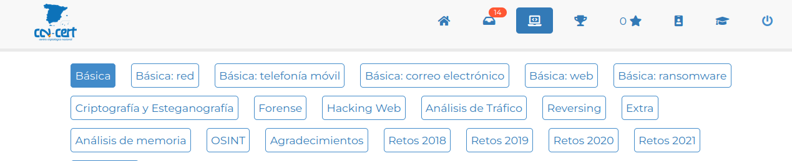

### Mi primer CTF. Retos de la plataforma Atenea

Este laboratorio es una introducción a la resolución de retos CTF. Para ello, se ha elegido la [plataforma Atenea](https://atenea.ccn-cert.cni.es), que dispone de retos en castellano y distintas categorías de retos básicos de iniciación y otros retos más avanzados. Una vez realizado el registro en la web, hay que dirigirse a la sección Retos y en ella a la pestaña Básica. Aparecerá un listado de retos desplegables que estarán accesibles conforme se vaya avanzando y resolviendo todos los anteriores (Figura 1.9).

La solución a los retos se envía a través de un campo de texto en el interior de cada reto. Deben leerse bien las instrucciones y verificar que se está introduciendo la flag de forma correcta, ya que solo se dispone de 3 intentos de envío. Si la flag es correcta, se recibirán los puntos que se tengan signados en ese momento y se marcará como resuelto con un color de fondo verde.

Los siguientes apartados sirven de guia para la resolución de los cuatro primeros retos de esta categoria. Se anima al lector a que continúe y complete los retos restantes.



Figura 1.9. Retos de la categoría Básica en la plataforma Atenea.

Los siguientes apartados sirven de guía para la resolución de los cuatro primeros retos de esta categoría. Se anima al lector a que continúe y complete los retos restantes.


**Figura 1.9. Retos de la categoría Básica en la plataforma Atenea.**

### Hash 1

El primer reto introduce las funciones de resumen o funciones hash, un tipo de función que se emplea en criptografía para el almacenamiento de contraseñas (Apartado 5.2.2). El enunciado del reto es el siguiente:

> Reto
>
> **La contraseña para superar este reto es** `LearnTheHashFunction`.
>
> Tendrás que calcular su hash md5 y ponerla en el formato de la plataforma, esto es: `flag{md5}`.
>
> Por ejemplo: `flag{378041508fcb2574e1724f8917369be9}`.

Por tanto, hay que calcular el hash md5 de la cadena indicada y ponerla en el formato en el que se introducen las flags en Atenea, que siempre es de la misma forma: `flag{md5}`.

Para calcular este valor se emplea la línea de comandos:

```bash
$ echo -n LearnTheHashFunction | md5sum
b2f2d6b27b264d83fe1abe0169b7613e -
```

 La opción `-n` elimina el salto de línea que añade la función `echo` por defecto. De no usarlo, el hash generado sería distinto y, por tanto, erróneo. De esta forma, se pasa la cadena mediante una tubería a la función `md5sum` disponible en la línea de comandos de Linux. También se puede utilizar el sitio web CyberChef (https://gchq.github.io/CyberChef/) para hallar el mismo resultado.

**Solución**: `flag{b2f2d6b27b264d83fe1abe0169b7613e}`

### Hash 2

Este segundo reto presenta una nueva función hash, sha256. El enunciado del reto es el siguiente:

> Reto
>
> **La contraseña para superar este reto es** `ThisIsAMoreSecureHashFunction`.
>
> Tendrás que calcular su hash sha256 y posteriormente calcular su md5 para poder poner la solución en el formato de la plataforma, esto es: `flag{md5}`.

Para calcularlo, hay que seguir el mismo procedimiento del reto anterior, utilizando además el comando `sha256sum`:

```bash
$ echo -n ThisIsAMoreSecureHashFunction | sha256sum
d191ce0a9d8061acb609be613d0abdecd13d93946fa3e8aa3c0c40a2102502ff -

$ echo -n d191ce0a9d8061acb609be613d0abdecd13d93946fa3e8aa3c0c40a2102502ff | md5sum
dd321a22229e0bbb5f8271e370b61eb0 -
```

Nótese que la salida de los comandos `sha256sum` y `md5sum` añaden espacios, un carácter `-` y un salto de línea al final del hash, por lo que no es posible usar una tubería entre ellos directamente. Podría utilizarse de manera intermedia el comando `awk` para extraer de la salida solo la cadena correspondiente del hash `sha256sum`:

```bash
$ echo -n ThisIsAMoreSecureHashFunction | sha256sum | awk '{printf $1}' | md5sum
dd321a22229e0bbb5f8271e370b61eb0
```

En el interior de `awk` se utiliza la función `printf` en lugar de `print` para evitar que se introduzca un salto de línea.

**Solución**: `flag{dd321a22229e0bbb5f8271e370b61eb0}`

### Hash 3

En este reto se explica que las funciones hash son de un único sentido, es decir, a partir del hash calculado no se puede obtener la cadena de texto original. Al menos esta es la teoría, ya que se pueden realizar ataques de fuerza bruta o por diccionario para tratar de hallar la cadena que genera ese hash. El enunciado de este reto es el siguiente:

> Reto
>
> **Para superar este reto deberás calcular la cadena de texto cuyo hash md5 se corresponde con el siguiente**: `54f662a095fa3d5fbbdaac72d176701b`.
>
> Una vez obtenida, deberás poner esa cadena de texto en mayúsculas y calcular su hash md5 para poder enviar la solución siguiendo el formato de la plataforma: `flag{md5}`.

Debe recuperarse la cadena que corresponde con ese hash, que tiene apariencia de haber sido generado con la función md5 por su longitud (32 caracteres hexadecimales). En los retos aparecen referencias que pueden servir de ayuda; en este se menciona CrackStation, una web que permite comprobar si un determinado hash ha sido ya calculado (Figura 1.10).


Figura 1.10. Búsqueda de la cadena de texto que genera un hash.(https://crackstation.net/).

Tal y como indican las instrucciones, debe pasarse la cadena a mayúsculas y obtener su hash md5.

```bash
$ echo MASTEROFPUPPETS | md5sum
f395885371dd0ad12136d8a733e05e22
```

También se dispone del comando `tr` que se usa para transformar cadenas de caracteres. El comando en una línea sería el siguiente:

```bash
$ echo -n masterofpuppets | tr a-z A-Z | md5sum
f395885371dd0ad12136d8a733e05e22 -
```

**Solución**: `flag{f395885371dd0ad12136d8a733e05e22}`

### Base64

Este reto es una introducción a la codificación de caracteres y a la diferencia entre cifrar y codificar. Una de las codificaciones más frecuentes es base64, que se emplea, por ejemplo, para transferir ficheros binarios a través del protocolo HTTP, correos electrónicos, etcétera.

El enunciado del reto es el siguiente:

> Reto
>
> **Para superar este reto tendrás que descodificar el fichero adjunto y poner la contraseña en el formato de la plataforma, esto es: `flag{md5}`.**

El contenido del fichero descargado es el siguiente:

```
UmVjdWVyZGEgcXV1LIGN1YWS5kbyBjb2RpZm1jYXMgYWxnbyB1biBiYXNINjQgTk8gbG8gZXNOw6FzIGNpZnJhbmRvLCBzaW5vIHF1ZSBzaW1wbGVtZW50ZSBsbyBlc3TDoXMgY29kaWZpY2FuZG8uDQoNCkxhIGNvbnRyYXNlw7FhIHBhemEgce3VwZXJhciBlc3R1IHJ1dG8gZXM6IHJ1Y3V1cemRhcXV1YmFzZTYOTK91c2NpZnJhcg0KCg==
```

Se puede emplear el comando `base64` con la opción `-d` o `--decode` para decodificar esta cadena:

```bash
$ base64 -d base64.txt
```
Recuerda que cuando codificas algo en base64 NO lo estás cifrando, sino que simplemente lo estás codificando.

La contraseña para superar este reto es: **recuerdaquebase64NOescifrar**.

Se obtiene la flag de la manera habitual:

```bash
$ echo -n recuerdaquebase64NOescifrar | md5sum
cf9df460535b4ec175a464c6c120d3fe -
```

**Solución**: `flag{cf9df460535b4ec175a464c6c120d3fe}`