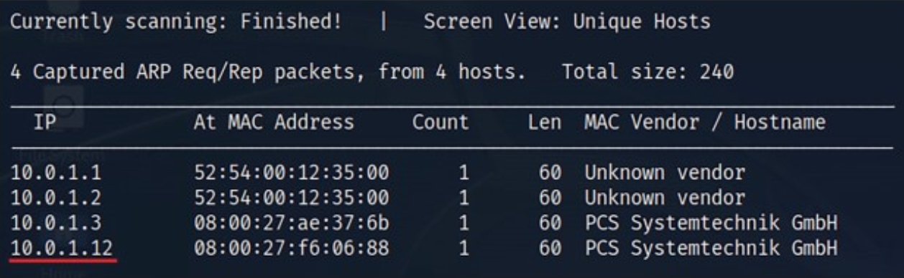
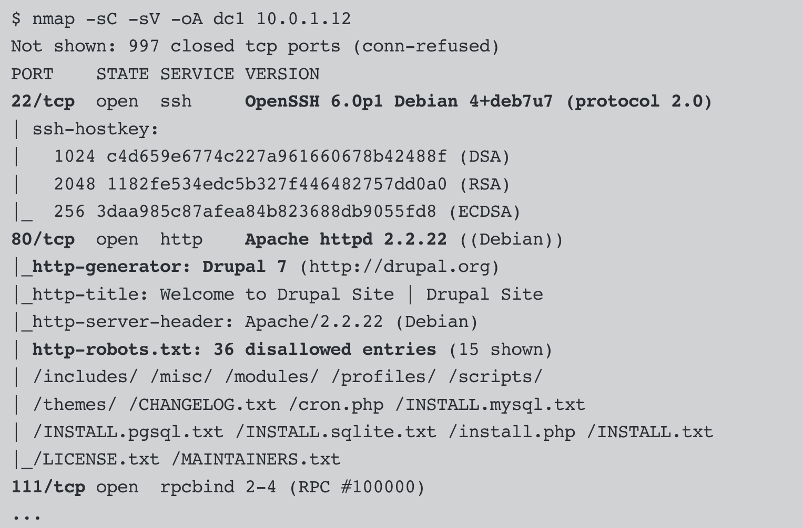
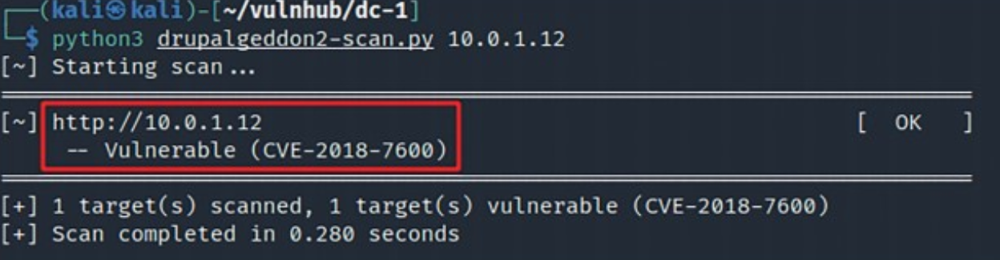
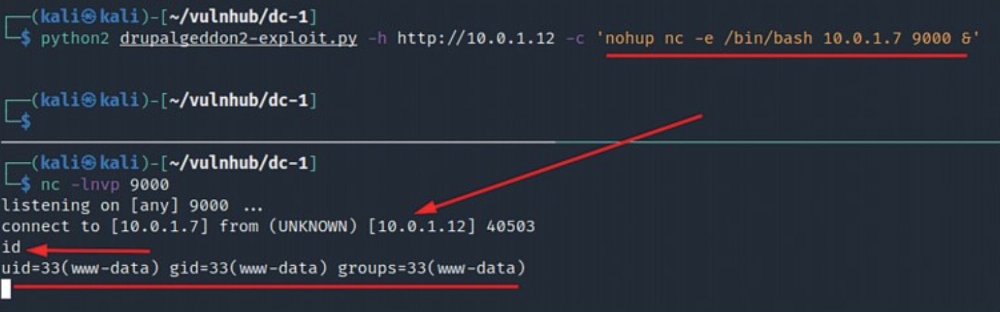

## Mi primera máquina vulnerable (boot2root): DC-1

Hackearemos una máquina que tiene diversas vulnerabilidades. Este tipo de retos llamados **boot2root** tienen dos objetivos. En primer lugar, lograr acceso a la máquina y obtener la primera flag de usuario, y en segundo lugar escalar privilegios y obtener la segunda flag de root o administrador.

Para ello se utilizará una máquina sencilla disponible en VulnHub: DC-1 ([Máquina en VulnHub: DC-1](https://www.vulnhub.com/entry/de-1,292/)). Esta máquina fue publicada en 2019 y presenta un sitio web construido con el CMS Drupal.

En multitud de ocasiones las máquinas se distribuyen en formato OVF. 

- Un **paquete OVF** contiene metadatos y elementos de archivo que describen las máquinas  virtuales, además de información adicional importante para la  implementación y el funcionamiento de las aplicaciones en el paquete  OVF. Su extensión de nombre de archivo es `.ovf`.

- Un **dispositivo virtual abierto (OVA)** es un paquete OVF en un único archivo de archivos con la extensión `.ova`.

Sin más dilación, hay que descargar la OVA y exportarla en KVM/Qemu para lo cual nos ayudaremos de las siguientes [instrucciones](../../../99.-Anexos/01.-Conversor de OVA a QCOW2) que encontrarás en los [Anexos](../../99.-Anexos/index.md). Emplearemos nuestra máquina atacante Kali Linux para llevar a cabo el test de intrusión. La configuración de red de las máquinas en VirtualBox será de red NAT.

### Escaneo y enumeración

El primer paso tras arrancar la máquina es averiguar la dirección IP que tiene asignada. Puesto que estamos en el mismo segmento de red se puede emplear el comando netdiscover que utiliza el protocolo ARP para descubrir los equipos activos en una red local:

```bash
$ sudo netdiscover -r 10.0.1.0/24
```

La Figura 1.11 muestra el resultado de este escaneo. Las tres primeras direcciones IP corresponden a VirtualBox, por lo que a la máquina objetivo le corresponde la dirección 10.0.1.12.



**Figura 1.11. Dirección IP de la máquina objetivo DC-1 descubierta con netdiscover.**

Una vez fijado el objetivo, se puede realizar un ping para comprobar que está activa. El siguiente paso es comprobar los puertos abiertos y enumerar los servicios que se están ejecutando en cada uno de ellos. Para ello se utiliza el comando `nmap` con una serie de opciones de enumeración (Apartado 3.3).



La salida muestra tres puertos abiertos. El que resulta más interesante es el puerto 80 donde se ejecuta el CMS Drupal en su versión 7. Al visitar la web se ve un formulario de login sin ningún enlace más a simple vista. Las credenciales predeterminadas no funcionan, por lo que se podría comenzar a realizar fuzzing web (Apartado 3.4.3). También se podría usar una herramienta específica de enumeración para Drupal como `droopescan` o `drupwn` para tratar de averiguar los plugins y temas instalados, la versión específica, las cuentas de usuario, etc. Nos saltaremos estos pasos.

Durante la labor de pentesting es importante tener en cuenta el periodo temporal en el que se lleva a cabo y conocer las vulnerabilidades más graves recientemente publicadas. La máquina se publicó en 2019 y en aquel momento la versión 7 de Drupal puede que estuviera desactualizada, por lo que se puede ver si existe algún exploit para esta. El comando `searchsploit` permite realizar esta búsqueda de forma sencilla.

```bash
$ searchsploit drupal 7
```

La salida del comando es extensa. Destacan una serie de vulnerabilidades graves llamadas Drupalgeddon que permiten la ejecución de código remoto (RCE). Dadas las versiones y el espacio temporal, se sabe que el CMS del objetivo podría ser vulnerable a Drupalgeddon 2 (CVE-2018-7600), que afectó a las versiones 6, las anteriores a la 7.58, y a diferentes ramas de la versión 8. Se empleará un script en Python desarrollado por kahliya ([CVE-2018-7600-drupalgeddon2-scanner](https://github.com/kahliya/CVE-2018-7600-drupalgeddon2-scanner)) para chequear si realmente el CMS del objetivo es vulnerable.

La Figura 1.12 muestra la ejecución del script confirmando que el objetivo es vulnerable. Por tanto, se puede pasar a la fase de explotación.



**Figura 1.12. Confirmación de la vulnerabilidad CVE-2018-7600 en el CMS Drupal del objetivo.**

### Explotación

Existen diversos exploits que se pueden utilizar para aprovechar la vulnerabilidad encontrada. Algunos de ellos, que aparecen en la salida del comando `searchsploit`, forman parte del framework Metasploit. El funcionamiento de Metasploit se explica en el Apartado 5.4, por lo que dejamos al lector revisarlo y que tras ello vuelva aquí y trate de explotar esta máquina con Metasploit.

Encontrar un exploit adecuado puede requerir diversas pruebas, pero es fácil encontrarlos a través de búsquedas en Google. Para explotar esta vulnerabilidad, se ha elegido un exploit escrito en Python por lorddemon ([drupalgeddon2](https://github.com/lorddemon/drupalgeddon2)).

El script es antiguo y está escrito en Python 2; por suerte, en Kali todavía hay soporte y está correctamente configurado para poder ejecutarlo sin problemas.

```bash
$ python2 drupalgeddon2-exploit.py -h http://10.0.1.12 -c 'whoami'
www-data
```

Como se ha comprobado, este script permite ejecutar comandos, por lo que se pueden realizar acciones de enumeración local (Apartado 6.3.1), pero antes de eso es recomendable obtener una shell reversa estable en nuestra máquina. La Figura 1.13 muestra cómo se ha logrado. En la parte inferior se ejecuta un listener con netcat y en la parte superior se ejecuta el exploit al que se le pasa el comando que inicia la shell reversa. Tras ejecutarlo, se inicia la conexión de la máquina explotada en nuestro listener. En la imagen se muestra la ejecución del comando `id` en DC-1 desde nuestra máquina Kali. En el Apartado 5.6.1 se explica en profundidad cómo se lleva a cabo este proceso.



**Figura 1.13. Obtención de una shell reversa con netcat en la máquina DC-1.**

Buscando la flag de usuario, encontraremos el fichero `flag1.txt` en `/var/www` y otra en `/home/flag4/flag4.txt`.

### Posexplotación

El último paso que nos queda es tratar de escalar privilegios y convertirnos en root. Existen muchas vías para hacerlo, y la correcta dependerá de la configuración de la máquina objetivo. Una de las opciones que primero debe comprobarse son los binarios SUID que hay en el sistema (Apartado 6.3.4) con el comando `find`.

```bash
www-data@DC-1:/var/www$ find / -perm -u=s 2>/dev/null
...
/usr/bin/gpasswd
/usr/bin/procmail
/usr/bin/find
/usr/sbin/exim4
/usr/lib/pt_chown
...
```

Vemos que en esta lista está el comando `find`. Al consultar la página de [GTFOBins](https://gtfobins.github.io), se ve que es posible aprovechar este binario para escalar privilegios y obtener una shell como root.

```bash
$ find . -exec /bin/bash -p \; -quit
```

```bash
bash-4.2# cd /root/
bash-4.2# ls
thefinalflag.txt
```

De este modo podemos navegar al directorio `/root` donde se sitúa habitualmente la última flag de la máquina. Por tanto, hemos finalizado el reto de explotación boot2root.