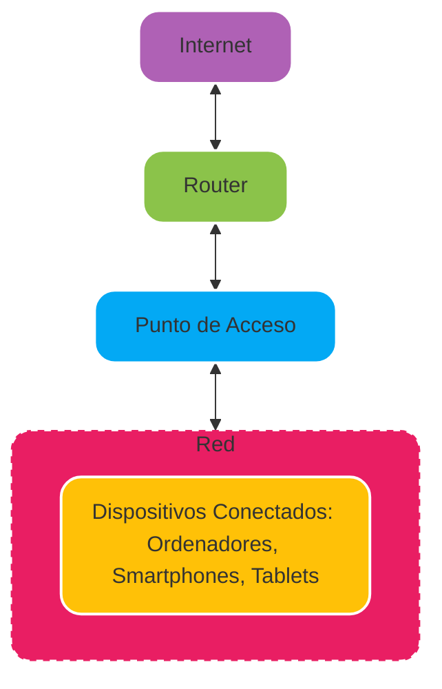

La estructura de una red inalámbrica es bastante sencilla, teniendo **3 componentes principales**:

Normalmente, esta estructura se apoya en una red de _Área Local_ para poder dotarla de una conectividad más extensa.

#### Router

- Dispositivo que permite **enrutar el tráfico** entre distintas redes (redes empresariales, redes de área extensa) o conectar las redes domésticas a internet.
  
- En redes domésticas, suele estar integrado en los propios puntos de acceso.
  

#### Punto de Acceso

- Dispositivos que presentan capacidad inalámbrica y de red _ethernet_.
  
- Se encargan de brindar **acceso Wi-Fi** a los clientes inalámbricos e interconectarlos con la red _ethernet_.
  
- En una misma red inalámbrica, puede haber varios puntos de acceso.
  

#### Clientes Inalámbricos

- Son todos aquellos dispositivos que pueden conectarse a una red inalámbrica a través de los puntos de acceso. Ejemplos: _Ordenadores, Smartphones, Tablets._
  

#### Antenas

- Parte esencial del punto de acceso.
  
- Ayudan en la tarea de **aumentar la cobertura** de la señal inalámbrica.