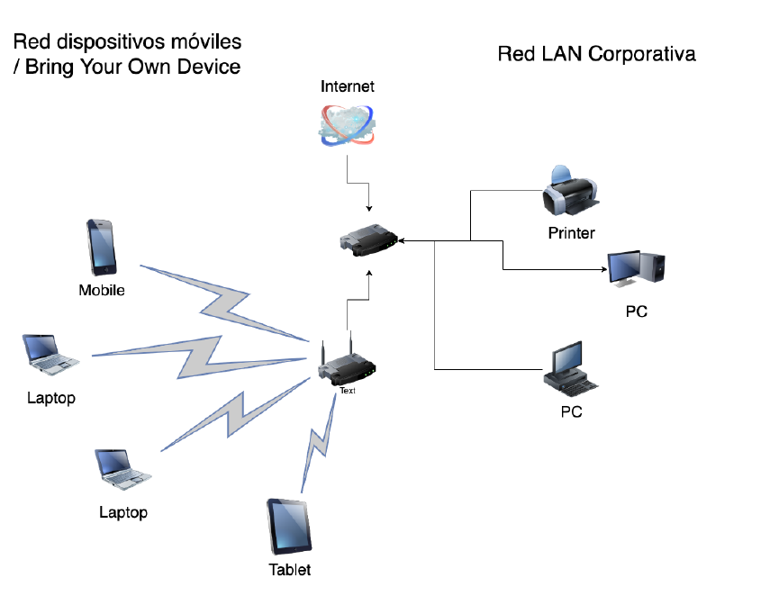

A continuación se muestran varios diagramas de la red. Teniendo en cuenta los conocimientos adquiridos en esta unidad, comenta para cada una de las redes que se muestran la problemática de diseño existente y cómo sería la infraestructura ideal.

## Red de invitados

La compañía dispone de una red Wi-Fi de invitados tipo **OPEN** para dotar de conectividad las salas de reuniones cuando tienen visitas de clientes o proveedores. También es común que en ciertas ocasiones se conecten los propios empleados con sus equipos corporativos dado que la cobertura en las salas de reuniones es mejor.

**Cuestiones a resolver:**

1. Justificar qué problemas de seguridad dispone esta red en base al tipo de red Wi-Fi cuál es y el uso que se hace de ella.
2. Justificar los tipos de ataque a los que está expuesta.
3. Mejoras que implementarías en la red.

A continuación se muestra el diagrama de la red de invitados:

## Red de dispositivos móviles

La compañía adoptó hace varios años la filosofía **"Bring Your Own Device"** mediante la cual dispone de una red específica para que los empleados puedan utilizar sus equipos personales (smartphone, tablet o portátil) para acceder a ciertos servicios en la red de empleados, como acceso al correo electrónico, al servidor de ficheros y a imprimir con las impresoras.

La red se encuentra protegida mediante **WPA2-PSK**. Además, en los últimos meses se han ido varios empleados a trabajar a la fábrica de al lado, aunque el administrador de la red no ha notado que la red tenga menos usuarios conectados.

**Cuestiones a resolver:**

1. Justificar qué problemas de seguridad dispone esta red en base al tipo de red Wi-Fi que es y el uso que se hace de ella.
2. Justificar los tipos de ataque a los que está expuesta.
3. Mejoras que implementarías en la red.

A continuación se muestra el diagrama de la red de dispositivos móviles:

---

Red corporativa
---

La compañía dispone de una red Wi-Fi en la que sólo está permitido el acceso a los usuarios legítimos de la empresa. La particularidad de esta red es que proporciona el mismo nivel de acceso a la red que cualquier equipo conectado por cable.

Para proporcionar este nivel de acceso, la red es de tipo **WPA2-Enterprise**, a la cual los empleados acceden autenticándose con su usuario y contraseña. En este sentido, su proveedor habitual de servicios le ha indicado que necesita desplegar un **MDM** para garantizar una mayor protección en la red. Este MDM está presupuestado pero aún no se ha desplegado.

**Cuestiones a resolver:**

1. Justificar qué problemas de seguridad dispone esta red en base al tipo de red Wi-Fi que es y el uso que se hace de ella.
2. Justificar los tipos de ataque a los que está expuesta.
3. Mejoras que implementarías en la red.

A continuación se muestra el diagrama de la red corporativa para su acceso mediante Wi-Fi:

## +