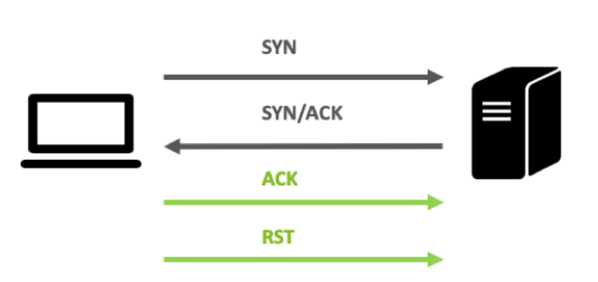

Una vez recopiladas las direcciones IP de los hosts dentro del alcance de las pruebas, el siguiente paso es identificar los servicios activos en cada equipo, los puertos TCP/UDP en los que operan y sus versiones. Esto permite:

- Determinar las funciones de cada equipo dentro de la infraestructura.
- Detectar posibles vulnerabilidades asociadas a las versiones de software identificadas.

## Herramientas para Escaneo de Servicios

### **nc (Netcat)**
Netcat o `nc`, es una herramienta de red que permite:

- Abrir puertos TCP/UDP para que queden a la escucha.
- Asociar una shell a un puerto específico.
- Forzar conexiones TCP/UDP para realizar escaneos de puertos o transferencias de archivos.

**Uso básico:**

- Conexión a un puerto específico
```
nc dirección_ip puerto
```

```bash
└─$ nc 172.31.1.1 22    
SSH-2.0-ROSSSH
```

- Comunicación en un puerto UDP
```
nc -u dirección_ip puerto
```
```bash
# Escaneo de un rango de puertos
nc -zv dirección_ip pto_inicial-pto_final
```

### **nmap**
`nmap` es una herramienta de red que permite realizar escaneos para:

- Identificar puertos abiertos.
- Reconocer servicios activos y sus versiones.
- Localizar vulnerabilidades conocidas.

**Comandos básicos:**
- Escaneo de servicios con detección de versiones
```
nmap [IP/rango] -p [puerto/rango] -sV
```
- Escaneo con scripts específicos de la categoría "version"
```
nmap [IP/rango] -p [puerto/rango] --script "version"
```
- Escaneo avanzado (incluye detección de sistema operativo y traceroute)
```
nmap [IP/rango] -p [puerto/rango] -A
```

#### Ejemplos

**Escaneo de Puertos en Redes Auditadas**

En una red auditada, pueden existir protecciones a nivel de red, como **firewalls**, que bloqueen o restrinjan el acceso a ciertos servicios. Sin embargo, es posible emplear diversas técnicas de escaneo para determinar si un puerto está abierto.

En el caso del protocolo **TCP**, se puede aprovechar el mecanismo del **"three-way handshake"**, que es fundamental para establecer la comunicación.

El siguiente comando en **nmap** realiza un escaneo utilizando la opción **-sT**, que establece una conexión completa para identificar puertos abiertos:

```bash
└─$ nmap -Pn 10.20.50.1 -sT
Starting Nmap 7.94SVN ( https://nmap.org ) at 2025-01-09 17:31 CET
Nmap scan report for 10.20.50.1
Host is up (0.0041s latency).
Not shown: 993 closed tcp ports (conn-refused)
PORT     STATE SERVICE
22/tcp   open  ssh
53/tcp   open  domain
80/tcp   open  http
443/tcp  open  https
1723/tcp open  pptp
2000/tcp open  cisco-sccp
8291/tcp open  unknown

Nmap done: 1 IP address (1 host up) scanned in 0.18 seconds

```
**Identificación de Servicios y Software en Puertos Abiertos**

Además de verificar si un puerto está abierto en un sistema remoto, es fundamental identificar:

- El servicio activo en ese puerto (por ejemplo, servidor web, base de datos, etc.).
- El software utilizado y su versión (por ejemplo, Microsoft IIS como servidor web).

Esta información permite tener una visión más exhaustiva de los servicios operativos en cada sistema remoto y comprender mejor la función de dicho equipo dentro de la infraestructura. Además, conocer el tipo y versión del software ayuda a localizar vulnerabilidades específicas asociadas a la versión concreta en uso.

**Técnica de "Banner Grabbing"**

El banner grabbing es una técnica que consiste en observar la información devuelta por cada aplicación remota al establecer una comunicación activa. La mayoría de los servicios, en su configuración predeterminada, exponen al menos el tipo y la versión del software que están ejecutando.

**Uso de Nmap para "Banner Grabbing"**

Para ejecutar esta técnica con `nmap`, es necesario realizar un escaneo TCP (full scan o stealth scan) o UDP y añadir el operador `-sV` (Service Version). Este operador permite que nmap solicite el banner del servicio, lo compare con su base de datos y devuelva el software utilizado y su versión (o, en algunos casos, una aproximación).
Ejemplo de Comando Nmap:

```bash
└─$ nmap -Pn 10.20.50.2 -sV
Starting Nmap 7.94SVN ( https://nmap.org ) at 2025-01-09 17:40 CET
Nmap scan report for 10.20.50.2
Host is up (0.018s latency).
Not shown: 996 closed tcp ports (reset)
PORT    STATE SERVICE    VERSION
22/tcp  open  ssh        Cisco SSH 1.25 (protocol 2.0)
23/tcp  open  telnet     Cisco router telnetd (password required but not set)
80/tcp  open  http       Cisco IOS http config
443/tcp open  ssl/https?
MAC Address: 00:17:95:8C:FD:41 (Cisco Systems)
Service Info: OS: IOS; Device: router; CPE: cpe:/o:cisco:ios

Service detection performed. Please report any incorrect results at https://nmap.org/submit/ .
Nmap done: 1 IP address (1 host up) scanned in 8.53 seconds
```
**Uso de Scripts de Nmap para Descubrimiento Avanzado**

Además de las funcionalidades básicas, nmap incluye una serie de scripts que permiten realizar consultas avanzadas sobre los objetivos. Estos scripts forman parte del Nmap Scripting Engine (NSE) y están organizados en diferentes categorías, diseñadas para tareas específicas.

Una de estas categorías es "version", que se enfoca en realizar tareas adicionales de descubrimiento de servicios. Estos scripts proporcionan información detallada sobre ciertos servicios, ampliando las capacidades de detección de software y versión más allá del simple "banner grabbing".

**Comando para Usar los Scripts de la Categoría "version"**

El siguiente comando invoca todos los scripts de la categoría "version":
```
nmap -Pn -p [puerto/rango] --script version [IP/rango]
```
Parámetros Explicados
- `-Pn`: Desactiva el escaneo previo de ping.
- `-p [puerto/rango]`: Indica el puerto o rango de puertos que deseas escanear. Por ejemplo, -p 80 o -p 1-1000.
- `--script version`: Invoca todos los scripts relacionados con la categoría `version`.
- `[IP/rango]`: Especifica la dirección IP o rango de direcciones objetivo.

```bash
└─$ nmap -Pn -p 22-2000 --script version 10.20.50.1  
Starting Nmap 7.95 ( https://nmap.org ) at 2025-01-16 16:49 CET  
Nmap scan report for 10.20.50.1  
Host is up (0.012s latency).  
Not shown: 1973 closed tcp ports (reset)  
PORT     STATE SERVICE  
22/tcp   open  ssh  
53/tcp   open  domain  
80/tcp   open  http  
443/tcp  open  https  
1723/tcp open  pptp  
2000/tcp open  cisco-sccp  
MAC Address: DC:2C:6E:D6:9F:EC (Routerboard.com)  
Service Info: Host: rt-net-tic-01  
  
Nmap done: 1 IP address (1 host up) scanned in 30.30 seconds
```

## Tipos de Escaneo en `nmap`

### **TCP Connect (Full Open Scan)**
La técnica de escaneo de puertos descrita corresponde al **"Escaneo TCP Connect"** (`-sT` en Nmap). Es el método por defecto utilizado por Nmap si no se tienen privilegios de administrador en el sistema (cuando no se puede enviar paquetes TCP personalizados).

#### Detalles del **"TCP Connect Scan"**

- Realiza una conexión completa mediante el **three-way handshake**:
    1. Envío de un paquete `SYN` al puerto objetivo.
    2. Si el puerto está abierto, se recibe un paquete `SYN/ACK`.
    3. A continuación, se envía un paquete `ACK` para completar la conexión.
- Si el puerto está cerrado:
    - Se recibe un paquete `RST` (Reset) como respuesta.
- Una vez identificado el estado del puerto, se cierra la conexión inmediatamente.



#### Ventajas:

- No requiere privilegios de superusuario porque utiliza las funciones estándar del sistema operativo para establecer conexiones.
- Es más fiable en entornos donde no se pueden usar técnicas de escaneo que manipulen paquetes directamente.

#### Desventajas:

- Es más fácil de detectar porque se generan registros en los sistemas de registro del servidor objetivo, ya que la conexión se completa.

#### Uso en Nmap:

Para realizar un escaneo `-sT`, simplemente usa:
```bash
nmap -sT [IP/rango] -p [puerto/rango]
```

```bash
└─$ nmap -sT 10.20.50.1 -p 22                       
Starting Nmap 7.95 ( https://nmap.org ) at 2025-01-16 16:54 CET  
Nmap scan report for 10.20.50.1  
Host is up (0.010s latency).  
  
PORT   STATE SERVICE  
22/tcp open  ssh  
MAC Address: DC:2C:6E:D6:9F:EC (Routerboard.com)  
  
Nmap done: 1 IP address (1 host up) scanned in 0.21 seconds
```
#### **Stealth Scan (SYN Scan)**
Envía un paquete SYN pero no completa el handshake, haciendo el escaneo más rápido.
```bash
nmap -sS [IP/rango] -p [puerto/rango]
```

### **FIN Scan**
Envía un paquete TCP con el flag FIN. Es útil para evadir firewalls.
```bash
nmap -sF [IP/rango] -p [puerto/rango]
```

### **XMAS Scan**
Envía un paquete TCP con múltiples flags activos (ACK, RST, SYN, URG, PSH). Funciona solo en sistemas UNIX.
```bash
nmap -sX [IP/rango] -p [puerto/rango]
```

### **NULL Scan**
Envía un paquete TCP sin ningún flag activado. Útil para evadir firewalls.
```bash
nmap -sN [IP/rango] -p [puerto/rango]
```

### **UDP Scan**
Detecta puertos UDP abiertos enviando datagramas UDP.
```bash
nmap -sU [IP/rango] -p [puerto/rango]
```

## Autoevaluación

**Pregunta:**  
¿Cuáles de las siguientes herramientas realizan un escaneo pasivo de los hosts en la red?

1. Wireshark  
2. Netdiscover  
3. Nmap  
4. Arp-scan  

**Solución:**
- **1. Correcto:** Wireshark es pasivo porque no genera tráfico activo.
- **2. Incorrecto:** Netdiscover utiliza mensajes ARP, lo que implica tráfico activo.
- **3. Incorrecto:** Nmap genera tráfico durante el escaneo.
- **4. Incorrecto:** Arp-scan realiza consultas activas en la red.
