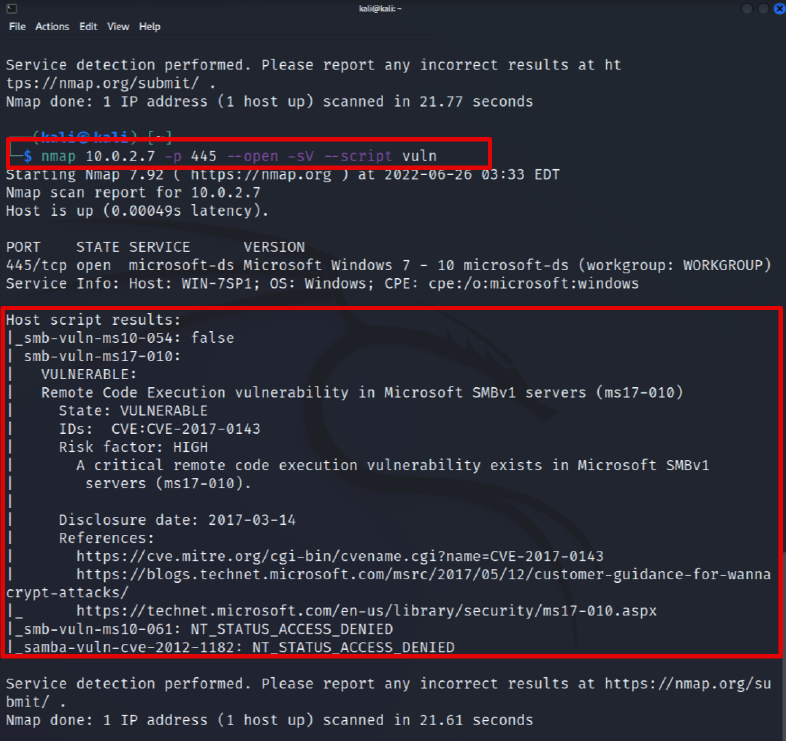

Después de haber localizado los servicios expuestos en los sistemas remotos, el software y la versión exacta de los mismos, es posible realizar una búsqueda para identificar posibles vulnerabilidades presentes en esas versiones concretas.

Además del uso de otras técnicas y herramientas, se puede utilizar la herramienta **nmap** para realizar un escaneo de vulnerabilidades. Para esta tarea, nmap se apoya en los scripts de la categoría **"vuln"** disponibles.


### **Scripts de Detección de Vulnerabilidades**

Existen scripts en nmap que buscan vulnerabilidades concretas en versiones específicas de algunos servicios. Estos scripts están englobados en la categoría **"vuln"** y pueden ejecutarse de forma conjunta.

**Uso básico de los scripts "vuln" en nmap:**
```bash
nmap  10.20.50.1 -sV --script vuln      
Starting Nmap 7.95 ( https://nmap.org ) at 2025-01-16 17:00 CET  
Pre-scan script results:  
| broadcast-avahi-dos:    
|   Discovered hosts:  
|     224.0.0.251  
|   After NULL UDP avahi packet DoS (CVE-2011-1002).  
|_  Hosts are all up (not vulnerable).
```
El resultado del escaneo muestra que el script `vuln` detectó una posible vulnerabilidad relacionada con **Avahi** (un servicio de descubrimiento de servicios en red similar a Bonjour). El script `broadcast-avahi-dos` detecta un **Denial of Service (DoS)** debido a un paquete NULL UDP enviado a un host en la red, que corresponde al **CVE-2011-1002**.

En este caso, el resultado indica lo siguiente:

- **Hosts descubiertos**: `224.0.0.251` es una dirección multicast, que se utiliza por Avahi para la difusión en la red local.
- **Vulnerabilidad**: El script menciona que, en teoría, podría haber un DoS (Denial of Service) con un paquete NULL UDP, pero el mensaje final **"_Hosts are all up (not vulnerable)"** indica que **no hay hosts vulnerables** en la red para este caso.

### En resumen:

El escaneo muestra que no se han encontrado vulnerabilidades activas para el **CVE-2011-1002** en el host objetivo (`10.20.50.1`), lo cual es una buena noticia, ya que significa que el sistema está protegido contra esa vulnerabilidad en particular. Sin embargo, el script identificó una dirección de multicast asociada con Avahi, pero no encontró ningún problema que represente un riesgo de seguridad.
**Nota importante:**
- Es obligatorio forzar la enumeración de servicios con el operador **`-sV`**. De lo contrario, los scripts no dispondrán de la información necesaria para mapear posibles vulnerabilidades.

### **Proyecto Vulscan**

El proyecto **Vulscan** utiliza nmap para buscar vulnerabilidades basándose en las versiones de los servicios detectados. Este proyecto se apoya en un script NSE y una base de datos local de vulnerabilidades.

**Uso básico de Vulscan:**
1. Instala el script desde el [repositorio oficial en GitHub](https://github.com/scipag/vulscan).
2. Ejecuta el script como parte de un comando de nmap:
   ```bash
   nmap 192.168.1.1 -sV --script vulscan/vulscan.nse
   ```



**Nota:**  
Al igual que los scripts de la categoría **"vuln"**, Vulscan requiere la enumeración de servicios con **`-sV`** para obtener resultados precisos.

### **Consideraciones Importantes**
- Herramientas como **nmap** indican posibles vulnerabilidades basadas en el software y su versión. **No garantizan que el sistema sea vulnerable.**
- Para confirmar una vulnerabilidad, es necesario realizar una explotación controlada de la misma.

## **Autoevaluación**

### **Pregunta 1:**  
¿La herramienta nmap se puede utilizar para realizar los tres tipos de escaneo (red, servicios y vulnerabilidades)?

- **Verdadero**  
**Respuesta:** Verdadero.  
Nmap tiene opciones para localizar equipos en la red, enumerar puertos abiertos y servicios activos, y realizar pruebas específicas con los scripts de la categoría **"vuln"**.

### **Pregunta 2:**  
¿Cuando utilizamos algunos scripts de la categoría **"vuln"**, no hace falta indicarle a nmap que enumere las versiones de los servicios?

- **Falso**  
**Respuesta:** Falso.  
Si no forzamos la enumeración de servicios con **`-sV`**, los scripts de nmap no podrán identificar vulnerabilidades porque desconocen las versiones del software.

### **Pregunta 3:**  
¿Los escaneos de red tratan de localizar equipos activos en la red únicamente mediante el uso del protocolo ICMP?

- **Falso**  
**Respuesta:** Falso.  
Los escaneos de red pueden localizar equipos activos utilizando los protocolos ARP, ICMP o mediante escaneos TCP.

### **Pregunta 4:**  
¿Para comprobar las versiones de los servicios, las herramientas de enumeración inician una comunicación con cada puerto concreto?

- **Verdadero**  
**Respuesta:** Verdadero.  
Para enumerar versiones de servicios, las herramientas establecen comunicación con los puertos abiertos y analizan los banners para identificar el software y la versión utilizada.

