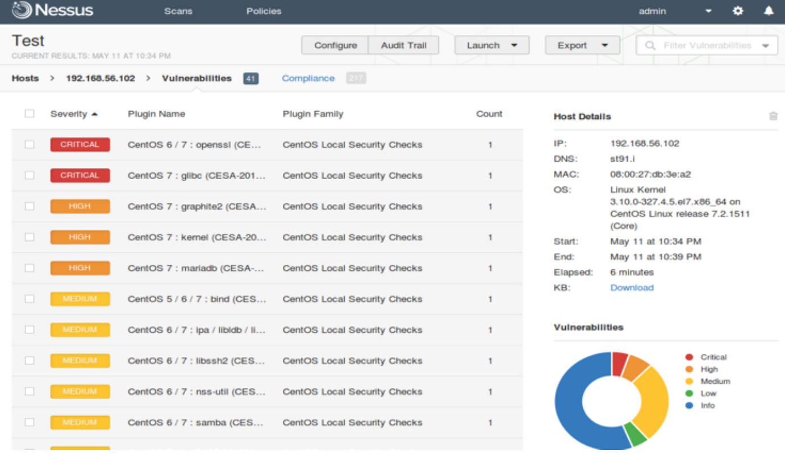
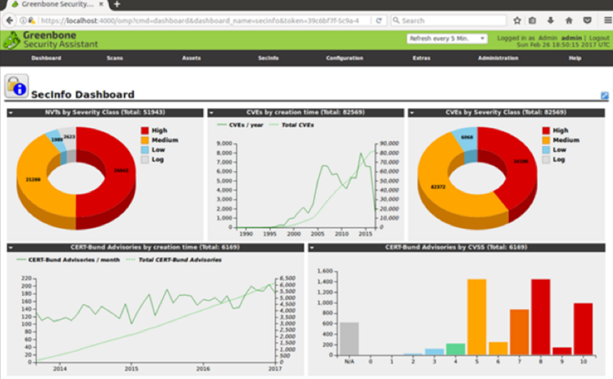

Aunque en secciones anteriores se ha visto cómo utilizar **nmap** como escáner de vulnerabilidades, también existen otros métodos y herramientas adicionales para llevar a cabo este proceso. A continuación, se describen algunas de las técnicas y herramientas más utilizadas.

## Búsqueda de Vulnerabilidades en Portales

En Internet se pueden consultar portales especializados que recopilan información sobre vulnerabilidades conocidas. Estos portales suelen proporcionar información como:

- Descripción de la vulnerabilidad.
- Pruebas de concepto asociadas.
- Parches de mitigación.
- Nivel de riesgo.

### Portales Destacados:
- **Common Vulnerabilities and Exposures (CVE):**  
  Portal del organismo Mitre que recopila vulnerabilidades catalogadas como públicas.  
  **Nota:** No incluye exploits ni pruebas de concepto.  
  Página: [CVE Details](https://www.cvedetails.com)

- **Vulners:**  
  Portal de una organización privada que recopila vulnerabilidades conocidas.  
  **Nota:** No incluye exploits ni pruebas de concepto.  
  Página: [Vulners](https://vulners.com)

- **Exploit-DB:**  
  Base de datos que incluye vulnerabilidades junto con sus exploits o pruebas de concepto.  
  Página: [Exploit-DB](https://www.exploit-db.com)

## Escáneres de Protocolos y Frameworks Específicos

Estas herramientas están diseñadas para localizar vulnerabilidades en protocolos o frameworks concretos:

- **TestSSL:**  
  Escáner de vulnerabilidades en protocolos SSL/TLS, certificaciones y algoritmos criptográficos.

- **[CMSMap](https://github.com/Dionach/CMSmap):**  
  Escáner desarrollado en Python para identificar vulnerabilidades en CMS populares como WordPress, Joomla, Drupal y Moodle.

- **[JoomScan](https://github.com/OWASP/joomscan):**  
  Escáner de vulnerabilidades en sitios Joomla, desarrollado por OWASP.

- **[Wpscan](https://github.com/wpscanteam/wpscan):**  
  Escáner en Ruby para detectar vulnerabilidades en sitios basados en WordPress.

## Escáneres de Vulnerabilidades Generales

Existen herramientas que realizan un escaneo completo de vulnerabilidades en sistemas remotos basándose en el software y versiones utilizadas:

### [Nessus](https://www.tenable.com/products/nessus)
- **Características:**  
  Escáner comercial que realiza escaneos de red, servicios y vulnerabilidades. Es completamente desatendido: el auditor solo configura los objetivos y las pruebas.
  
- **Versiones:**
  - **Nessus Home:** Gratuita, limitada a 16 hosts y sin soporte técnico.
  - **Nessus Profesional:** Sin limitaciones de escaneo, incluye soporte y módulos de compliance (PCI, entre otros).  

### **[OpenVAS](https://openvas.org/)/GVM**
- **Características:**  
  Alternativa open-source a Nessus, realiza escaneos completos de vulnerabilidades. Sin embargo, su efectividad puede ser menor debido a que los plugins son mantenidos por la comunidad.
  
  
- **Evolución:**  
  Desde 2017, OpenVAS se integra en el framework **Greenbone Vulnerability Management (GVM)**, que ofrece opciones comerciales como appliances y servicios en la nube.

## Autoevaluación

### **Pregunta:**  
¿Cuál de los siguientes comandos realiza un escaneo **Stealth Scan** sobre los 100 puertos TCP más comunes?

1. `nmap 192.168.1.0/24 -sS -p 100`  
2. `nmap 192.168.1.0/24 --top-ports 100`  
3. `nmap 192.168.1.0/24 -sS --top-ports 100`  
4. `nmap 192.168.1.0/24 -sS -p 1-100`

### **Solución:**
- **1. Incorrecto:** Realiza un Stealth Scan sobre el puerto TCP 100.  
- **2. Incorrecto:** Realiza un escaneo TCP estándar sobre los 100 puertos más comunes.  
- **3. Correcto:** Realiza un Stealth Scan sobre los 100 puertos TCP más comunes.  
- **4. Incorrecto:** Realiza un Stealth Scan sobre los primeros 100 puertos TCP (1-100).
