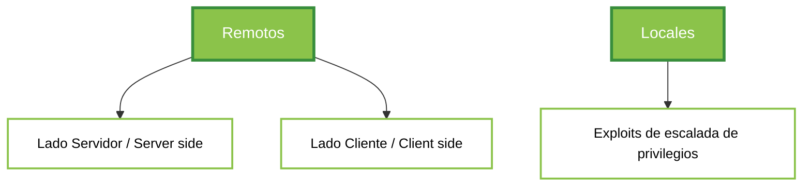
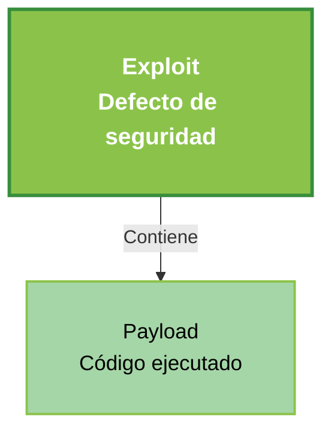

Un **exploit** es un software, pequeña aplicación o script que permite aprovecharse de un defecto de seguridad, como configuraciones incorrectas en el sistema, contraseñas débiles o por defecto, o fallos en el software, sistema o dispositivo. Su objetivo es comprometer la seguridad de un sistema.

## Riesgos de Seguridad Asociados a un Exploit

La ejecución satisfactoria de un exploit puede generar los siguientes riesgos:

- **Denegación o degradación del servicio.**
- **Corrupción de información.**
- **Corrupción de la configuración del sistema o servicio.**
- **Acceso no autorizado.**
- **Escalada de privilegios.**

## Categorización de Exploits

Los exploits pueden clasificarse en los siguientes grupos:

### Explotables de Manera Remota

La explotación se realiza sobre un sistema remoto al que no se tiene acceso previo:

- **Server-side:** Exploits dirigidos a servicios que se ejecutan en modo servidor.
- **Client-side:** Exploits que afectan al software ejecutado en el cliente (navegadores web, clientes de correo, programas ofimáticos, etc.).

### Explotables de Manera Local

Estos exploits requieren acceso previo al sistema afectado:

- **Exploits de escalada de privilegios:** Permiten obtener un mayor nivel de acceso en el sistema comprometido.

## Partes de un Exploit

Todo exploit consta de dos componentes principales:

1. **Exploit:** Código encargado de explotar la vulnerabilidad mediante la ejecución de instrucciones en el sistema afectado.
2. **Payload:** Código o conjunto de instrucciones que se ejecutan tras explotar la vulnerabilidad. Este código puede realizar acciones como ejecutar una shell o comandos no autorizados.

## Búsqueda de Exploits

Una vez identificadas posibles vulnerabilidades tras la fase de escaneo, es necesario buscar exploits públicos o pruebas de concepto para comprometer el objetivo. Las herramientas más utilizadas son:

### Exploit-DB

- Base de datos en línea con vulnerabilidades y exploits.
- Página oficial: [https://www.exploit-db.com](https://www.exploit-db.com)

### GitHub

- Aunque es un repositorio de código, también alberga pruebas de concepto y exploits funcionales.

### Searchsploit

- Herramienta para Linux que realiza búsquedas en una copia local de la base de datos de Exploit-DB.
- Permite localizar y modificar exploits para adaptarlos al sistema objetivo.

### Metasploit

- Suite completa para explotación y postexplotación.
- Contiene una extensa base de datos de exploits listos para usar.
