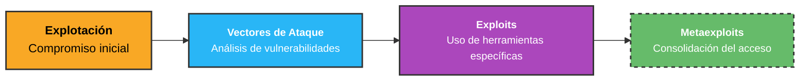

# Fase de explotación de vulnerabilidades (Exploitation)
La fase de explotación de vulnerabilidades se realiza después de completar la fase de escaneo. Tras identificar las vulnerabilidades en los servicios localizados durante las fases anteriores, el siguiente paso es explotarlas con el objetivo de demostrar el riesgo real que representan. Este riesgo se evalúa en función de los tres pilares de la seguridad:

1. **Confidencialidad**
2. **Integridad**
3. **Disponibilidad**

## Objetivo de la Explotación

El objetivo principal de esta fase es comprometer un sistema remoto utilizando herramientas específicas de explotación que se aprovechen de ciertos vectores de ataque. Estas herramientas permiten:

- Realizar un compromiso inicial en el sistema remoto.
- Validar la existencia de la vulnerabilidad identificada.
- Evaluar el impacto real de la explotación en el entorno objetivo.

## Cadena de Explotación

El siguiente gráfico muestra la cadena de explotación en la que trabajaremos para lograr el compromiso de un sistema remoto:

