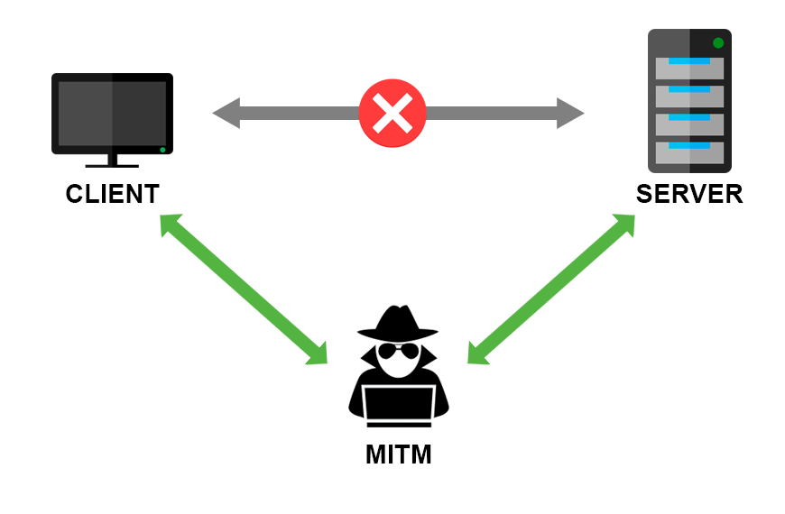

## **Intercepción de las comunicaciones**

Es el conjunto de técnicas utilizadas por un atacante para redirigir el tráfico de la víctima a un sistema que él controla.

Existen distintas técnicas que permiten realizar esta acción. A continuación se indican las más comunes:

- **Punto de Acceso falso:** Se establece un PA y se interceptan las comunicaciones.
- **ARP Spoofing:** Se realiza una inundación ARP para modificar la tabla ARP de la víctima.
- **DNS Spoofing:** Modificar la BD del DNS para que un dominio apunte a otra IP.

> **Nota:** La más común es **ARP Spoofing**, pero requiere que el atacante y la víctima se encuentren en el mismo dominio de colisión broadcast para que se puedan manipular las tablas de rutas ARP en ese segmento.

## **Herramientas de interceptación de vulnerabilidades**

Existen varias herramientas para realizar un ataque de **Man in the Middle:**

- **ettercap:** De las primeras herramientas en realizar ataques MiTM que soportaban distintas técnicas y protocolos.
- **bettercap:** Evolución de la herramienta ettercap, soporta más protocolos de comunicaciones y una interfaz mejorada.
- **mitmproxy:** Proxy de interceptación para el protocolo HTTP/HTTPS.

Sin embargo, la más utilizada a día de hoy es **bettercap**. En el siguiente enlace podéis acceder al repositorio de Github del proyecto **[bettercap](https://github.com/bettercap/bettercap)**.

## **Características de bettercap**

- Herramienta para realizar ataques de MiTM en lenguaje golang.
- Soporta interceptación de las comunicaciones en Wi-Fi, Bluetooth Low Energy, y protocolos ethernet:
    - Posibilidad de realizar ciertos ataques Wi-Fi.
    - Spoofing ARP, DNS, NDP, DHCP.
    - Proxy HTTP, TCP con posibilidad de automatización.
    - Recolección de contraseñas.
    - Interfaz gráfica basada en web.

## **Para saber más**

Para obtener más información de las características y uso avanzado de **bettercap**, os recomendamos visitar su [página oficial](https://www.bettercap.org/).