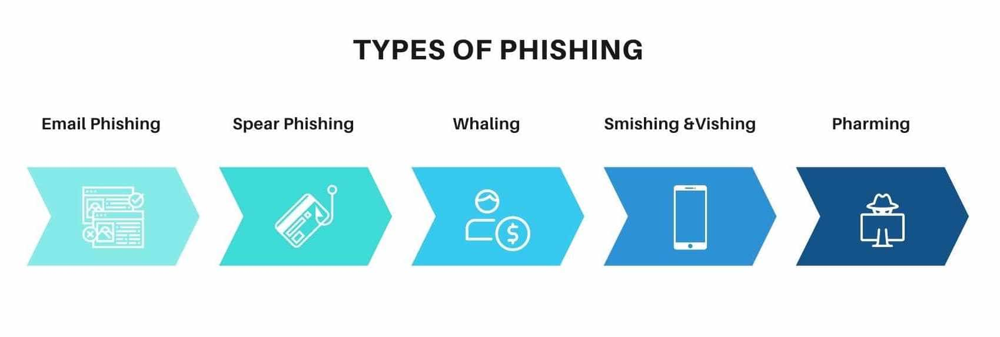

El **Phishing** es un conjunto de técnicas que tratan de engañar a una víctima haciéndose pasar por una persona, empresa o servicio en la que la víctima confía.

Para realizar este engaño, habitualmente se hace uso de la **ingeniería social** para tratar de convencer a la víctima.

### **Objetivos del Phishing**

Los objetivos que trata de conseguir el **Phishing** son muy variados, entre ellos:

- **Obtención de información.**
- **Fraude bancario.**
- **Compromiso del sistema remoto (malware).**

---

### **Tipos de Phishing**

Existen distintas clasificaciones de **Phishing**, pero en general los podemos agrupar en los siguientes tipos:

- **Email Phishing:**  Phishing enviado por mail. Hacen uso de dominios fraudulentos.
- **Spear Phishing:** Phishing dirigido a una persona u organización concreta. Gran nivel de detalle.
- **Whaling:**  Phishing dirigido a ejecutivos y CEOs.
- **Smishing:** Phishing enviado por SMS.
- **Vishing:**  Llamadas telefónicas haciéndose pasar por otra persona u organización.
- **Pharming:** Se compromete el sistema y se redirige a la víctima a un sitio controlado por el atacante.

