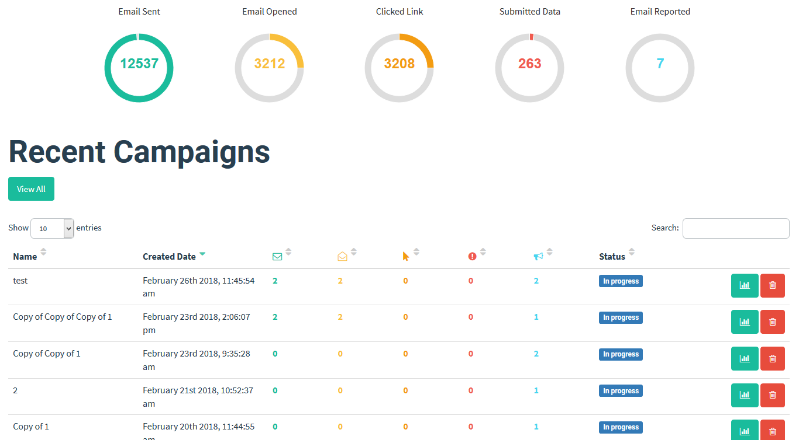

Para crear una campaña de **Phishing**, hay que realizar una serie de acciones como idear la campaña, pensar en el cebo, establecer la infraestructura, etc.

Para que estas acciones se realicen de una manera ordenada, se puede establecer una metodología de **Phishing** que se divide en las siguientes fases:

1. **Establecer el tipo de Phishing:**
    - Spear Phishing, Vishing, Smishing.
2. **Establecer el contenido:**
    - Cuál va a ser el fraude o el engaño y a quién va dirigido.
3. **Compra de dominios:**
    - Adquirir un dominio que se ajuste al contenido de campaña que queremos realizar.
4. **Recopilar datos del objetivo:**
    - Email, número de teléfono, nombre. A mayor cantidad de información, mayor probabilidad de éxito.
5. **Generar la campaña:**
    - Diseñar la campaña y crear el email fraudulento.
6. **Enviar la campaña:**
    - Se utilizan herramientas específicas para el envío de las campañas.

> **Para saber más**
> 
> En el siguiente enlace podéis obtener más información sobre la [**metodología de Phishing**.](https://book.hacktricks.wiki/en/generic-methodologies-and-resources/phishing-methodology/index.html)

## Herramientas de Phishing - Gophish

**Gophish** es una herramienta escrita en **Golang** que permite generar y enviar de manera sencilla campañas de tipo **Phishing**.

### **Características principales de Gophish**

- Establece plantillas de **Phishing**.
- Realiza seguimiento de los **Phishing** abiertos, accedidos al sitio, etc.
- Posibilidad de configurar varios servidores de correo.
- Interfaz gráfica vía web.
- API tipo REST y cliente en Python para la automatización de campañas.

En el siguiente enlace podéis acceder a la [**página oficial de Gophish**](https://getgophish.com/#).

> **Para saber más**
>
> En el siguiente enlace podéis acceder a la **Documentación oficial de Gophish**.

## **Autoevaluación**

**¿Cómo se conoce al tipo de Phishing dirigido a una persona u organización concreta con un gran nivel de detalle?**  
_(Opción múltiple)_

1. **Whaling**
2. **Pharming**
3. **Spear Phishing**
4. **Email Phishing**

### **Solución**

1. **Incorrecto**
2. **Incorrecto**
3. **Correcto**
4. **Incorrecto**